# Kittenbot JoyFrog micro:bit遙控

Kittenbot JoyFrog micro:bit遙控綠色(HKBA8027A)

Kittenbot JoyFrog micro:bit遙控紫色(HKBA8027B)

JoyFrog是Kittenbot推出的Microbit擴展版，它為Microbit增加了按鍵和搖桿等的輸入方式，適合作為遙距控制機械人的遙控器。它還可以用作主控板，在Kittenblock中充當遊戲手掣使用。

## 配送清單

- Joyfrog手掣x1
- Microbit電池盒x1

## 產品特色

- 作為主控板：可以在Kittenblock用作遊戲手掣
- 作為擴展版：可以為Microbit提供遊戲般的控制
- 可以透過3pin和4pin接口連接傳感器

## 產品規格

尺寸：128mmx80mmx35mm    
主控晶片：GD32F350C8T6   
頻率：108MHz   
快閃記憶體：64K   
內存：8K   
工作電壓：3.3V   
供電：Micro USB(5v)/3v(AAA電池x2，JST接口)

## MakeCode編程教學

#### 加載JoyFrog插件：github.com/KittenBot/pxt-joyfrog

#### JoyFrog積木塊：

#### 搖桿編程：

推動搖桿，Microbit就會顯示搖桿值。

[參考程式網址](https://makecode.microbit.org/_Ty95YCWwUC3s)

#### 按鈕編程：

按下按鈕，Microbit會顯示您按下的按鈕。

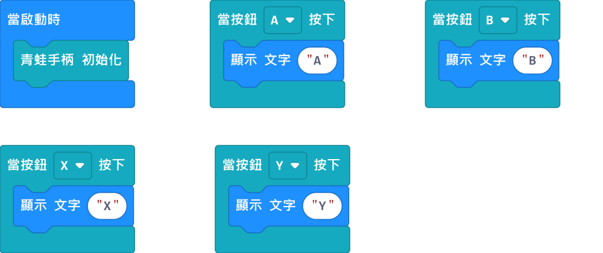

[參考程式網址](https://makecode.microbit.org/_THaPh5RTVRRt)

#### 紅外線發訊號編程：

按下按鍵，發射紅外線訊號。

    紅外線訊號只支援16進位數值(hexadecimal)。

[參考程式網址](https://makecode.microbit.org/_Wvp6vxiPMLWr)

#### 紅外線收訊號編程：

顯示紅外線收到的訊號。

    紅外線訊號只支援16進位數值(hexadecimal)。

[參考程式網址](https://makecode.microbit.org/_DoM9fj6Cj97U)

#### 類比讀取編程：

按下按鍵，讀取類比模組(例如電位器)的數字。

[參考程式網址](https://makecode.microbit.org/_HLtdh2Ha6KMp)

#### 類比寫入(PWM)編程：

按下按鍵，以PWM寫入類比數值(例如LED燈或者舵機)。

[參考程式網址](https://makecode.microbit.org/_1y8ET7e7A8TF)

#### 數位數字讀取：

按下按鍵，讀取數位模組(例如按鍵)的數字。

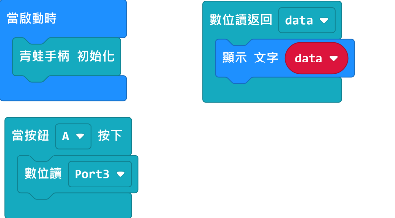

[參考程式網址](https://makecode.microbit.org/_Dd71FegibTs3)

#### 數位數字寫入：

按下按鍵，寫入數位數字。

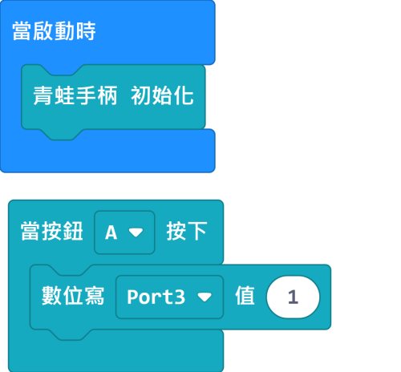

[參考程式網址](https://makecode.microbit.org/_UKU0K75uYcyL)

## Kittenblock編程教學

首先將JoyFrog用USB線連接到電腦。

在左上角小貓logo旁邊的硬件欄選擇硬件，加載JoyFrog的插件。

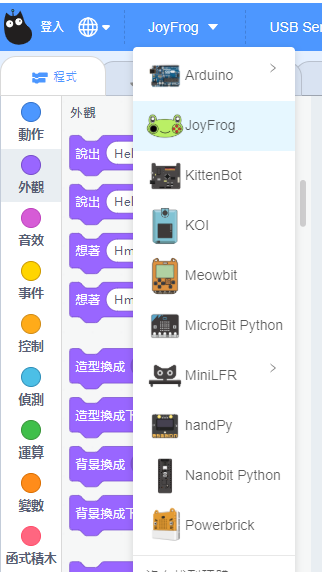

加載成功。

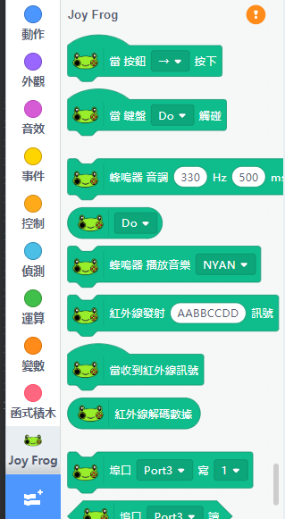

在JoyFrog的積木欄中按下感嘆號 ( ! ) 按鈕。然後點選『開始連線』。

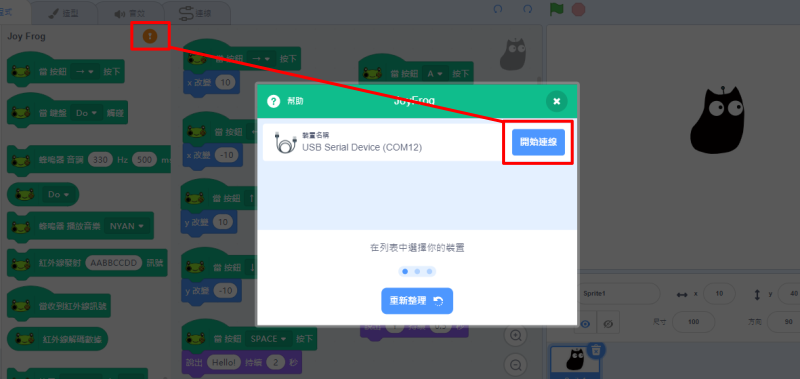

連接成功後，JoyFrog會哼出旋律。

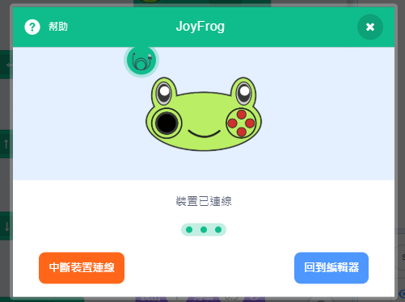

#### 按鍵和搖桿編程：

JoyFrog的按鍵和搖桿是充當了鍵盤的方向鍵和ABXY鍵。按下搖桿會觸發空白鍵。

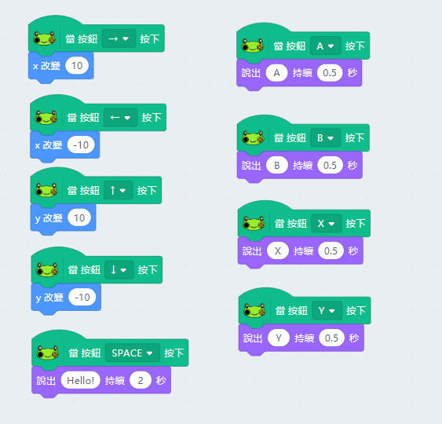

#### 金手指鋼琴編程：

利用JoyFrog底部的金手指，我們可以當作鋼琴使用。

嘗試連接不同的導電物件，例如水果，餐具等，創作你獨一無二的鋼琴吧。

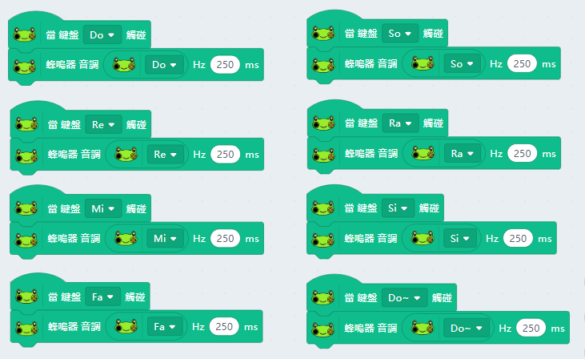

#### 紅外線收發信號編程：

按下A鍵，發送紅外線訊號，JoyFrog收到訊號之後會叫小貓說出來。

    紅外線訊號只支援16進位數值(hexadecimal)。

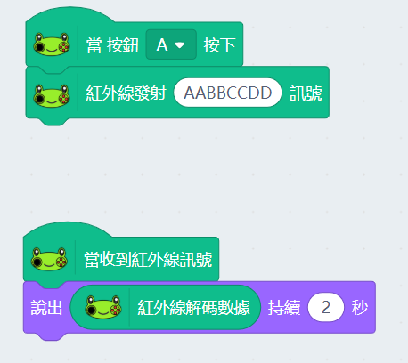

#### 數位數值讀取：

按下A鍵寫入數位數值。讀取到數位模組(例如按鍵)數字的時候小貓會說Hello。

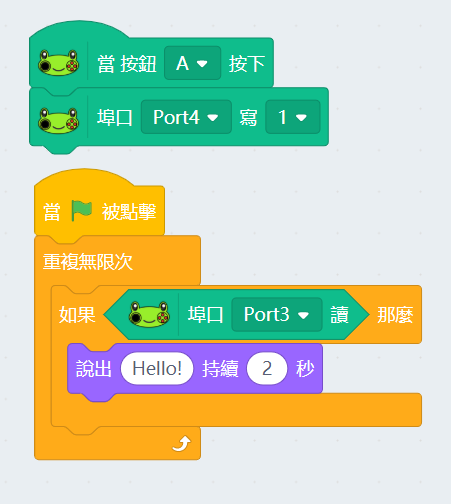

#### 類比數值讀寫：

按下A鍵讀取類比數值。使用PWM寫入類比數值(例如LED燈或者舵機)。

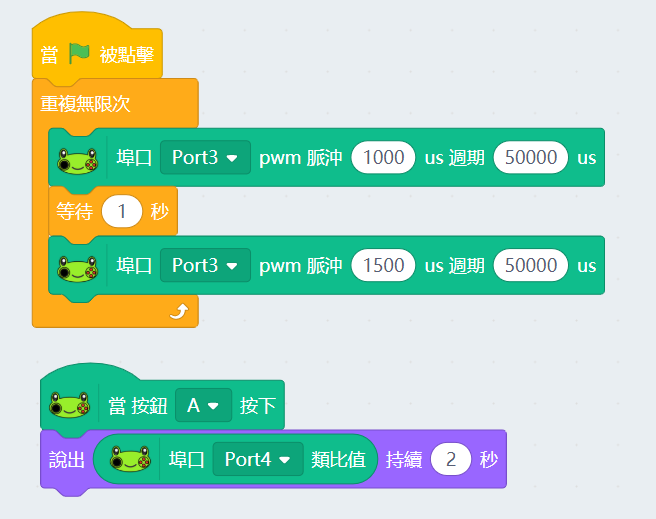