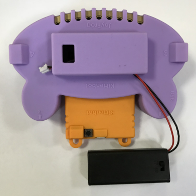
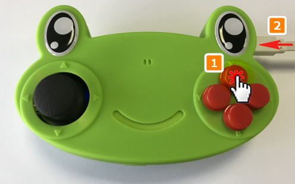

# Kittenbot JoyFrog micro:bit遙控介紹

Kittenbot JoyFrog micro:bit遙控綠色(HKBA8027A)

Kittenbot JoyFrog micro:bit遙控紫色(HKBA8027B)

JoyFrog是Kittenbot推出的Microbit擴展版，它為Microbit增加了按鍵和搖桿等的輸入方式，適合作為遙距控制機械人的遙控器。它還可以用作主控板，在Kittenblock中充當遊戲手掣使用。

## 配送清單

- Joyfrog手掣x1
- Microbit電池盒x1

## 產品特色

- 作為主控板：可以在Kittenblock或者Scratch用作遊戲手掣
- 作為擴展版：可以為Microbit提供遊戲般的控制
- 可以透過3pin和4pin接口連接傳感器
- 作為遊戲手掣：連接可以當基本的遊戲手掣使用

## 產品規格

- 尺寸：128mmx80mmx35mm    
- 主控晶片：GD32F350C8T6   
- 頻率：108MHz   
- 快閃記憶體：64K   
- 內存：8K   
- 工作電壓：3.3V   
- 供電：Micro USB(5v)/3v(AAA電池x2，JST接口)

## 主控板上零件

- 2軸遊戲搖桿（有按鈕）
- 四粒按鍵
- 紅外線發射器和接收器（可以對NEC紅外碼解碼）
- 8條金手指，可以配搭鱷魚夾使用
- 蜂鳴器
- 喇叭開關（切換蜂鳴器或者喇叭輸出）

## 主控板接口

- Microbit 40PIN接口x1
- GVAB 4PIN PH2.0防反接接口x2
- GVS 3PIN PH2.0防反接接口x2
- 3.5音頻接口x1(可以連接喇叭或耳機)
- NRF24L01 8PIN 2.4G無綫x1

## 支援軟件

- Kittenblock

    [Kittenblock大全](../../KittenBlock/index)
    
- MakeCode

    [MakeCode編程平台教學](../../Makecode/index)
    
## 主控板指示圖

1. 紅外線接收器
2. 3.5mm音頻接口
3. 蜂鳴器切換開關
4. 重置按鍵
5. DFU模式按鍵
6. 4pin模塊防反接接口
7. 2軸搖桿
8. 金手指接觸片（1~8、GND）
9. Microbit 40PIN接口
10. 主控芯片
11. 蜂鳴器
12. 4粒按鍵
13. 4pin 防反接I2C接口
14. MicroUSB接口
15. 紅外線發射器
16. 3pin模塊防反接接口
17. 3pin模塊防反接接口

## 介紹短片

[)](https://www.youtube.com/watch?v=MyQpYKhSHmY)

## JoyFrog電池盒安裝教學

安裝Microbit電池盒之後，就不用永遠連著電線啦～

## JoyFrog雙人模式

考慮到大家用Kittenblock或者Scratch做遊戲的時候可能會做多人遊戲，Kittenbot特地加了雙人模式，讓大家可以在一部電腦上使用兩隻JoyFrog手掣。

按著X鍵不放手，用USB線連接到電腦。JoyFrog會發出兩下較長的聲音，代表成功進入2號玩家模式。

在2號玩家模式下，JoyFrog所充當的鍵盤按鍵會改變。

