# JoyFrog micro:bit遙控在Kittenblock編程教學

## Kittenblock編程教學

首先將JoyFrog用USB線連接到電腦。

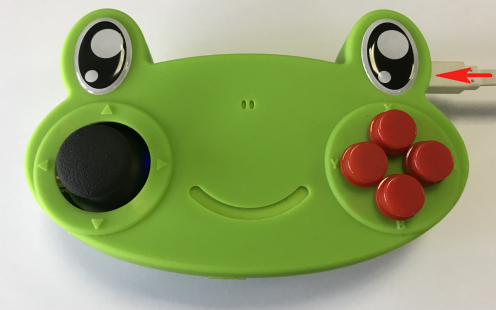

在左上角小貓logo旁邊的硬件欄選擇硬件，加載JoyFrog的插件。

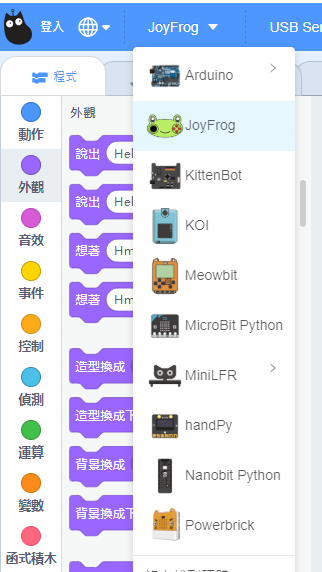

加載成功。

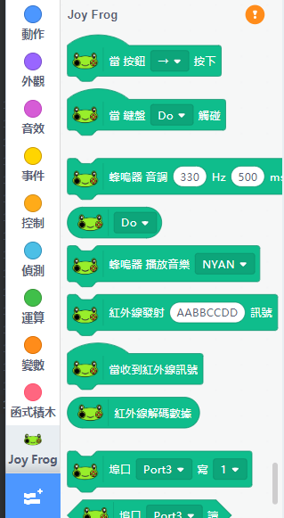

在JoyFrog的積木欄中按下感嘆號 ( ! ) 按鈕。然後點選『開始連線』。

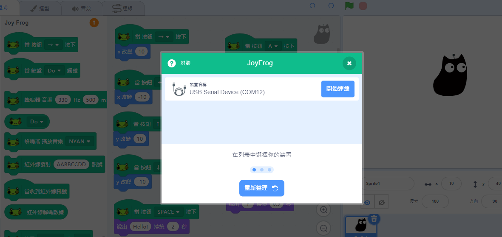

連接成功後，JoyFrog會哼出旋律。

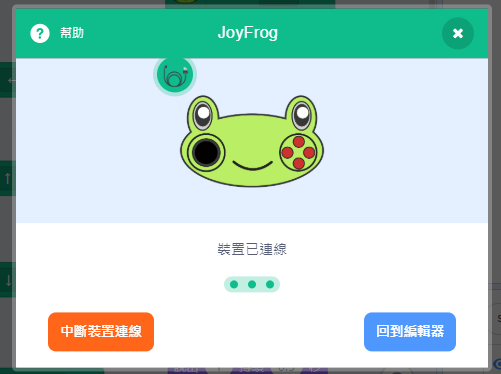

#### 按鍵和搖桿編程：

JoyFrog的按鍵和搖桿是充當了鍵盤的方向鍵和ABXY鍵。按下搖桿會觸發空白鍵。

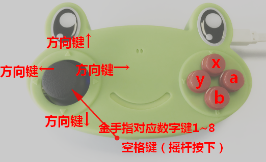

JoyFrog底部的金手指亦會觸發1-8數字鍵。

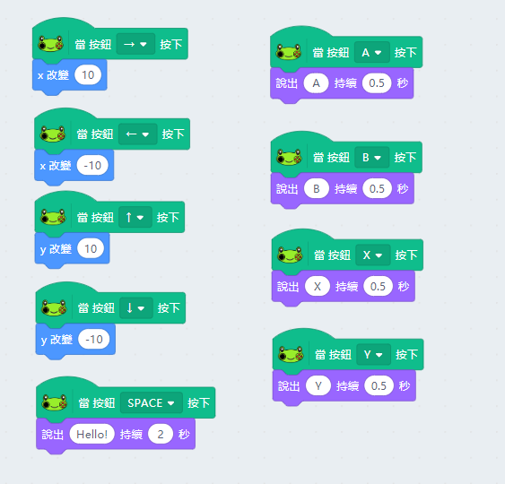

#### 金手指鋼琴編程：

利用JoyFrog底部的金手指，我們可以當作鋼琴使用。

嘗試連接不同的導電物件，例如水果，餐具等，創作你獨一無二的鋼琴吧。

    鍵盤(Do-Do~)觸碰的積木與按鈕(1-8)按下的積木是一樣的，只是為了方便大家對音調編程，特意用這個積木。

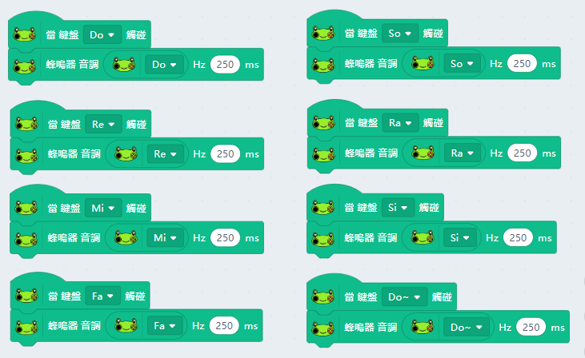

這裡使用了JoyFrog的蜂鳴器發聲，大家還可以加插喇叭發聲，或者使用音樂插件用電腦發聲呢！

#### 紅外線收發信號編程：

按下A鍵，發送紅外線訊號，JoyFrog收到訊號之後會叫小貓說出來。

    紅外線訊號只支援16進位數值(hexadecimal)。

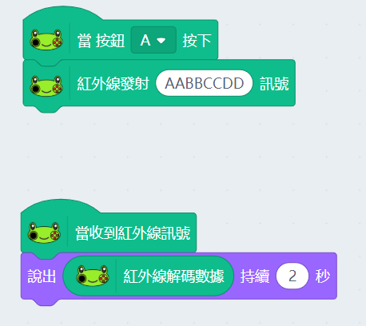

#### 數位數值讀取：

按下A鍵寫入數位數值。讀取到數位模組(例如按鍵)數字的時候小貓會說Hello。

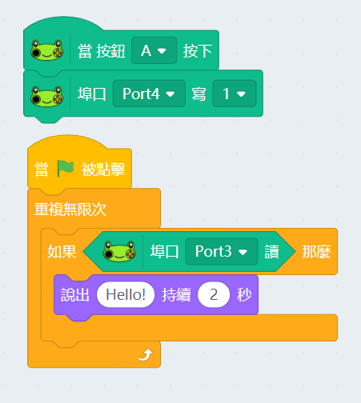

#### 類比數值讀寫：

按下A鍵讀取類比數值(例如電位器)。使用PWM寫入類比數值(例如LED燈或者舵機)。

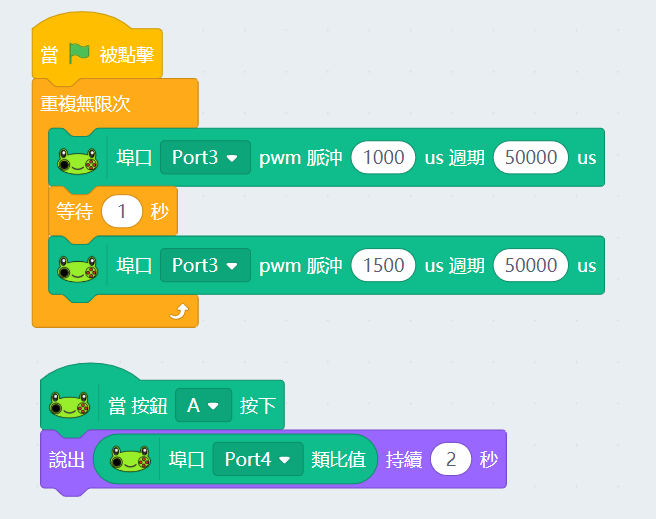