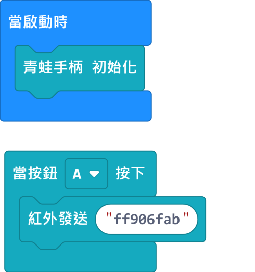
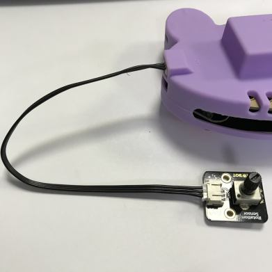

# JoyFrog micro:bit遙控在MakeCode編程教學

## MakeCode編程教學

#### 加載JoyFrog插件：github.com/KittenBot/pxt-joyfrog

#### JoyFrog積木塊：

#### 搖桿編程：

推動搖桿，Microbit就會顯示搖桿值。

[參考程式網址](https://makecode.microbit.org/_Ty95YCWwUC3s)

#### 按鈕編程：

按下按鈕，Microbit會顯示您按下的按鈕。

[參考程式網址](https://makecode.microbit.org/_THaPh5RTVRRt)

#### 鋼琴編程：

利用JoyFrog底部的金手指，我們可以當作鋼琴使用。

嘗試連接不同的導電物件，例如水果，餐具等，創作你獨一無二的鋼琴吧。

[參考程式網址](https://makecode.microbit.org/_79zhcpKDT9o0)

這裡使用了JoyFrog的蜂鳴器發聲，大家還可以加插喇叭發聲。

#### 紅外線發訊號編程：

按下按鍵，發射紅外線訊號。

    紅外線訊號只支援16進位數值(hexadecimal)。

[參考程式網址](https://makecode.microbit.org/_Wvp6vxiPMLWr)

#### 紅外線收訊號編程：

顯示紅外線收到的訊號。

    紅外線訊號只支援16進位數值(hexadecimal)。

[參考程式網址](https://makecode.microbit.org/_DoM9fj6Cj97U)

#### 類比讀取編程：

按下按鍵，讀取類比模組(例如電位器)的數字。

[參考程式網址](https://makecode.microbit.org/_HLtdh2Ha6KMp)

#### 類比寫入(PWM)編程：

按下按鍵，以PWM寫入類比數值(例如LED燈或者舵機)。

[參考程式網址](https://makecode.microbit.org/_1y8ET7e7A8TF)

#### 數位數字讀取：

按下按鍵，讀取數位模組(例如按鍵)的數字。

[參考程式網址](https://makecode.microbit.org/_Dd71FegibTs3)

#### 數位數字寫入：

按下按鍵，寫入數位數字。

[參考程式網址](https://makecode.microbit.org/_UKU0K75uYcyL)