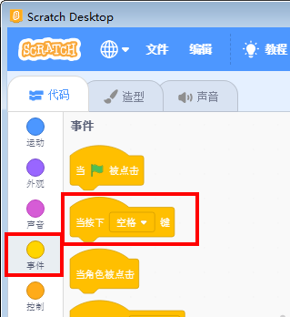
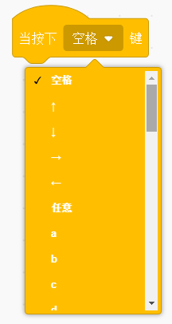
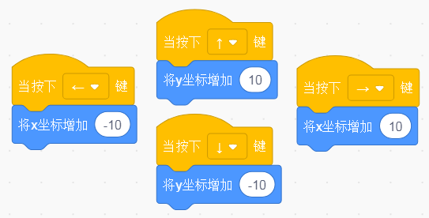
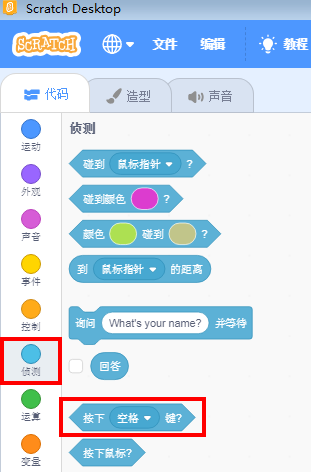
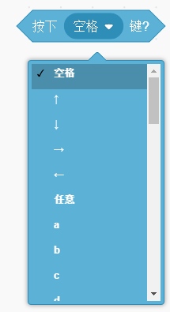
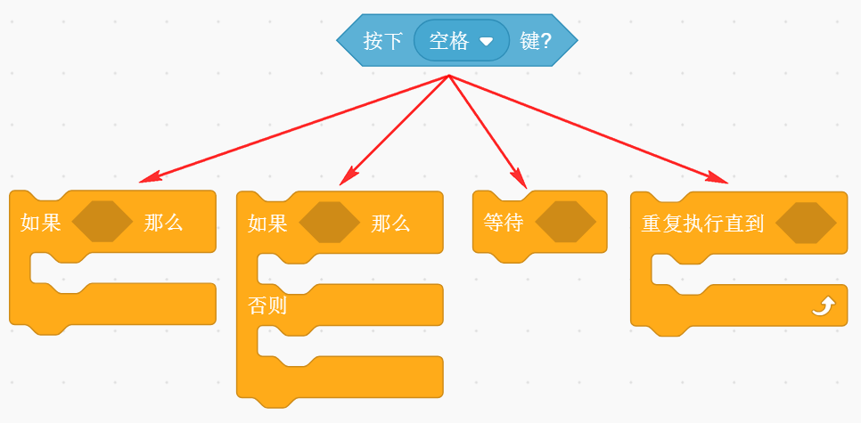
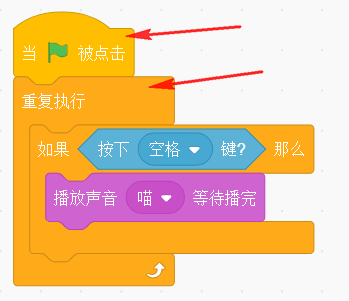

# JoyFrog micro:bit遙控在Scratch編程教學

## Scratch編程教學

首先將JoyFrog用USB線連接到電腦。

打開Scratch。

JoyFrog在Scratch中可以用事件的鍵盤積木觸發。

JoyFrog的按鍵和搖桿是充當了鍵盤的方向鍵和ABXY鍵。按下搖桿會觸發空白鍵。

事件積木觸發範例。

你亦可以用檢測觸發。

檢測積木的用法。

檢測積木觸發範例。

