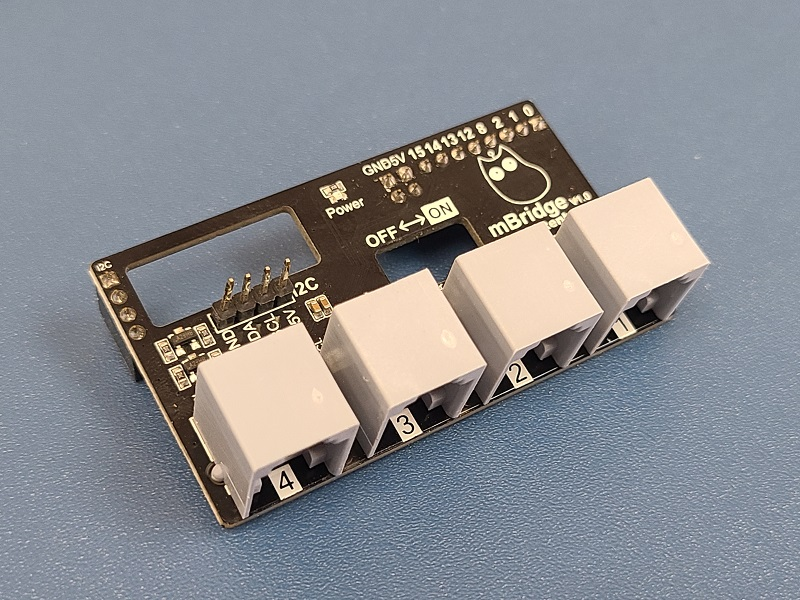
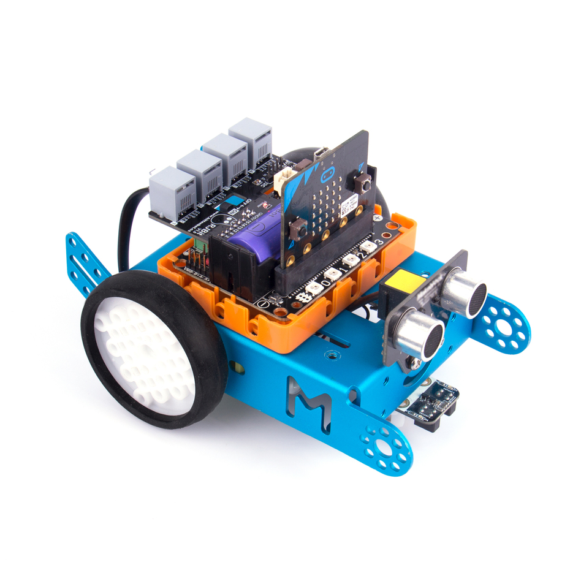
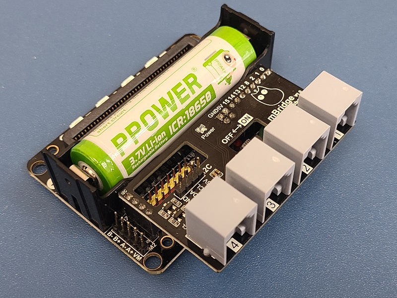
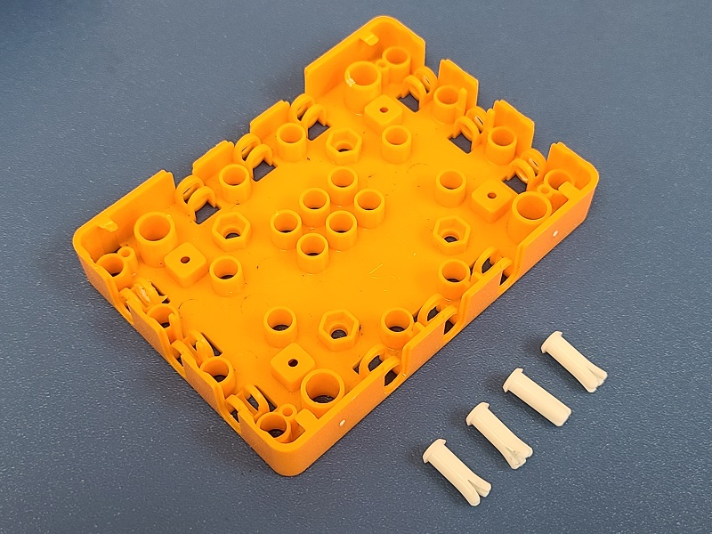
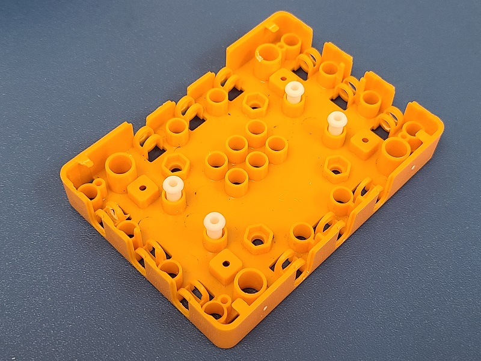
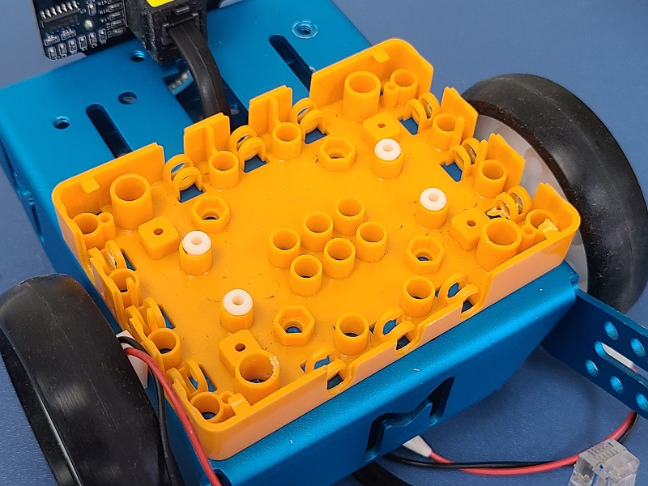
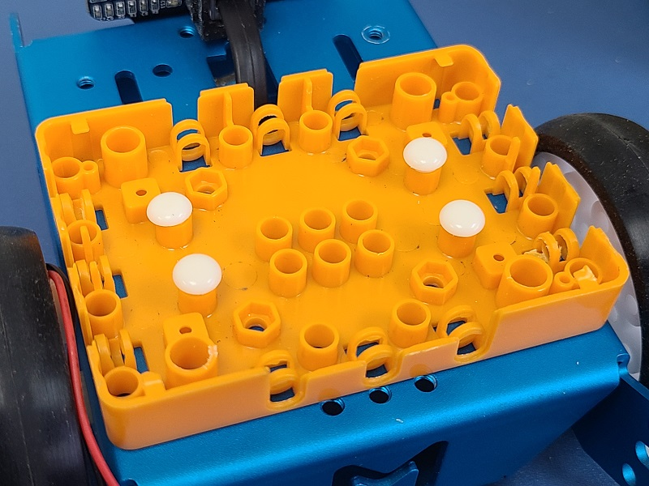
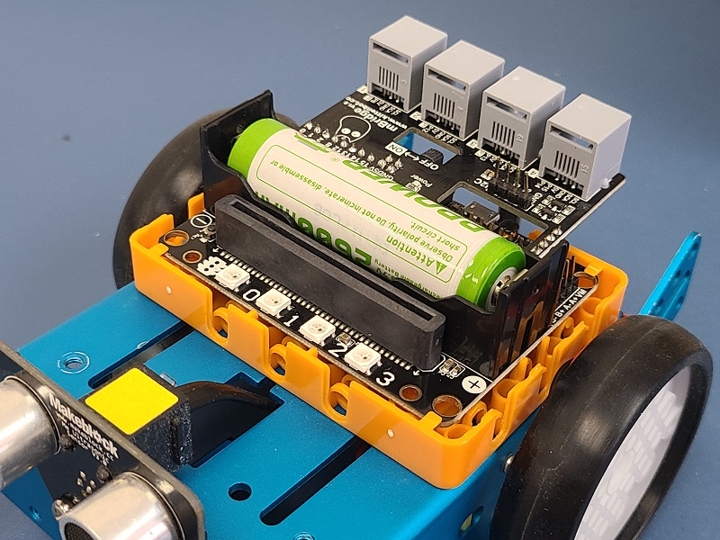

# mBridge轉接板

mBridge是KittenBot為了讓Micro:bit兼容使用RJ25接口的模組而設計的一款轉接板，只要將轉接板插在Robotbit 2.2上就可以為Robotbit帶來4個RJ25接口的連接功能，可以在MakeCode上簡單地令Micro:bit使用RJ25感應器。

## 產品特色

- 不用浪費RJ25接口的模組
- 毋須使用杜邦線，簡化接線程序
- 毋須杜邦線，直接使用RJ25水晶接口
- 支援MakeCode圖像化編程

## 產品參數

- 尺寸: 64x36x24 mm
- 接口: 4組RJ25接口，I2C接口
    - Port 1、Port 2、Port 3可以接模擬(Analog)感應器，可以接makeblock的黑色模組
    - Port 1、Port 2、Port 3、Port 4可以接數位(Digital)感應器，可以接makeblock的黃色和藍色模組
    - Port 1、Port 2、Port 3、Port 4可以接I2C模組，可以接makeblock的白色模組
    - 板載I2C接口可接5V I2C模組
- 支持擴展板: Robotbit 2.2

## 接口詳細介紹

## 使用方法

1.將mBridge轉接板插在Robotbit 2.2上，將電源開關與舵機接口對準轉接板上的空格即可。

2. 將塑膠鈕釘套安裝在Robotbit底座上。

3. 將Robotbit底座安裝在小車上。

4. 插入塑膠釘子，固定Robotbit與小車。

5. 將Robotbit安裝好。

## MakeCode編程教學

### 首先加載mBridge的插件

### 插件地址: https://github.com/KittenBot/pxt-mBridge

### [詳細方法](../../Makecode/powerBrickMC)

### mBridge積木塊

### mBridge參考程式

[參考程式下載](https://makecode.microbit.org/_Vegepwb5T3Ek)

### 程式玩法:

1.這是使用超聲波測距模組的避障小車。
2.將手放到小車的超聲波測距模組前，可以推開或拉近小車。