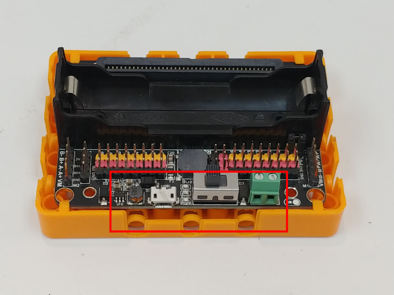

# Robotbit底座

Robotbit擴展板可以配合底座使用，使用底座不但可以保護Robotbit底部的電子引腳避免短路，底座上面還有兼容樂高積木的插孔和螺絲固定孔，讓大家在設計機械人時有更多選擇。

## Robotbit底座安裝示範：

## Robotbit底座圖例

#### 請注意Robotbit底座的前後！！
#### Robotbit上USB插頭的方向要與底座上的凹位對上。

