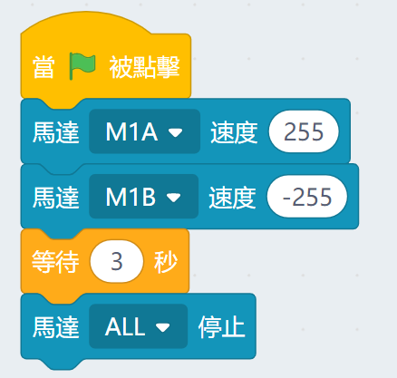
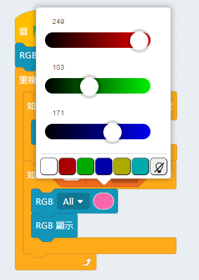

# Robotbit 在Kittenblock編程

Robotbit亦支援在Kittenblock上編程。

有關Kittenblock的介紹可以參考：[Kittenblock大全](../KittenBlock/index)

## Kittenblock編程

首先將Microbit用USB線連接到電腦。

在左上角小貓logo旁邊的硬件欄選擇硬件，加載Robotbit的插件。

在Microbit的積木欄中按下感嘆號 ( ! ) 按鈕。

然後點選『開始連線』。

連接完成！

成功連接後，MicroBit會顯示心形。

假如沒有顯示心形，可以按下升級韌體。

#### 加載成功

### 1. 電機編程

將電機連接在robotbit的M1A和M1B上。

### 2. 舵機編程

將舵機連接在Robotbit的S1上。

### 3. 步進電機編程

將步進電機連接到Robotbit的M1和M2上（將紅色電線連接到VM）。

### 4. 蜂鳴器編程

使用蜂鳴器時，不可以拔除P0的Jumper線帽。

### 5. RGB燈編程

#### 5.1 4顆燈同時點亮

#### 5.2 使用RGB數值指定顏色

#### 5.3 點亮指定一顆燈

