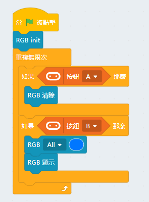
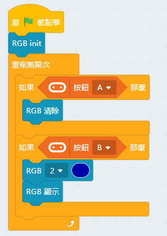
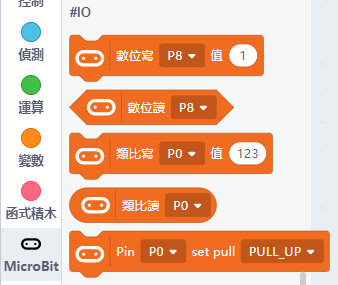
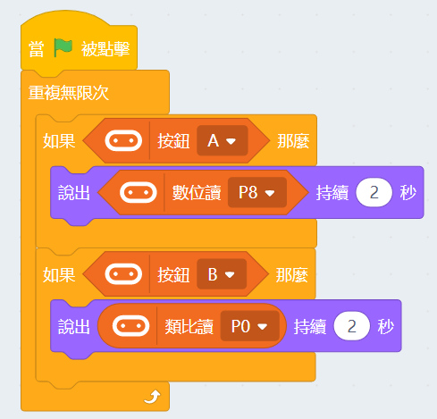
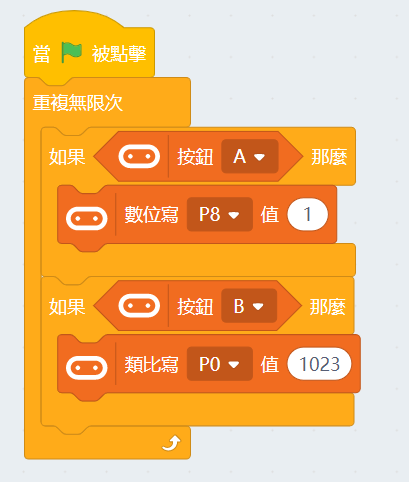

# Robotbit 在Kittenblock編程

Robotbit亦支援在Kittenblock上編程。

有關Kittenblock的介紹可以參考：[Kittenblock大全](../KittenBlock/index)

## Kittenblock編程

首先將Microbit用USB線連接到電腦。

在左上角小貓logo旁邊的硬件欄選擇硬件，加載Robotbit的插件。

在Microbit的積木欄中按下感嘆號 ( ! ) 按鈕。

然後點選『開始連線』。

連接完成！

成功連接後，MicroBit會顯示心形。

假如沒有顯示心形，可以按下升級韌體。

#### 加載成功

### 1. 電機編程

Kittenbot每款電機的詳細教學可以參考：[電機教學](../../motors/index)

示範接線與編程：

將電機連接在robotbit的M1A和M1B上。

    電機速度範圍由-255至255

### 2. 舵機編程

Kittenbot每款舵機的詳細教學可以參考：[舵機教學](../../motors/index)

示範接線與編程：

將舵機連接在Robotbit的S1上。

    將舵機的橙色線接到黃色引腳針線，紅色線接到紅色正極針線，黑色線接到黑色負極針線。

    由於舵機轉動需要時間，所以我們需要加一個短暫的停頓(pause)，給予舵機足夠時間轉動。
    一般舵機的轉向角度範圍由0至180度
    

### 3. 步進電機編程

Kittenbot每款電機的詳細教學可以參考：[電機教學](../../motors/index)

示範接線與編程：

將步進電機連接到Robotbit的M1和M2上（將紅色電線連接到VM）。

    步進電機的角度範圍為-360至360度

### 4. 蜂鳴器編程

使用蜂鳴器時，不可以拔除P0的Jumper線帽。

### 5. RGB燈編程

    所有積木都需要加一個”顯示”的積木才會顯示效果。

#### 5.1 4顆燈同時點亮

#### 5.2 使用RGB數值指定顏色

    RGB的數值範圍由0-255。

#### 5.3 點亮指定一顆燈

    燈的編號由0至3。(Robotbit上也印有編號)
    

### 6. 引腳編程

引腳的讀寫需要用到Microbit的積木塊。

    Pin 0-2可以用作類比引腳，其他Pin只可以用作數位引腳。
    類比數值範圍由0-1023，數位數值範圍由0至1。
    

#### 6.1 引腳數值讀取

    Pin 0預設與蜂鳴器相接，所以使用Pin 0引腳時需要拔除跳線帽。

#### 6.2 引腳數值寫入

    Pin 0預設與蜂鳴器相接，所以使用Pin 0引腳時需要拔除跳線帽。

