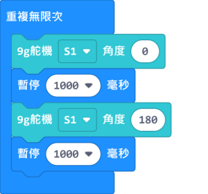
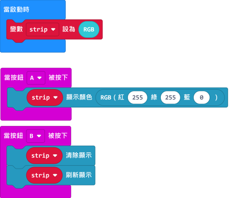
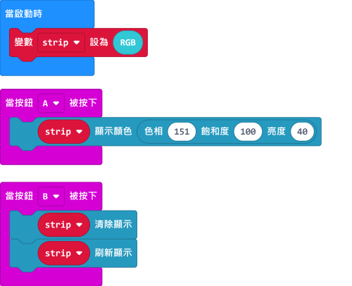
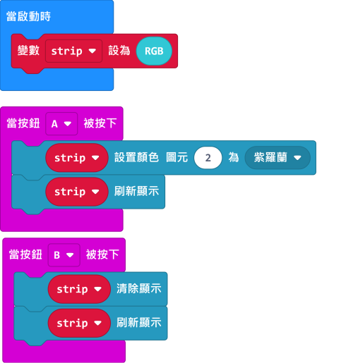
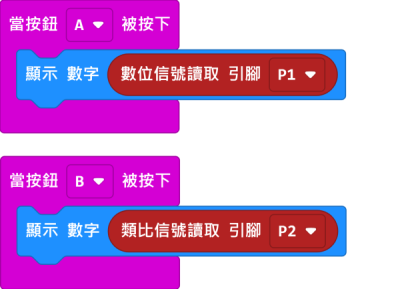
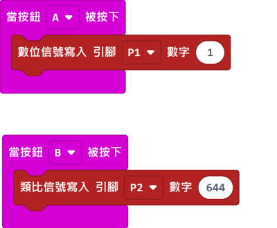

# Robotbit 在Makecode上的編程

Robotbit支援Makecode上編程。

## Makecode編程

### 首先加載Robotbit的插件

#### 1. 在makecode添加包中直接搜索Robotbit（Robotbit插件已經通過微軟官方認證)  
          

#### 2. 在Kittenbot makecode離線版本中，添加包列表可以顯示Robotbit以及其他集成擴展包（Robotbit可以離線加載不依靠網絡，其他的擴展包不可以） 

#### 加載成功

### 1. 電機編程

將電機連接在robotbit的M1A和M1B上。

### 2. 舵機編程

將舵機連接在Robotbit的S1上。

### 3. 步進電機編程

將步進電機連接到Robotbit的M1和M2上（將紅色電線連接到VM）。

### 4. 蜂鳴器編程

使用蜂鳴器時，不可以拔除P0的Jumper線帽。

### 5. RGB燈編程

RGB燈的編程需要使用Neopixel的積木塊。

Neopixel的詳細講解可以參考：[Neopixel介紹](../../accessories/LEDMatrix/LEDMatrixNeoPixel1)

#### 5.1 4顆燈同時點亮

#### 5.2 使用RGB數值指定顏色

#### 5.3 使用HSL數值指定顏色

#### 5.4 點亮指定一顆燈

#### 5.5 調整亮度編程

### 6. 引腳編程

引腳的讀寫需要用到引腳的積木塊。

#### 6.1 引腳數值讀取

#### 6.2 引腳數值寫入

