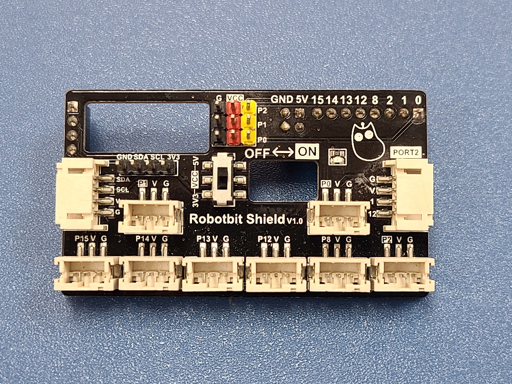
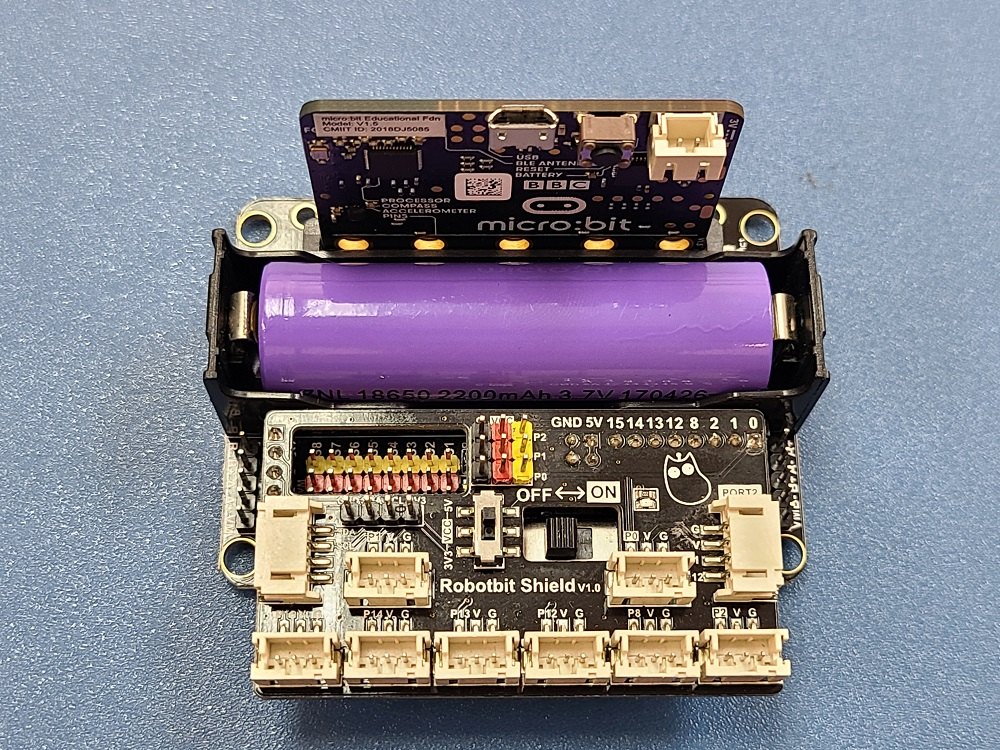

# Robotbit Shield 擴展板

為了方便大家使用不同模塊的PH2.0防反接接口Kittenbot推出了Robotbit的擴展板Robotbit Shield，板上載有多個3pin和4pin的PH2.0接口，讓大家不用再每次都使用杜邦線轉接到模塊了。

 

## Robotbit Shield 安插示範

 

## Robotbit Shield 擴展板指示圖

 

1: PH2.0 4PIN I2C接口           

2~9: PH2.0 3PIN接口                    
   
10: PH2.0 4PIN接口，與Armourbit上的Port2對應    
                 
11: 4PIN針線I2C接口                    
 
12: 電壓切換開關，用於切換13號針位的電壓，可以選3.3V和5V   
               
13: 3PIN針線接口，VCC電壓用12號開關選擇，可以選3.3V和5V 
                       
14: 電源指示燈                       

 

15: 8PIN排母接口，用於插接Robotbit Pin排針
     
16: 2x2排5V母接口，用於插接Robotbit 5V排針  
      
17: 4PIN排母接口，用於插接Robotbit I2C排針 
    
    注：所有PH2.0接口的電壓都是3.3V

