# Robotbit 在Makecode上的編程

Robotbit支援Makecode上編程。

## Makecode編程

### 首先加載Robotbit的插件

#### 1. 在makecode添加包中直接搜索Robotbit（Robotbit插件已經通過微軟官方認證)  

 
         
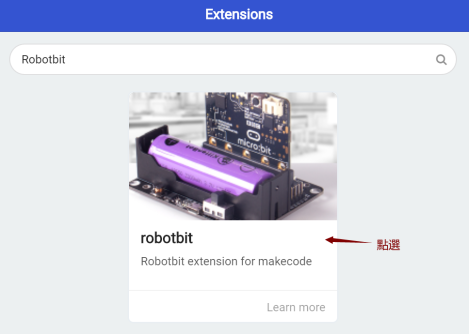

#### 2. 在Kittenbot makecode離線版本中，添加包列表可以顯示Robotbit以及其他集成擴展包（Robotbit可以離線加載不依靠網絡，其他的擴展包不可以） 

#### 加載成功

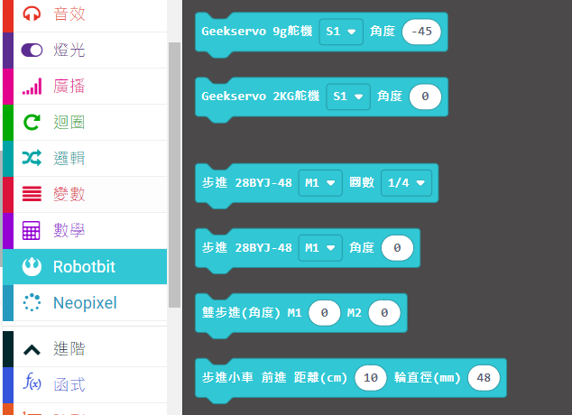

### 1. 電機編程

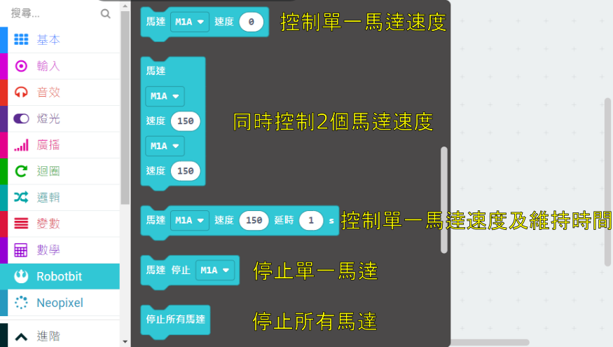

Kittenbot每款電機的詳細教學可以參考：[電機教學](../../motors/index)

示範接線與編程：

將電機連接在Robotbit的M1A和M1B上。

    電機速度範圍由-255至255

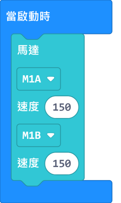

### 2. 舵機編程

Kittenbot每款舵機的詳細教學可以參考：[舵機教學](../../motors/index)

示範接線與編程：

將舵機連接在Robotbit的S1上。

    將舵機的橙色線接到黃色引腳針線，紅色線接到紅色正極針線，黑色線接到黑色負極針線。
    一般舵機的轉向角度範圍由0至180度。
    
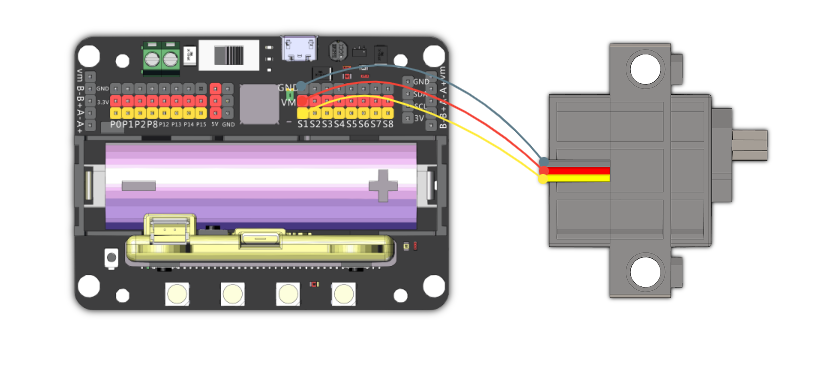
    
    由於舵機轉動需要時間，所以我們需要加一個短暫的停頓(pause)，給予舵機足夠時間轉動。

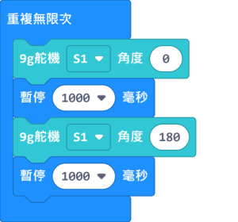

### 3. 步進電機編程

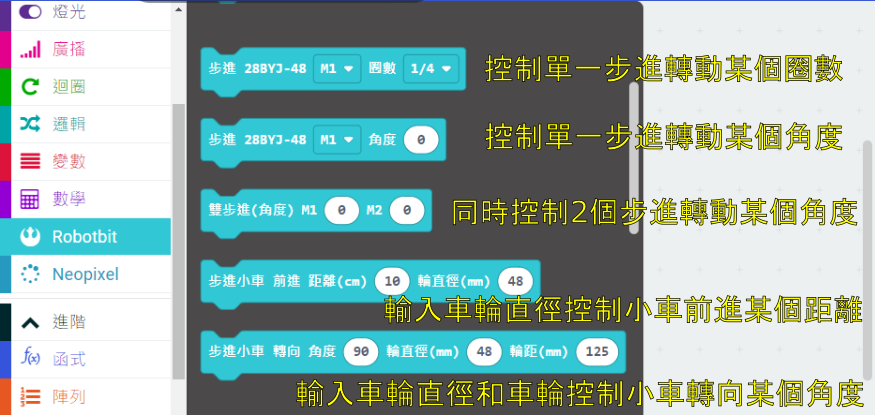

    控制距離和轉向的積木是為Kittenbot的28BY-48-5V步進電機而設計，使用其他步進電機時可能有誤差。

Kittenbot每款電機的詳細教學可以參考：[電機教學](../../motors/index)

示範接線與編程：

將步進電機連接到Robotbit的M1和M2上（將紅色電線連接到VM）。

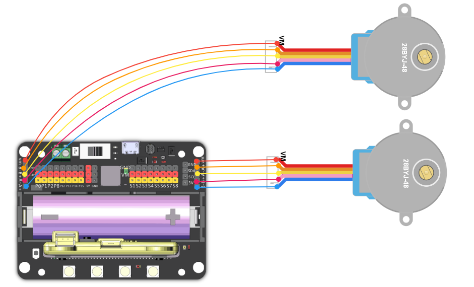

    步進電機的角度範圍為-360至360度

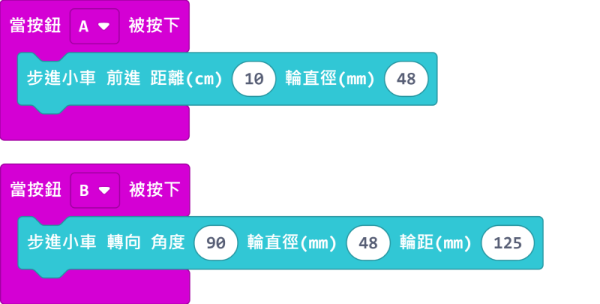

### 4. RGB燈編程

RGB燈的編程需要使用Neopixel的積木塊。

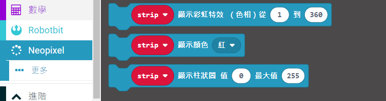   

    除了”顯示顏色”的積木之外，其餘所有的積木都需要加一個”刷新顯示”的積木才會顯示效果。

#### 4.1 4顆燈同時點亮

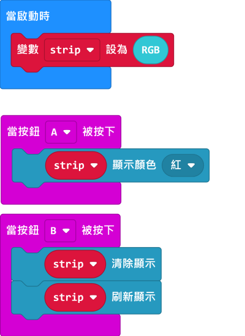

#### 4.2 使用RGB數值指定顏色

    RGB的數值範圍由0-255。

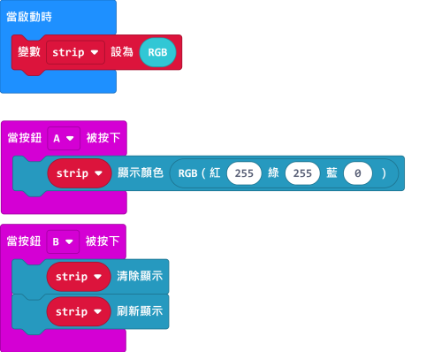

#### 4.3 使用HSL數值指定顏色

    HSL的色相範圍由0-360，飽和度和亮度由0-100。

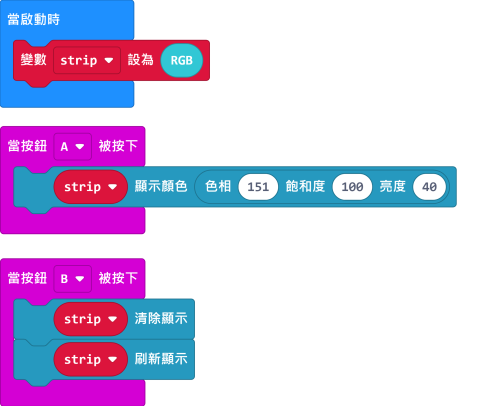

#### 4.4 調整亮度編程

    亮度範圍由0至255

### 5. 引腳編程

引腳的讀寫需要用到引腳的積木塊。

    Pin 0-2可以用作類比引腳，其他Pin只可以用作數位引腳。
    類比數值範圍由0-1023，數位數值範圍由0至1。

在Robotbit Edu上使用傳統感應器可以使用3芯轉杜邦線(另購)。
    

#### 5.1 引腳數值讀取

    Pin 0預設與蜂鳴器相接，所以使用Pin 0引腳時需要拔除跳線帽。

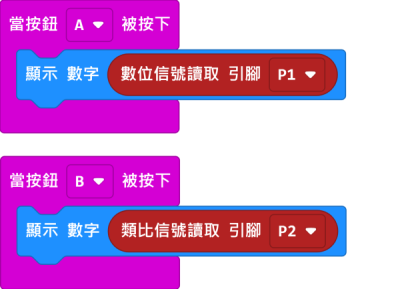

#### 5.2 引腳數值寫入

    Pin 0預設與蜂鳴器相接，所以使用Pin 0引腳時需要拔除跳線帽。

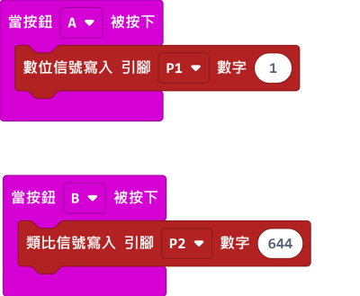
