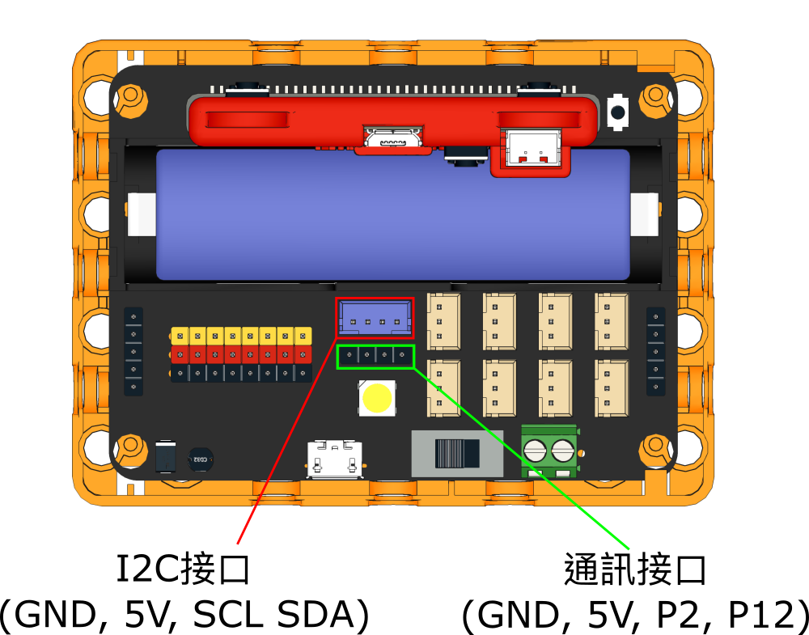
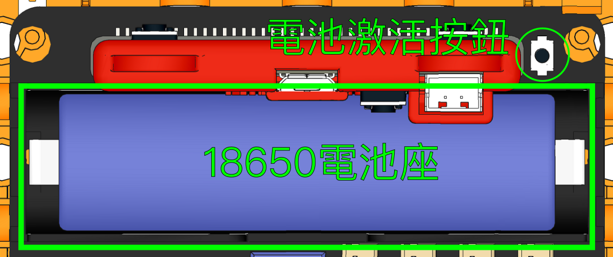
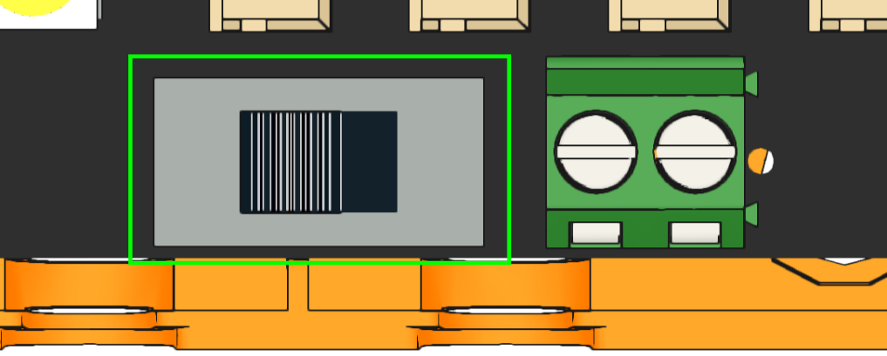
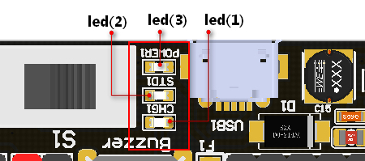
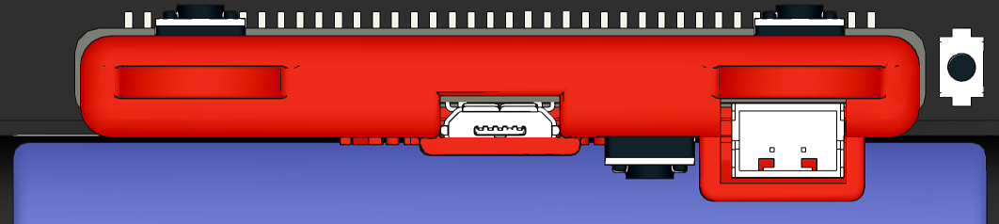
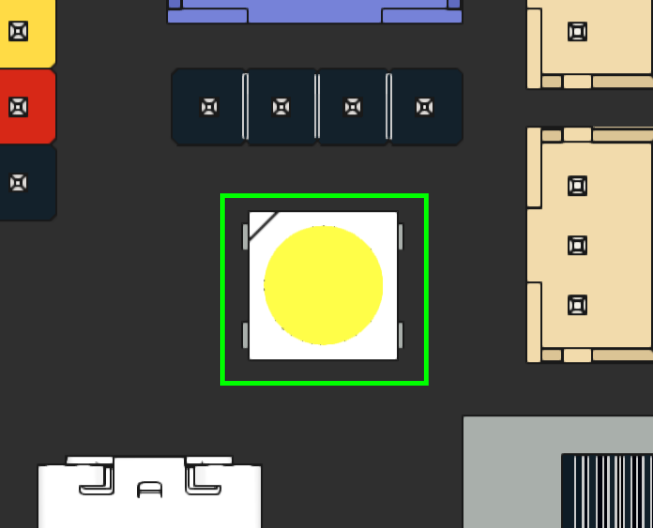
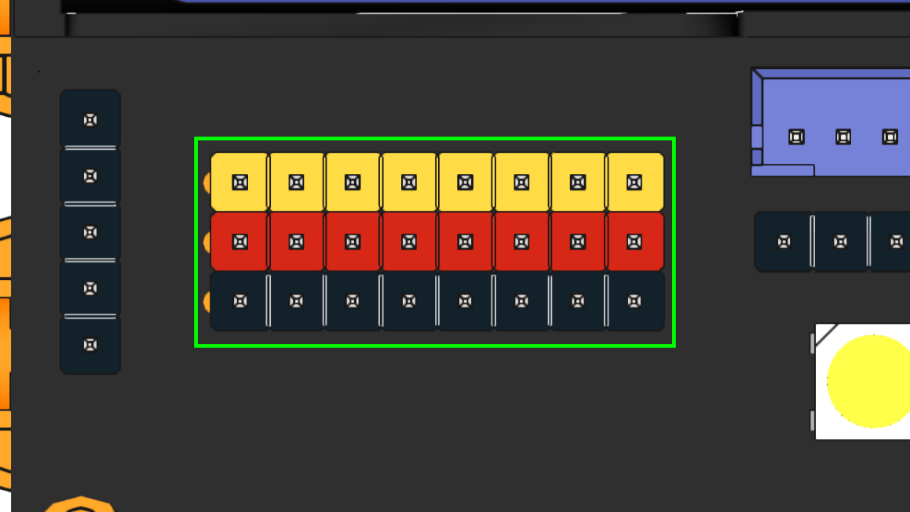
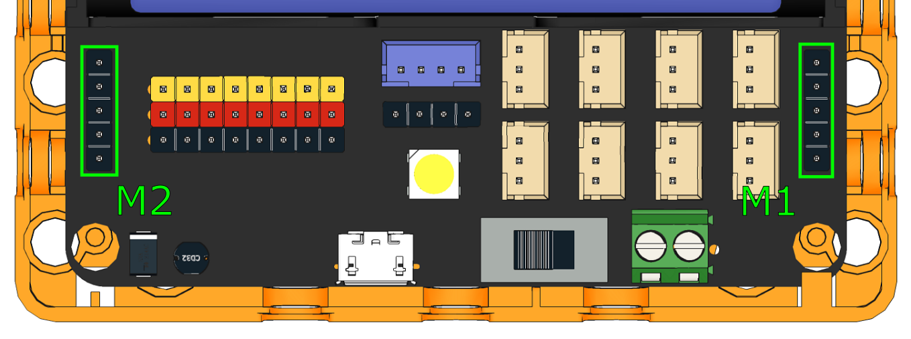
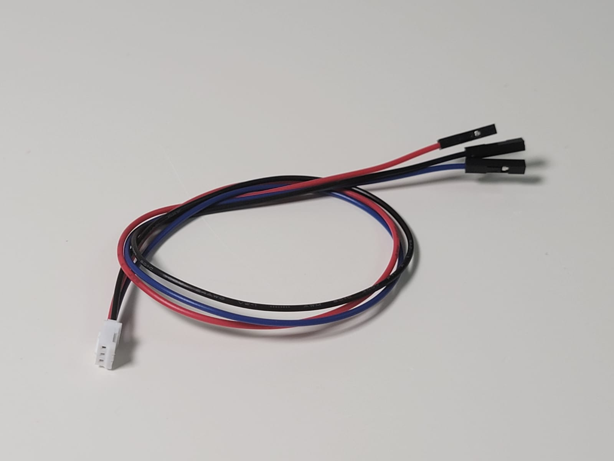
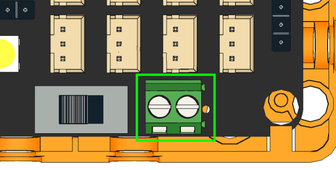

# Robotbit Edu 介紹


Robotbit Edu是Kittenbot旗下長青擴展板Robotbit的最新版本。這擴展板的最大特點是它將Robotbit的強大驅動力和Armourbit的防反插設計結合起來。Robotbit Edu將原本Robotbit的杜邦針頭換成PH2.0的3 Pin防反插接口，令接線變得更簡易。而且亦都保留了Robotbit的4個電機接口和8個舵機接口，讓Robotbit Edu仍然擁有強大驅動力。

## 適用對象

- 學校STEM教學
- 擁有Microbit、Meowbit或未來板的用家
- 創客

## 產品特色

- 強大驅動力
    - 可以同時驅動最多8隻舵機與4隻電機或2隻步進電機
- 防反插接線設計
    - 採用PH2.0 3Pin防反插接口，令接線更輕鬆
- 配套專用的保護殼
    - 不但提供保護，還提供標準樂高孔和M3螺絲母的連接方式
- 供電充電一體化
    - 統一供電到所有輸出位置，電源穏定
    - 自帶18650電池座，可選以鋰電池供電到板上所有輸出位置(方便之選)
    - 自帶USB充電口與電源指示燈
    - 亦可選擇以外部電源輸入方式，以電池盒供電 (提升動力之選，最高可輸入6V電壓，即4粒1.5V 3A/2A電池)
- 帶有電源管理和保護電路
    - 能夠避免電池過放過充等的危險情況，短路時亦都會有適當保護
- 自帶燈光功能
    - 板上設有全彩LED燈
- 支援多款主控板
    - 完美支援Micro:bit，Meowbit與未來板
  
## 產品參數

- 尺寸：78 x 57 x 23 mm
- 重量：37.5g
- 小孔直徑：3.0mm
- 大孔直徑：4.8mm
- 供電方式：5V USB供電，4.2~3.7V 鋰電池供電
- Vin外部輸入：最大6V3A
- 工作電壓：3V/5V，18650鋰電池最大輸出1A

## 詳細板載資源介紹




1. PH2.0 3Pin IO接口x8
    - 在Robotbit Edu上使用傳統感應器可以使用3芯轉杜邦線(另購)
2. I2C通訊接口x1
3. 串口通信接口x1
4. 電機接口x4(最多可接2隻步進電機)
5. 舵機接口x8
6. 蜂鳴器
7. 全彩LED燈x1
8. 18650電池座
9. VIN外部電源輸入
10. USB充電接口

### 18650電池座



收到擴展板首先安裝18650鋰電池，注意電池正負極，切勿裝反！  

當第一次安裝電池時，Robotbit處於待激活狀態，啟動電源後電源燈不亮，此時需要短按一下電池保護激活按鈕或連接USB供電，使Robotbit進入正常工作模式。
（如果你重新安裝電池，就需要操作這個步驟） 

### 電源開關



開關打開後（撥向綠色端子那邊為打開開關），為Micro:bit和擴展板的接口供電。（擴展板需要裝上18650電池） 

### Micro USB充電口


電腦供電或任意5V 1A或者1A以上的手機充電器均可為18650鋰電池充電。  
5V1A的充電器約2.5小時充滿，建議充電時關閉電源。   
充滿會自動截止，指示燈變綠。**充滿電後請把USB 拔走, 不宜長充, 同時請細閱讀盒內附帶之"鋰電池使用貼士"。** 

```
attention: 只能用於充電, 不是用於下載hex程式
```
### 電源與電量指示燈                                                                                                                                                                                                                                                          
   


Led（3）為電源指示燈，打開開關後常亮   
Led（1）為充電指示燈，充電過程中常亮，電量充滿後Led（2）常亮

### 主板插槽                                                                                                                                                                                                                                   



用於安裝主板。

Robotbit支援Micro:bit，Meowbit和未來板。

### 全彩RGB LED



可以編程的全彩LED燈，連接在Robotbit的Pin 16。

### 8路舵機標準3Pin接口



- 8路舵機實際通過專門的舵機擴展驅動芯片與Micro:bit的I2C口控制,而非IO口控制。


      ```
      attention: 舵機接口不能作為普通IO口使用, 只能驅動舵機 
      ```
  
- 擴展板在18650電池狀態下，最多能支持8個9g舵機（總電流<2A），禁止使用MG995等大電流舵機，以免燒壞擴展板 。

- 擴展板在外部電源接口（綠色端子）供電狀態下（5V 3A或者3A以上），最多能支持總電流不超過3A的舵機。 

### DC motor 直流電機 x 4  或 Stepper Motor 步進電機 (28BYJ ) x 2                      



在隨香港代理選購的電池下工作，一共可以同時控制4個（左右兩側合計）TT馬達，或者2個步進電機（與舵機合計總電流＜2A），禁止接大電流DC 馬逹和大電流步進馬逹 (建議選配Kittenbot的馬逹) ，以免燒毀擴展板 。  

支持直流電機與步進電機混合使用（2個直流電機與1個步進電機）（與舵機合計總電流<2A）  

### 3Pin IO接口                                                                                                                                               


P0-P2、P8、P12-P15轉出到擴展板上8個3 Pin的防反插PH2.0接口，方便接駁不同模組或感應器。



假如你想使用傳統杜邦接線的感應器，KittenBot亦有提供3Pin轉杜邦接口的線材。

### I2C接口與串口通信接口


I2C接口採用4Pin的PH2.0防反插接口，可插接I2C模塊。

串口通信接口接口採用杜邦線接口，可插接4Pin模塊。


### 2PIN外接電源端子                                                                                                                                                                            



- 雖然有防反接功能，但接線仍需要註意正負極。

- 外接線端子支持DC 5V的外部電源供電，推薦5V 2A以上電源供電以滿足拓展板驅動高扭矩舵機的電流需求。         

- 內部電源供電時，舵機VM接口電源為18650電池電壓3.7V；當使用外部電源供電時，舵機VM接口的電壓為5V 負載電流最大3A。  

  

## MakeCode編程教學

Robotbit Edu的編程方法與Robotbit是一樣的，詳細的MakeCode編程教學可以參考：

[Robotbit在Makecode上編程教學](./robotbitMC.md)

## Kittenblock編程教學

Robotbit Edu的編程方法與Robotbit是一樣的，詳細的KittenBlock編程教學可以參考：

[Robotbit在KittenBlock上編程教學](./robotbitKB.md)

## FAQ常見問題與解答

### 電池插上去沒有，打開開關沒有反應？

檢查是否已經按了電池激活按鈕？   
檢查電池正負是否接反？   
檢查電池是否有電？   

----------

### 電池激活按鈕用什麽用？

在過流，或者短路，或者打開開關插拔電池這些瞬間異常大電流情況下，電池保護芯片會啟動工作，保護電路的安全性。點擊電池激活按鈕，即可恢復正常工作模式 。

----------

### 插上USB電腦找不到Microbit

Robotbit上的Micro USB插口只能用於充電，不能用於下載程序。USB插到Robotbit上，電腦是不會有反應的。

----------

### 電池插反會不會燒毀Robotbit？

不會，robotbit的設計考慮到一般性失誤操作而做了防反接處理。插反不會供電但亦請盡量避免!

----------

### Microbit插反會不會燒毀Robotbit？

不會，另外Microbit插反只會不運作。

----------

### Microbit上可編程IO口不止8個剩下的都去哪裏了？

Microbit上可編程IO口接近20個，但是很多已經與板子上的點陣按鍵覆用了。考慮到覆用帶來的不方便性對，新手容易帶來誤解，Robotbit 引出了8個（跟micro:bit自身沒有覆用的IO口）已經完全足夠應對日常的DIY。      
如果你對IO數量有狂熱的追求，可以選擇喵家另外一款擴展板IObit。

----------

### 舵機排針可以當編程IO口使用嗎？

不能，舵機s1-s8使用專門的舵機驅動芯片拓展出來，只能用於舵機驅動。

----------

### 電機接口那邊的VM有什麽用？

平時使用直流電機是用不到VM，直流電機只需要插A+A-或者B+B-。使用4相5線步進電機的時候，剛好VM就用上了，詳細請看[Robot:bit 2.0 詳細使用手冊](https://goo.gl/9E3c6Q) 。

----------

### 板子可以放在金屬表面或者潮濕環境下使用嗎？

不行，會短路的，要註意絕緣。使用前請套上隨盒附送的底座。

[底座安裝示範](https://youtu.be/FhimDxoAsj4)

----------

### 綠色端子外部電源應該接幾V電源？插高壓電會燒壞嗎？

只能接不高於6V。高於6V都會燒毀板子，電流建議2~3A，也就是說板子最大支持的電流是3A。

----------

### 我按照教程做得，得不到實驗結果

如果實驗得不到對應的結果，請首先檢查自己的接線和程序，一般就是有些小地方遺漏了，請再三檢查下。   

-----------

### 電路板好像燒壞了，有保養嗎？

Robotbit在工廠出廠都進行過硬件程序測試，保證了功能的完好性。   
首先先排除下是不是程序使用問題。如果你確定燒壞了，可以聯絡供應商作評估。

如評估結果為非人為損壞或自然損耗, 銷售期1年內憑單據, 香港代理會作出更換。
