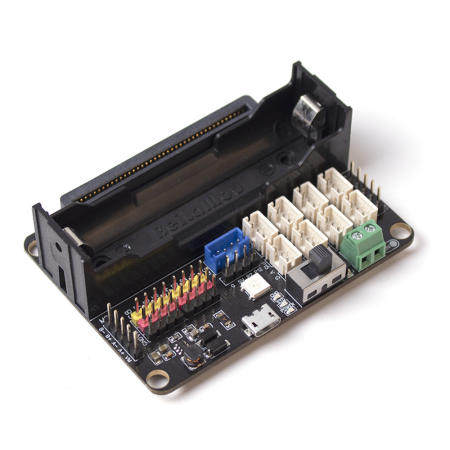
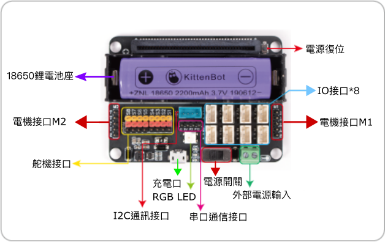

# Robotbit Edu 介紹

Robotbit Edu是Kittenbot旗下長青擴展板Robotbit的最新版本。這擴展板的最大特點是它將Robotbit的強大驅動力和Armourbit的防反插設計結合起來。Robotbit Edu將原本Robotbit的杜邦針頭換成PH2.0的3 Pin防反插接口，令接線變得更簡易。而且亦都保留了Robotbit的4個電機接口和8個舵機接口，讓Robotbit Edu仍然擁有強大驅動力。

## 適用對象

- 學校STEM教學
- 擁有Microbit、Meowbit或未來板的用家
- 創客

## 產品特色

- 強大驅動力
    - 可以同時驅動最多8隻舵機與4隻電機或2隻步進電機
- 防反插接線設計
    - 採用PH2.0 3Pin防反插接口，令接線更輕鬆
- 配套專用的保護殼
    - 不但提供保護，還提供標準樂高孔和M3螺絲母的連接方式
- 供電充電一體化
    - 統一供電到所有輸出位置，電源穏定
    - 自帶18650電池座，可選以鋰電池供電到板上所有輸出位置(方便之選)
    - 自帶USB充電口與電源指示燈
    - 亦可選擇以外部電源輸入方式，以電池盒供電 (提升動力之選，最高可輸入6V電壓，即4粒1.5V 3A/2A電池)
- 帶有電源管理和保護電路
    - 能夠避免電池過放過充等的危險情況，短路時亦都會有適當保護
- 自帶燈光與聲效功能
    - 板上設有蜂鳴器與全彩LED燈
- 支援多款主控板
    - 完美支援Micro:bit，Meowbit與未來板
  
## 產品參數

- 尺寸：78 x 57 x 23 mm
- 重量：37.5g
- 小孔直徑：3.0mm
- 大孔直徑：4.8mm
- 供電方式：5V USB供電，4.2~3.7V 鋰電池供電
- Vin外部輸入：最大6V3A
- 工作電壓：3V/5V，18650鋰電池最大輸出1A

## 板載資源介紹

1. PH2.0 3Pin IO接口x8
2. I2C通訊接口x1
3. 串口通信接口x1
4. 電機接口x4(最多可接2隻步進電機)
5. 舵機接口x8
6. 蜂鳴器
7. 全彩LED燈x1
8. 18650電池座
9. VIN外部電源輸入
10. USB充電接口

## MakeCode編程教學

Robotbit Edu的編程方法與Robotbit是一樣的，詳細的MakeCode編程教學可以參考：

[Robotbit在Makecode上編程教學](../Robotbit/robotbitMC.md)

## Kittenblock編程教學

Robotbit Edu的編程方法與Robotbit是一樣的，詳細的KittenBlock編程教學可以參考：

[Robotbit在KittenBlock上編程教學](../Robotbit/robotbitKB.md)