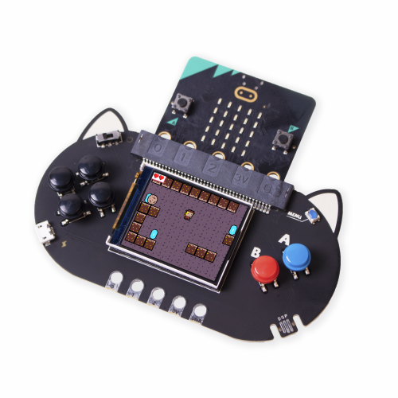
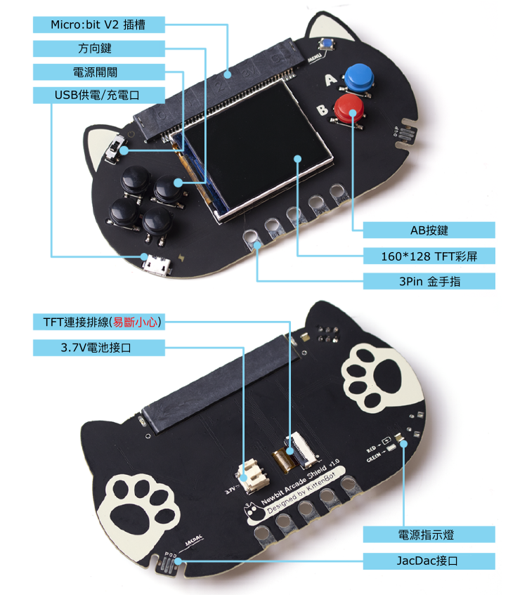
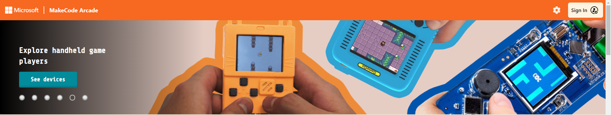
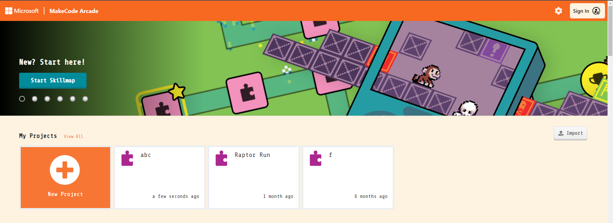
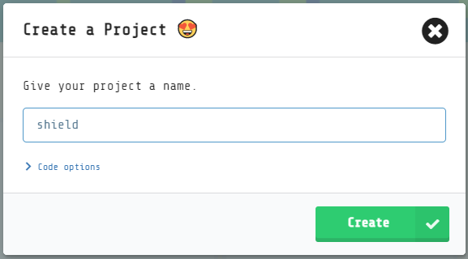
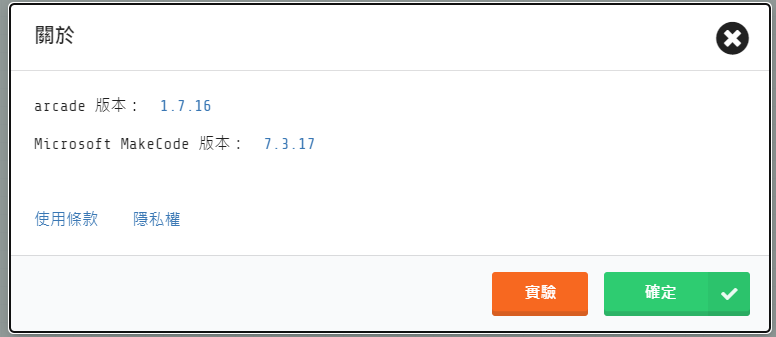
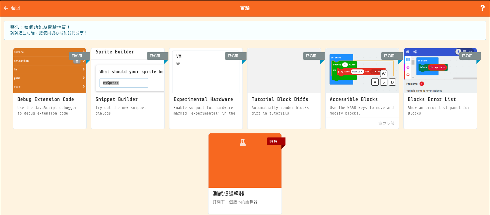
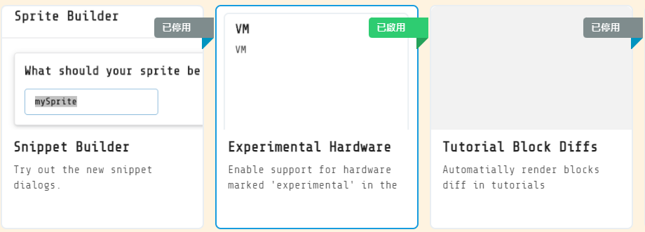
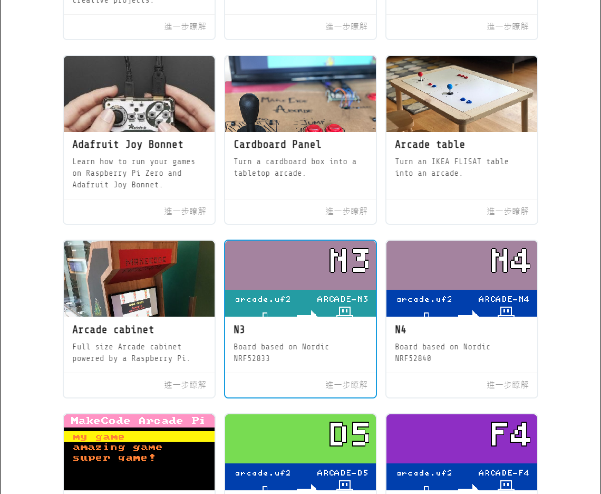
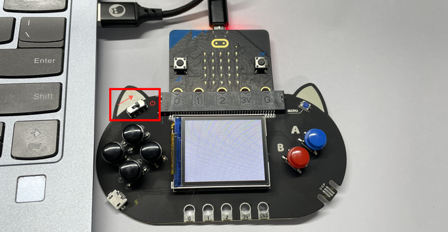

# Newbit Arcade Shield擴展板

因應Microbit V2的硬件性能提高，Kittenbot特意為Microbit V2設計出Newbit Arcade Shield，賦予Microbit V2可編程遊戲的能力。透過Microsoft MakeCode Arcade可以實現圖像化的遊戲編程並且下載到V2上遊玩，亦都可以把擴展板當作遙控器使用。

## 產品參數

尺寸: 115 x 65 x 17.5 mm
重量: 35g
供電方式: Micro USB(5V)/鋰電池(3.7V)
板載資源: 160*128 TFT顯示屏, 方向鍵*4, AB按鍵, 3Pin 金手指, Micro USB供電/充電接口, JacDac接口, 電源指示燈

## 產品詳細

## 編程教學

### 前往Microsoft MakeCode Arcade

[Microsoft MakeCode Arcade](https://arcade.makecode.com/)

### 開新專案

### 打開『關於』欄

### 點擊『實驗』

## 啟用『Experimental Hardware』
## 這設定只需完成一次，不需要之後每次都設定

## 選擇硬體

## 選擇『N3』

## 下載到Micro:bit V2上

## 打開電源

