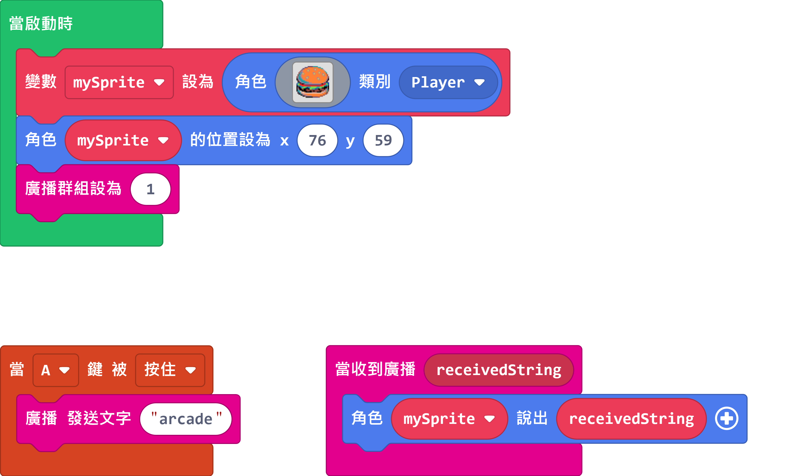
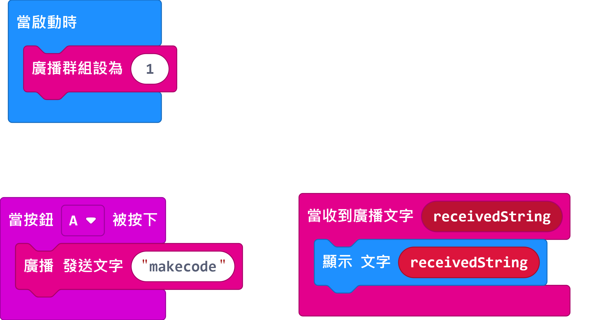

# 使用Newbit Arcade Shield作為遙控器教學

Newbit為Micro:bit V2帶來了多個操控按鍵，這些按鍵除了用作遊戲控制的用途之外，亦都可以用作遙控器之用，可以實現MakeCode Arcade與MakeCode之間的通信。

## Newbit Arcade Shield在MakeCode Arcade中編程教學

[參考程式](https://makecode.com/_Wfb9qX4JeXLU)

## Micro:bit在MakeCode中編程教學

[參考程式](https://makecode.microbit.org/_V7eEK0PzLC2p)

