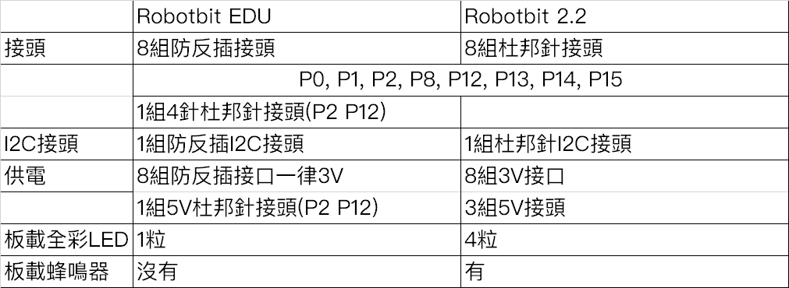
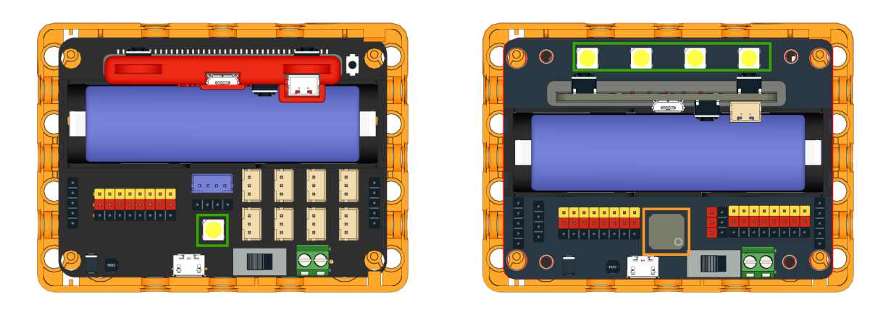

# Robotbit EDU與Robotbit 2.2的分別

Robotbit EDU是Robotbit的新版本，在設計和功能上面均有分別。

## 兩者分別一覽

## 兩者分別詳解

### 分別1: 接頭

綠色：IO接頭

橙色: I2C接頭

Robotbit EDU主要使用PH2.0防反插接頭，令接線更簡單。

Robotbit 2.2主要使用杜邦針接頭，令接線更靈活。

### 分别2: 板載資源

綠色： 全彩LED

橙色: 蜂鳴器

Robotbit EDU有1粒全彩LED。

Robotbit 2.2有4粒全彩LED和蜂鳴器。

