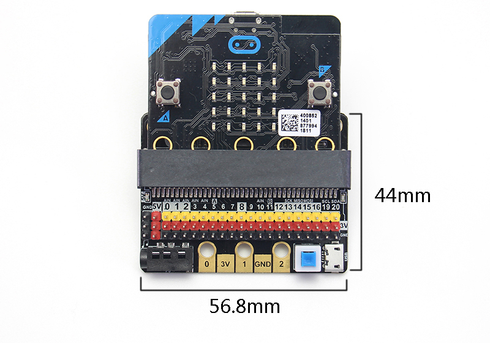

# IOBit 入門擴展板

IOBit(HKBC8009A)

IOBit是一款為Microbit而設計的入門擴展版，而名稱當中的I和O分別代表Input(輸入)和Output(輸出)，顧名思義IOBit就是將Microbit的IO引腳拉出，讓大家可以自主控制所有IO引腳。

## 產品介紹

IOBit是一塊價錢較低的Microbit入門擴展板，它將Microbit的引腳全部拉出，讓大家可以用杜邦線輕易使用Microbit引腳。IOBit上還配有蜂鳴器和3.5mm音頻接口。而且亦有電源接口，為您的硬件提供5V或3V供電。板上還保留了鱷魚夾金手指，方便喜歡使用鱷魚夾的大家。

## 產品特色

1. 將Micro:bit的全部引腳引出為常用的2.54間距3PIN排針形式，絲印標記詳細，並且以黑紅黃三色區分地、電源和信號腳
2. 板載短路保護及自恢復保險絲，有效避免接線錯誤引致燒板等安全隱患
3. 保留Micro:bit的金手指，讓部分Micro:bit慣性用戶延續使用習慣
4. 2個標準樂高插孔，輕易結合於樂高機械結構

## 產品參數

- 尺寸：56.8x44x12 mm
- 供電方式：USB 5V供電/Micro:bit電池盒3V供電
- 輸出電壓：3.3V~5V，最大1A

## 板載功能

- 3組IO金手指
- 蜂鳴器及開關
- 3.5mm耳機插頭
- 5V USB插口
- 電源開關按鈕

### 5V供電

1. 插入USB電源
2. 按下電源按鈕
3. 電源顯示燈會亮起
4. 此時就可以使用左邊的5V插口

### P0蜂鳴器開關

此撥動開關用以開關P0蜂鳴器功能

## 介紹短片

## 使用注意事項：

1. 請勿使用大功耗元件，例如大舵機、電機。否則很容易會燒壞Micro:bit！
2. 使用5V電源時，可以驅動多個小舵機，但是注意電流不可以超過1A。
3. 使用P0時需要將蜂鳴器開關撥向關，否則蜂鳴器會誤鳴。
4. 使用Micro:bit的點陣屏引腳(P3~P11)時，需要禁用點陣屏，否則點陣屏會亂亮。
5. USB輸入電流不可以超過1A。