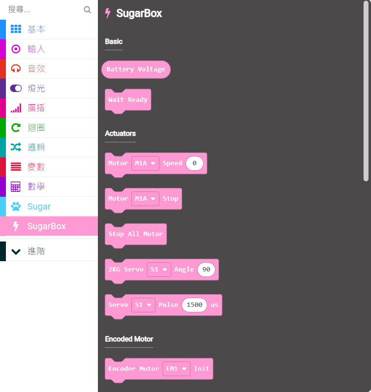
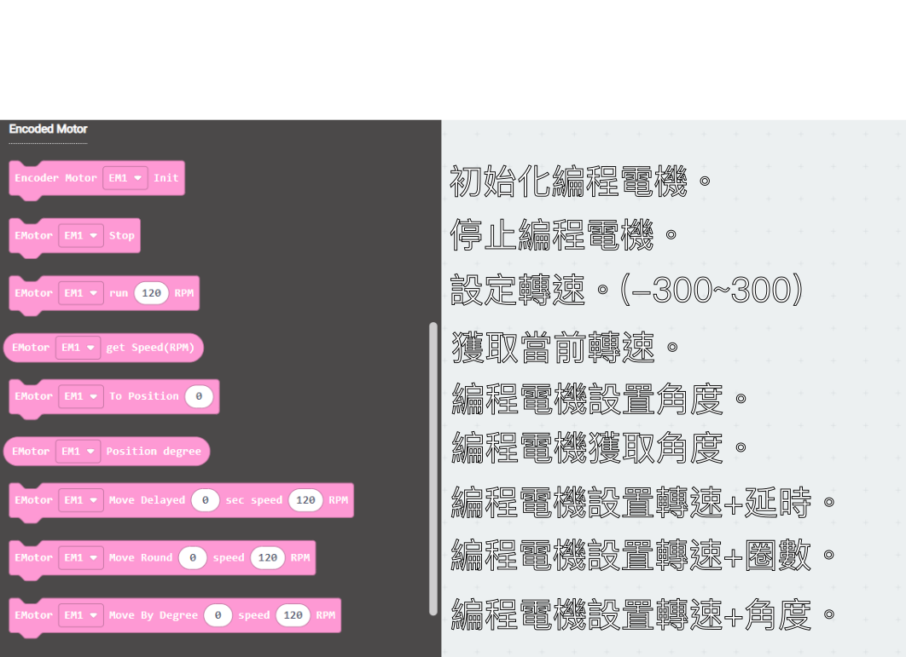
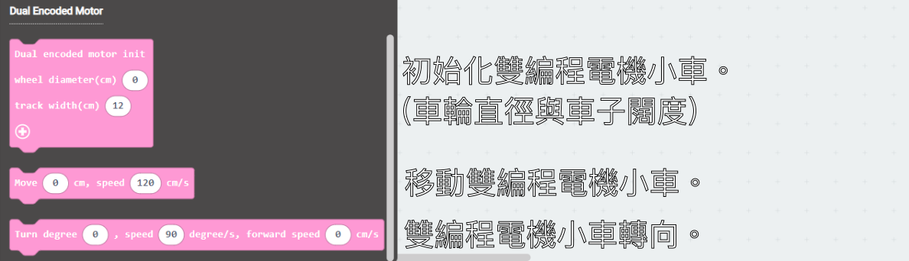

# SugarBox在MakeCode編程教學

## 加載Sugar插件：https://github.com/KittenBot/pxt-sugar

### [詳細方法](../../Makecode/powerBrickMC)

### SugarBox積木塊

### MakeCode編程教學

## 插件版本與更新

插件可能會不定時推出更新，改進功能。亦有時候我們可能需要轉用舊版插件才可使用某些功能。

詳情請參考: [Makecode插件版本更換](../../Makecode/makecode_extensionUpdate)