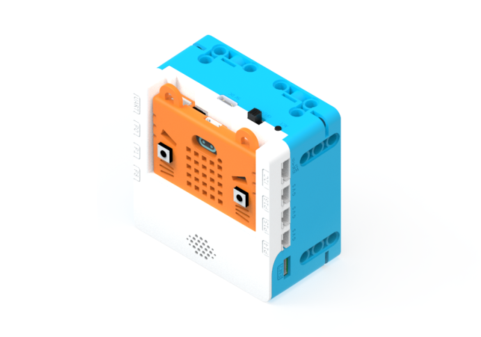
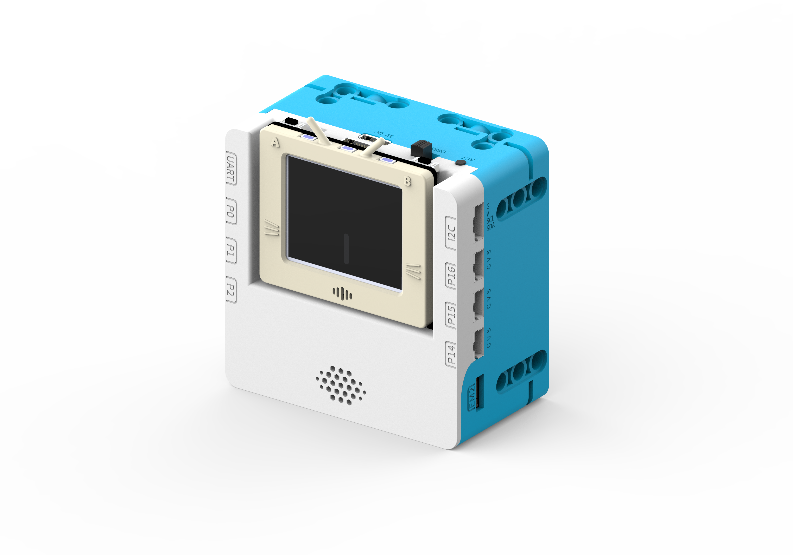
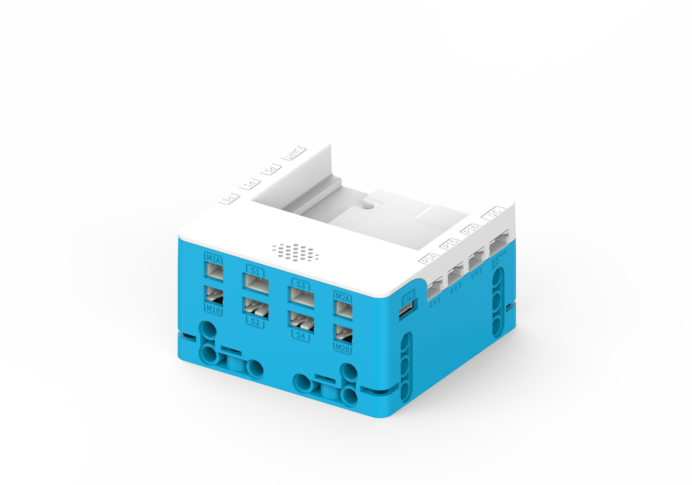
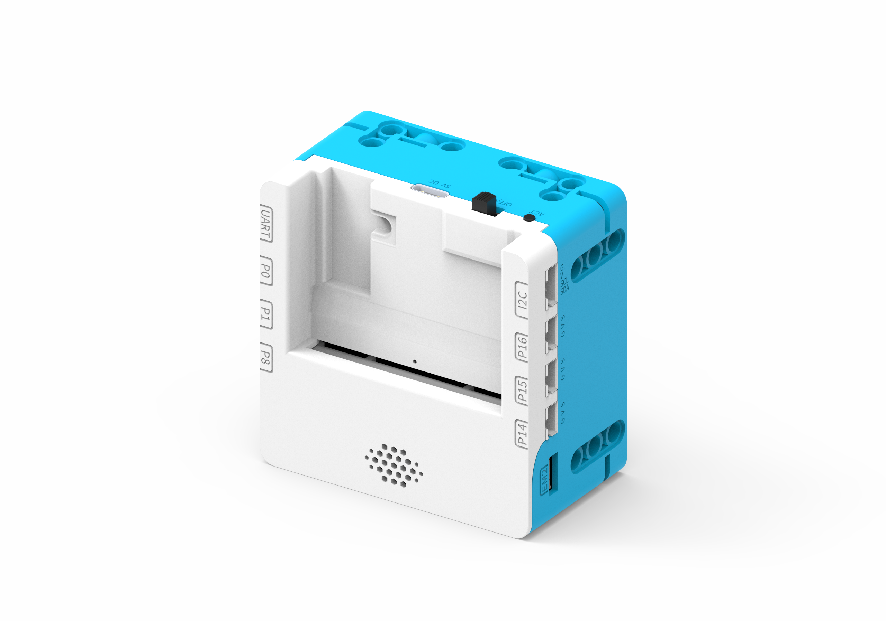
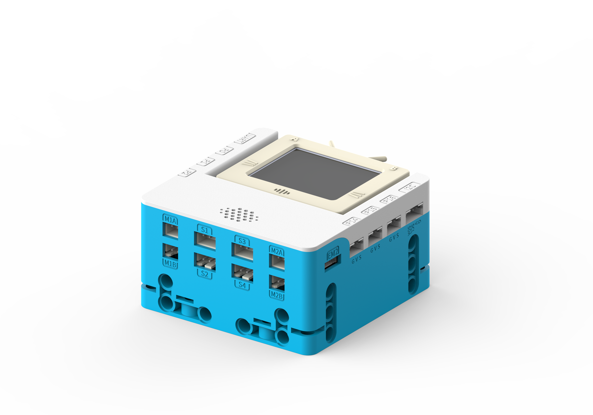

# SugarBox擴展盒

SugarBox是Kittenbot旗下最新的擴展盒，它是為未來版和Micro:bit而設計的，它的特點在於它的動力來源。SugarBox使用的是2顆18650的鋰電池，為SugarBox提供強大的動力以及續航力。

SugarBox顧名思義，是為了Sugar系列的模組而設計，能夠透過防反插排線接駁8隻模組。SugarBox亦都提供4組電機與4組舵機接口，並帶有2組創新的編程電機接口，為大家的創作帶來強勁的驅動力。SugarBox亦都內置電源監察系統，能夠透過主控板使用I2C得知當前電壓與電量等的資訊。將SugarBox搭配未來版使用，更可以利用喇叭播放各種音頻。

SugarBox採用全包裹的設計，不但美觀亦都能夠提供全方位的保護，在擴展盒的5面都設有樂高積木孔，方便搭建出各種創作。

## 產品特色

- 驅動能力強
    - 擁有足夠5V動力驅動舵機，電機及編程電機
- 全包裹結構
    - 整個外殼都採用堅硬的膠殼做保護，不單止美觀，最重要的是能夠提供全方位的保護
- 兼容樂高積木
    - 在擴展盒5面都設有兼容樂高的積木孔，方便設計各種結構
- 續航能力強勁
    - 使用2顆18650鋰電池，一共提供7.4V的充足電源，總電量高達5200mah，確保持久的續航力
- 板載喇叭
    - 配合未來板使用，可以透過板載喇叭播放各種音頻
    
## 產品參數

- 尺寸: 72 x 72 x 40 mm
- 供電方式: 7.4V 2顆18650鋰電池，5V USB Type C充電口
- 工作電壓: IO口最大輸出3.3V 1A，電機舵機最大輸出5V 2A
- 板載資源: 6組3PIN IO口、I2C接口、UART接口、4組舵機接口、2組編程電機接口、1W喇叭、電量檢測電路、電源／充電指示燈、USB Type C充電口、短路保護電路
- 支援主控板: Micro:bit、未來板
- 編程平台: MakeCode，KittenBlock

## 產品展示

