# 各IoT平台與MIT AI2編程教學

物聯網的應用很多時都離不開手機應用程式，透過MIT AI2，我們可以輕易地編寫手機應用程式。

## MakerCloud與MIT AI2編程教學

MakerCloud創客雲有官方的AI2插件和教學，詳情請參考：

[MakerCloud官方教學](https://learn.makercloud.io/zh_TW/latest/ch4_connect/ai2/connect_ai2/)

## ThingSpeak或其他IoT平台與MIT AI2編程教學

### 一般使用MQTT的IoT平台都可以支援MIT AI2，不過此教學會以ThingSpeak平台作為例子。

由於MIT AI2沒有內建的MQTT支援，請前往以下網站下載第三方的MQTT插件。

[插件下載](https://ullisroboterseite.de/android-AI2-PahoMQTT-en.html)

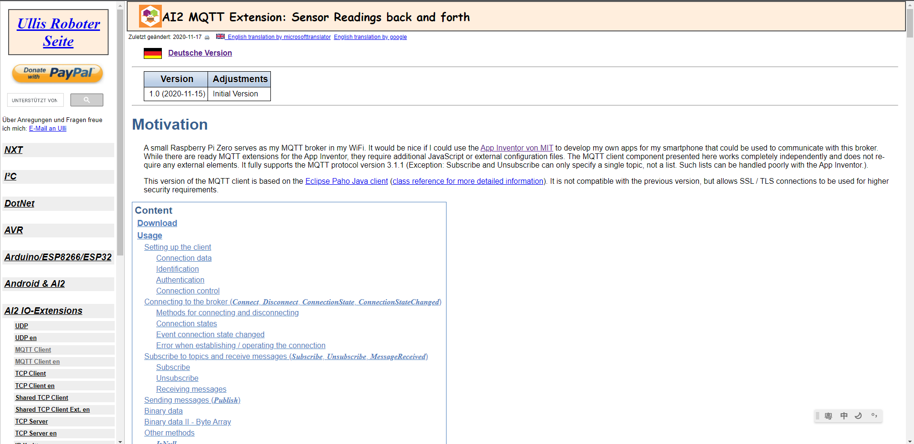

按此下載。

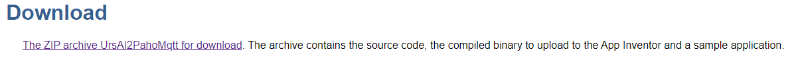

將aix檔案解壓出來。

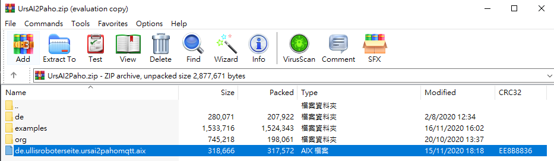

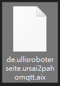

前往MIT AI2網站。

[MIT AppInventor 2](http://appinventor.mit.edu/)

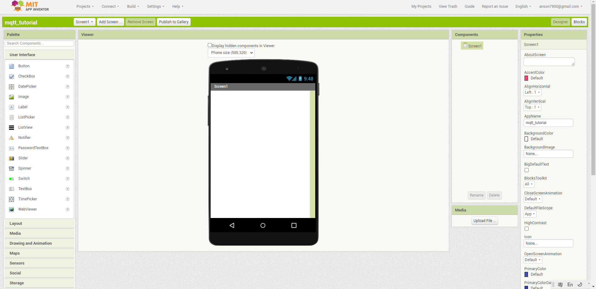

點擊”Extension”。

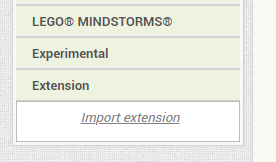

選擇壓縮出來的aix檔案。

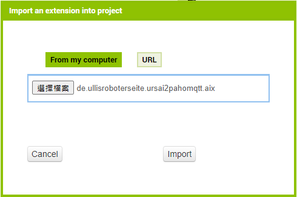

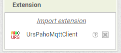

將插件組件加入到介面。

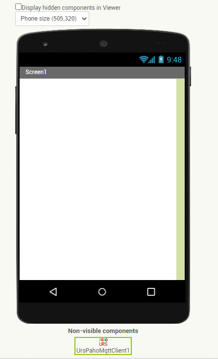

在Broker一欄中填入IoT平台的地址。clientID按平台要求填寫。

由於我們現在使用ThingSpeak平台，所以請填入mqtt3.thingspeak.com。

在clientID一欄裡填入ThingSpeak的client ID登入資料。

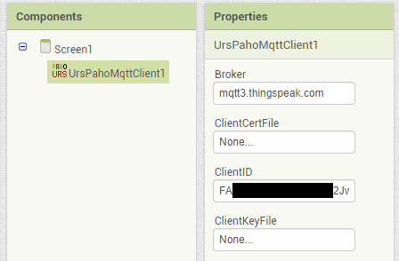

按平台的需要填入username和password。由於我們使用ThingSpeak平台，請填入username和password。

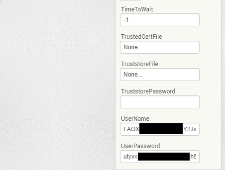

## 在AI2連接到MQTT平台

設定登入資料後並不代表已經連接IoT平台，請按下圖搭建程式。

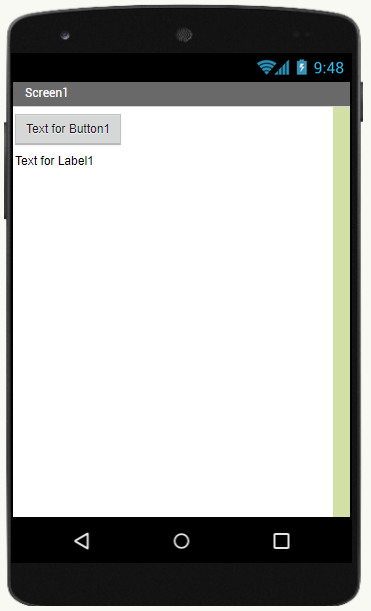

轉換到編程介面並搭建以下程式。

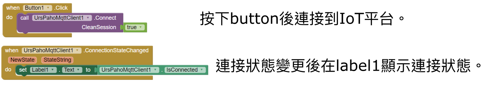

測試程式，按下按鈕後文字變為true代表成功連接到IoT平台。

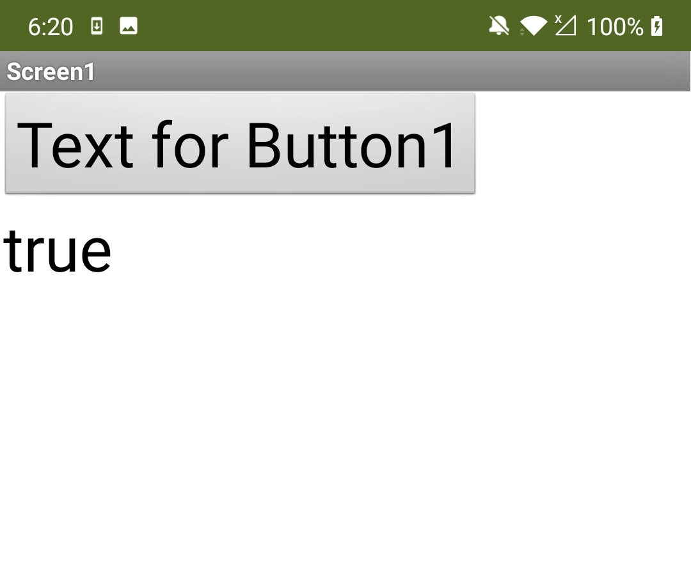

## 在AI2發佈信息到IoT平台

成功連接IoT平台之後就可以開始向IoT平台發佈信息。

請在介面裡加入一個按鈕，輸入Random Num。

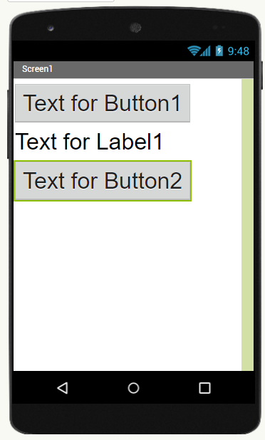

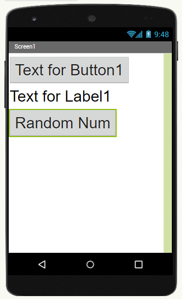

切換至編程模式，搭建以下程式。

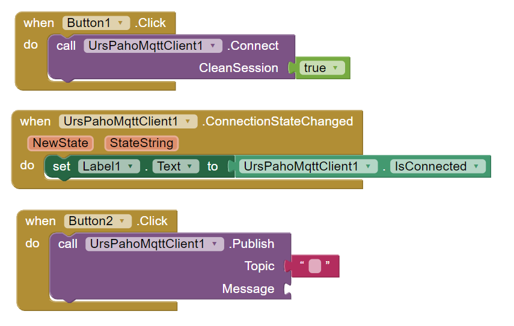

在topic的一欄裡面填入主題名稱。本教學將會按照ThingSpeak的格式填寫。

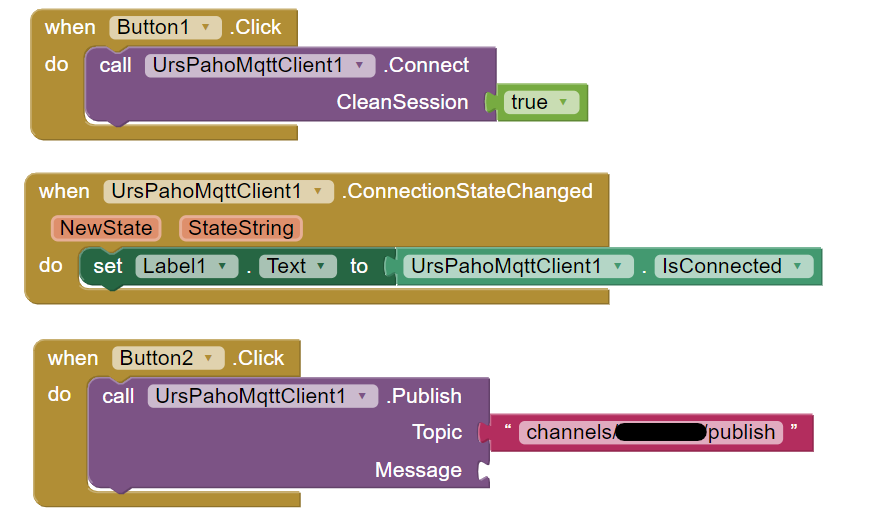

在message一欄裏面填入要發佈的信息。將隨機取數放到數據訊息裡面。

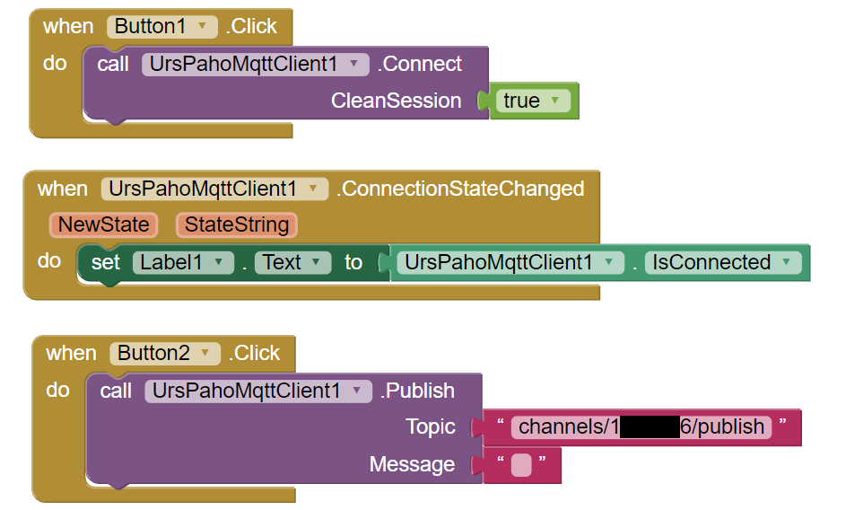

對於ThingSpeak的編程，請使用join將數據欄與數據訊息合併。

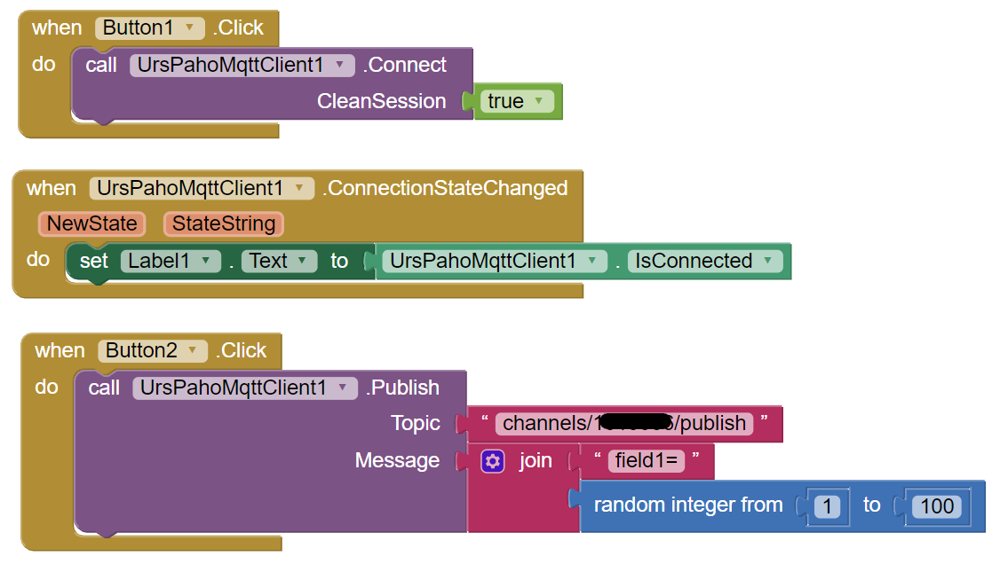

測試程式，連接IoT平台之後按下按鈕發布隨機數字到IoT平台。

成功之後在ThingSpeak會看到剛發佈的數據。

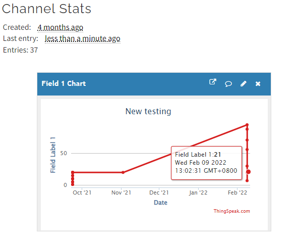

## 在AI2收取IoT平台的訊息

成功發佈數據之後，就可以試試在AI2收取數據。

在介面裡面新增一個文字label。

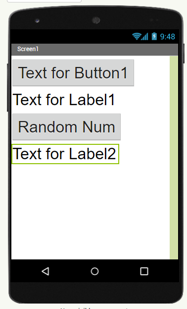

切換到編程介面，加入積木訂閱MQTT話題。

在話題欄裡填入要訂閱的MQTT話題。QoS請按照平台需要填寫，ThingSpeak用戶只需要填0。

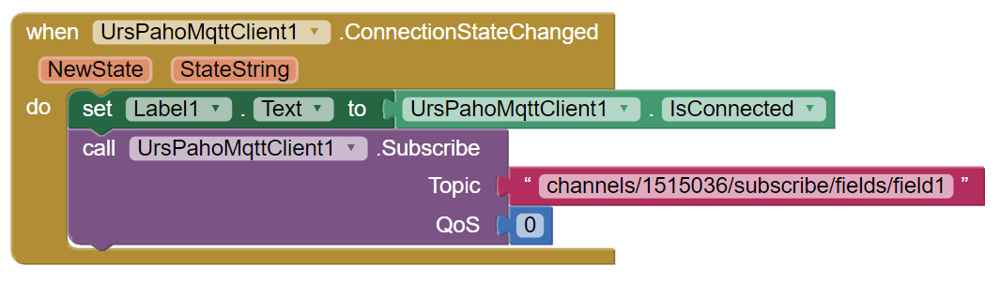

加入積木，當訂閱話題收到訊息之後觸發事件。

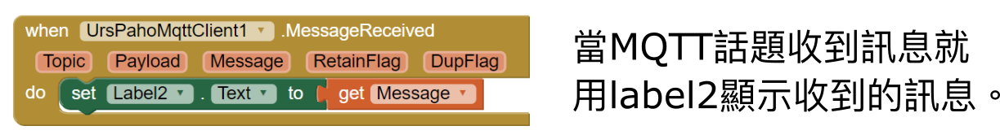

測試程式，連接IoT平台後按下發布按鈕，發佈的數據會在ThingSpeak和程式裡顯示出來。

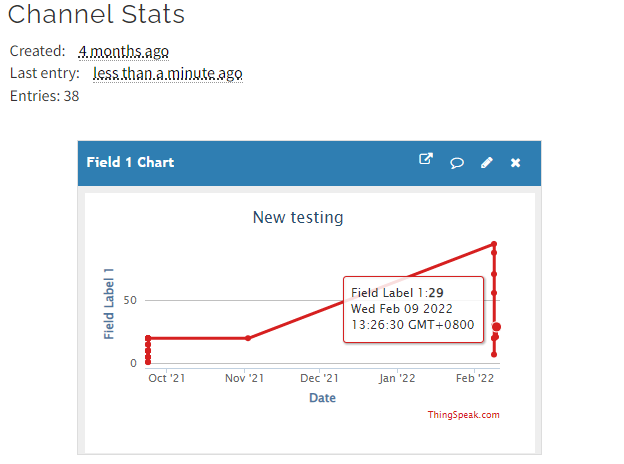

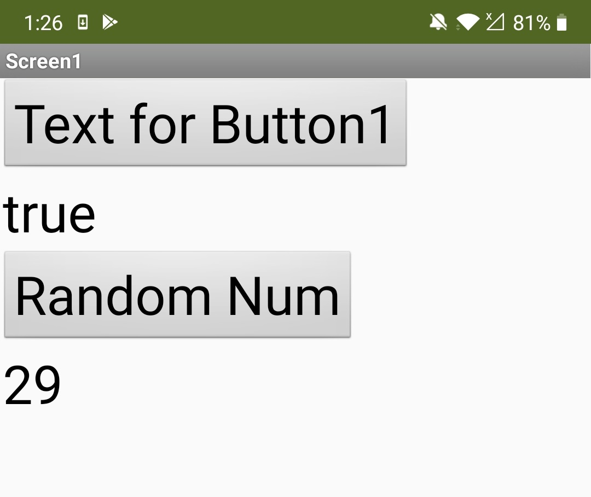

## 下載AI2參考程式

大家可以下載以下參考AI2程式，只要填入ThingSpeak的登入資料就可以不需任何編程試玩MIT AI2與IoT平台的互動。

[AI2參考程式下載](https://drive.google.com/file/d/1g0Bf8zQGRk6PEBNDGzEWxrBTcfsoehhQ/view?usp=sharing)