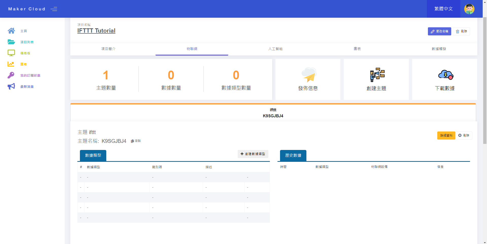
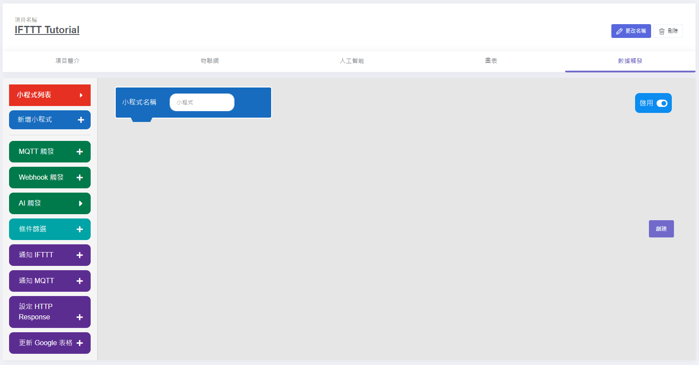
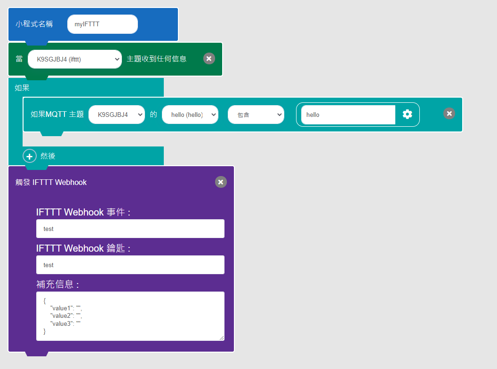
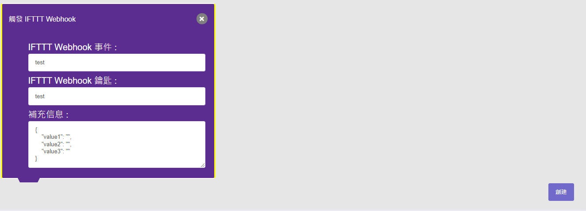
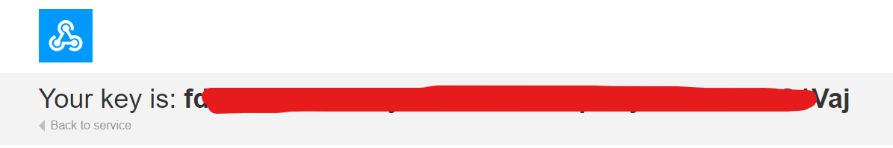
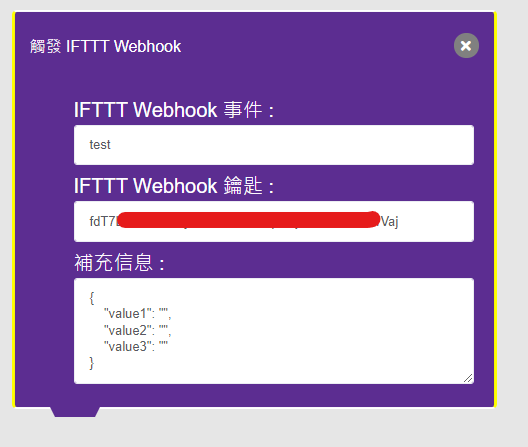
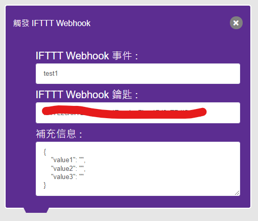
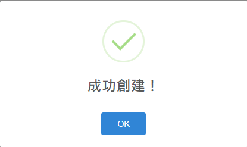

# MakerCloud x IFTTT應用教學

透過IFTTT，我們可以將IoT項目升級，做到更多不同的應用，例如自動發電郵，Telegram訊息等。

MakerCloud平台上已經有容易使用的工具，讓大家可以快速地建立IFTTT的應用。

## MakerCloud官方教學

MakerCloud有提供官方教學，一切以MakerCloud官方教學為準。

### 第一步：數據觸發教學

### [數據觸發教學](https://learn.makercloud.io/en/latest/ch9_event_trigger/event_trigger/smartrack_ET/)

### 第二步：數據續發IFTTT教學

### [數據觸發IFTTT教學](https://learn.makercloud.io/en/latest/ch9_event_trigger/ifttt/smartrack_IFTTT/)

## MakerCloud x IFTTT應用教學

### 以下內容由KittenBot HK撰寫，一切以官方教學作準。

### 第一步：數據續發

首先前往MakerCloud，建立新或者選擇一個項目，並建立一個話題。

前往數據觸發頁面。

搭建出以下數據觸發小程式。

在webhook事件和鑰匙先隨便填入資料，然後點擊創建。

### 第二步：設立IFTTT

前往IFTTT並註冊或登入帳號。

建立新程式。

在If This的選項裡選擇Webhooks。

選擇Receive A Web Request。

假如之前沒有使用過Webhook的話，請點Connect。如曾使用此服務的話可以跳過這步驟。

在EventName裏填入一個事件名稱。

然後選擇Then That。

在這個示範會使用電郵，請選擇email。

選擇Send Me an Email。

使用此服務之前需要先啟動，假如曾使用過就不用理會。

按照指示啟動電郵服務。

可以更改電郵的主旨和內容，現在先全部使用預設。

完成之後就可以按Continue。

然之後需要獲取個人的Webhook資料。前往帳戶的My Services。

選擇Webhooks。

選擇Documentation。

將Your Key複製。

回到MakerCloud的頁面，將Webhook密碼貼到鑰匙一欄上。

在Webhook事件裡填寫你的事件名稱。

完成之後點擊創建。

測試一下對頻道發送訊息，假如訊息與觸發條件吻合，你應該會收到電郵。

