(IoT 平台介紹)

# thingspeak

## 簡介

說到IoT (物聯網)教學, 不能不提[thingspeak](https://thingspeak.com/)

它是一個由Mathworks管理, 強大的IoT 分析服務端平台, 讓用家可以把設備(如sensor)所收集的數據, 經過網絡傳送到該平台上 (REST API / MQTT 協議) , 以圖像型式把數據程現或作雲端數據分析。當然, 我們也可以通過thingspeak進行數據互換, 把由A 點上傳的數據, 推送到B點設備上作進一步判斷或應用, 進行實時數據交換。

thingspeak是其中一個現時最多新手選用的IoT 平台, 有免費版本也有商用版; 對於剛接觸的初學用家而言, 免費版本的thingspeak 是個不錯的選擇。

更多關於Licence[說明](https://thingspeak.com/pages/license_faq)

## 登記帳戶

正式使用thingspeak 前, 我們需先登記一個帳戶; 如上文提及, 一般新用戶可先登記一個免費帳戶進入平台

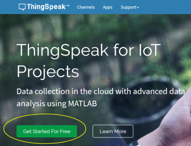

新用戶選Create Acconut; 已登記過的就直接Sign In 便可    

 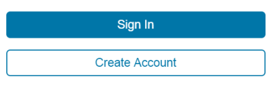

填好資料後便按下Continue

 

在選項上打剔便可繼續登記程序。

 

跟據指示, 到所用的郵箱找回確認電郵並完成第2點的核實程序。**此頁面需保留**

 

在郵件中點選連結, 完成確認程序。

 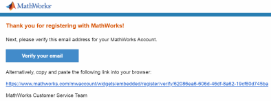

 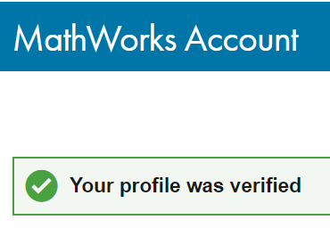

然後我們需要返回上一頁面, 點選第3項的continue

 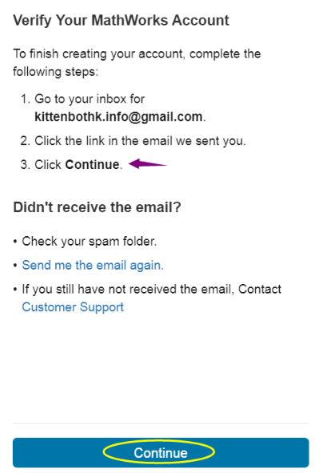

為帳號設定password

 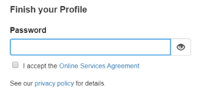

帳號登記成功

 

## 頁面介紹

成功登入後, 我們會看到以下頁面。對於新手而言, 最常到的是**Channels**及右手邊的**Profile icon**

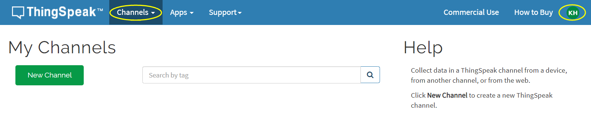

在稍後時間使用到相關內容時會再作說明。

新手也可以到**Support** 中碰運氣, 說不定可以進一步找到有用資訊及例子。

## 設立Channel

Channel 是平台為你而設獨有的雙向頻道; 你可以把數據上傳到你指定的Channel, 同時也可從Channel 中獲取數據。免費用戶最多只能設立4個頻道。

按下New Channel

 

現在我們可以為新設的Channel 設定內容;

** 在輸入內容前, 我們需要理解 **Fields** 的概念

我們可以把具不同意義的數據發送到1條頻道中, 然後數據都會被發配到指定的Field 。換句話, 每個Field就是收集某一指定數據類別的地方, 繼而可生成一個具意思的圖表。

**例子**: 學生想收集101號房的環境數據, 包括光度﹑溫度﹑濕度及聲音指數。

我們可以這樣進行設定

 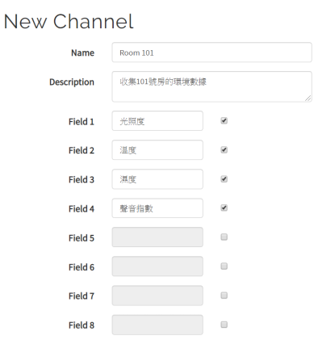

**注意:** 每條Channel 最多只有8個Fields

填寫好內容後按下Save Channel, 系統便會按設定建立了1條獨有的頻道。

[更多設定內容說明](https://ww2.mathworks.cn/help/thingspeak/channel-settings.html)

## Channel 頁面

這就是我們剛才設定的Channel 頁面, 也是用戶常到的位置。

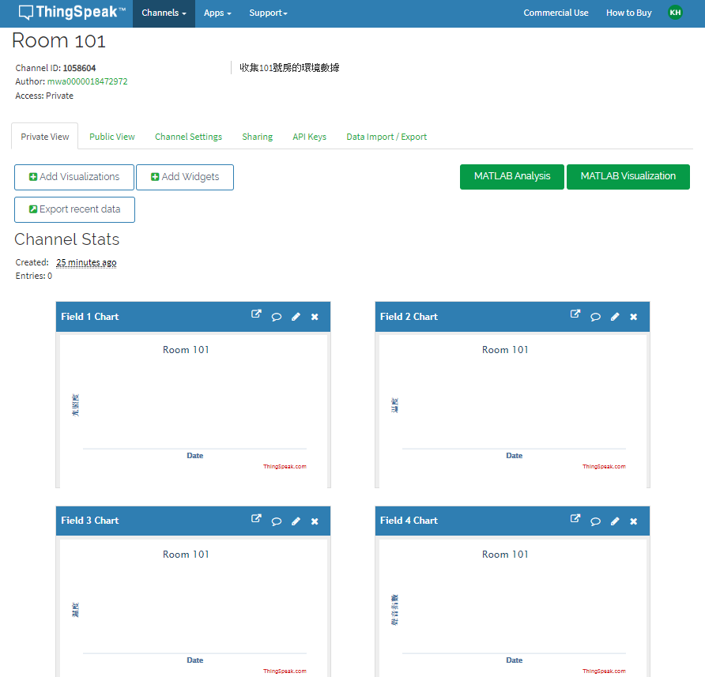

我們可以看到:

1. 一個由系統為Channel 自動生成的獨有ID, 此ID在稍後編程時候會用上, 可以讓我們把想要的數據送到這條Channel 中。

2. 系統自動把頻道設定為Private; 用戶可以在Sharing 中更改狀態為Public。

   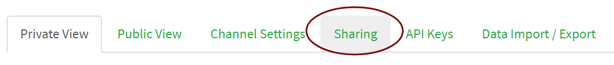

   免費帳號最多設定3個公開Channel。

3. 對應我們在上一步設定的數據類型Field Chat。稍後我們上傳的數據值, 便可在個別Field Chart 中看到。

   e.g. Field 1 Chart = 光照度

    

若想修改Channel 內容, 可以到Channel Setting 進行修改:

 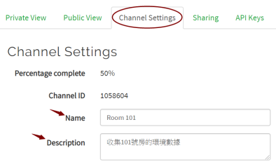

若要從網頁中其他頁面回到指定Channel 頁面, 可按以下步驟進行:

 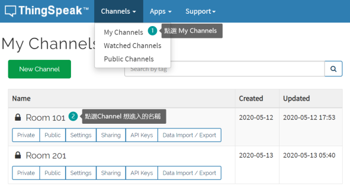

## 發佈與訂閱 (Publish & Subscribe) 須知

**發佈 (Publish)** 與**訂閱 (Subscribe)**是IoT 中2個重要的概念。 簡單來說, 發佈就是把數據推送到Field 中; 相反, 訂閱就是設備從雲端中讀取數據。

 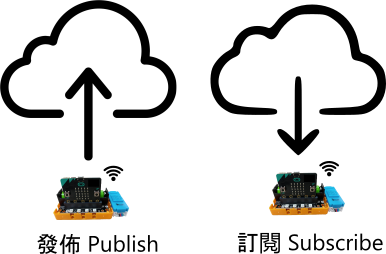

#### 發佈 (Publish)

當我們想把數據發佈到thingspeak 某一Channel時, 需要先獲取該Channel 的**Write API Key**

例如我們想把光亮度發佈到Room 101, 需先到該Channel 頁面, 再進入**API Keys**頁面

 

以下就是Room 101 Channel 的Write API Key , 在編寫發佈程式時就會用上

 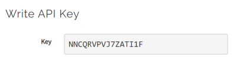

#### 訂閱 (Subscribe)

相對發佈, thingspeak 對訂閱的安全設定比較高; 當我們想要從thingspeak 獲取任何Channel 的數據, 必須先獲得該帳號的MQTT API Key。

在頁面中的右上角, 點選Profile icon 開啟選單, 然後點選My Profile

 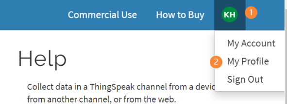

進入頁面後住下拉, 就會看到MQTT API Key, 在下一個關於編程的編章中, 講及如何訂閱Channel時會用上這個 MQTT API key

 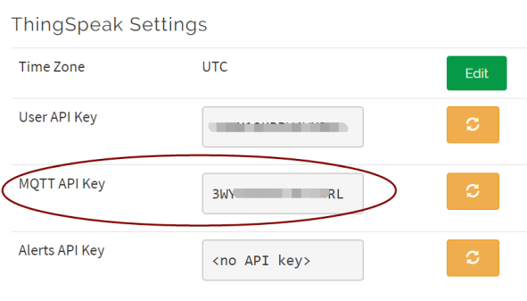

thingspeak 有MathWorks 作為後台, 其付費版含強大的高階功能, 有興趣的發燒友可一步步了解其他功能。

## Makecode 編程與ThingSpeak

[Makecode編程教學](../MakeCode/thingspeak.md)