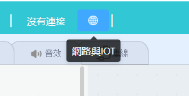
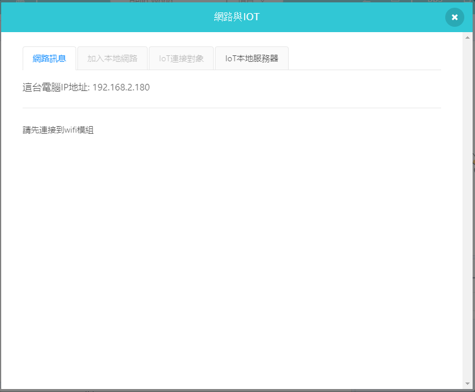
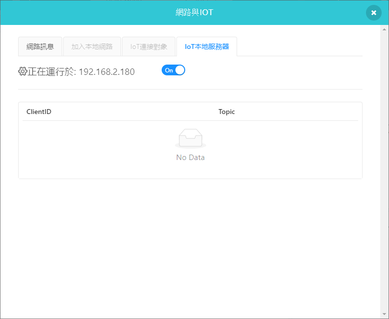

(IoT 平台介紹)

# Kittenblock內置IoT平台

## 簡介

因應學校教學時可能面對的網絡問題與平台使用的困難，Kittenbot的開發人員特別在Kittenblock裏內建了一個簡單易用的本地MQTT伺服器，為大家提供一個免費可靠且易用的IoT平台。

Kittenblock內置IoT平台的特點在於免費，容易使用，不需外網，而且不需登入。

## 啟動內置IoT平台

打開KittenBlock。

打開IoT面板。

在本地服務器頁面中啟動伺服器。

## 安裝KittenBlock

[下載KittenBlock](../../KittenBlock/kittenblockGreen.md)

## Makecode 編程與KittenBlock

[Makecode編程教學](../MakeCode/mc_kb.md)