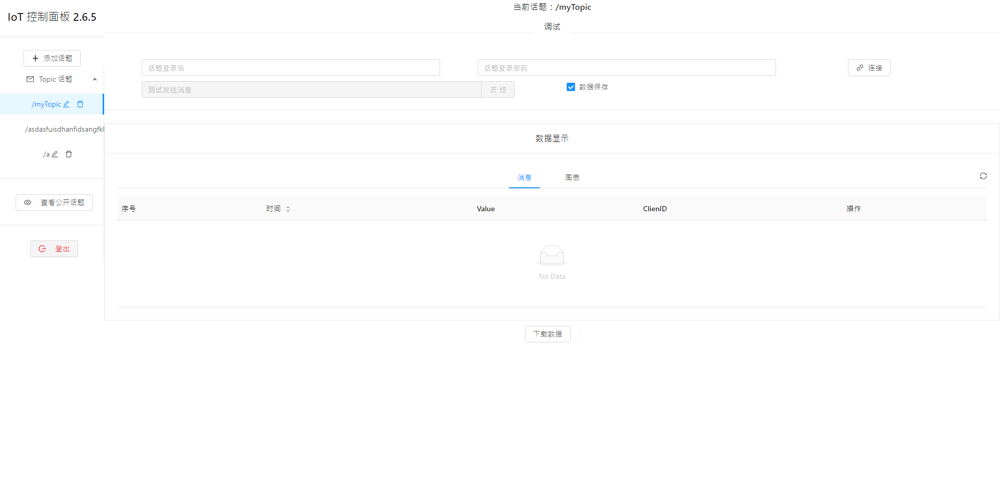
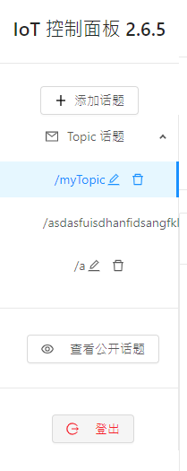
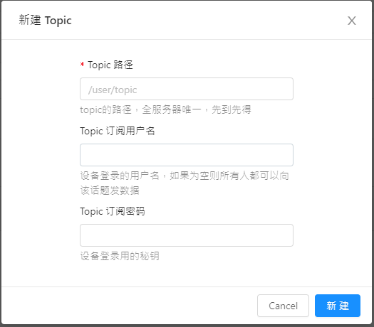
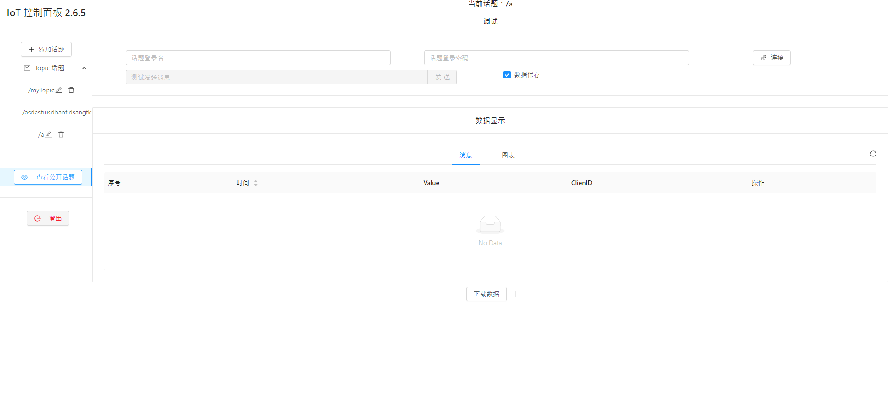
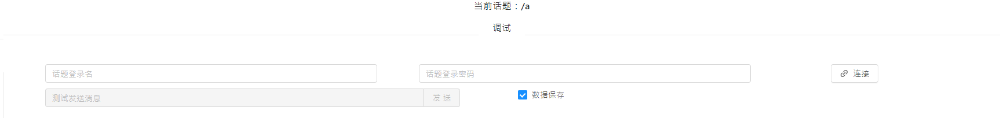
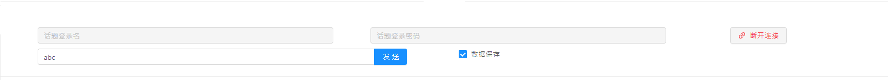
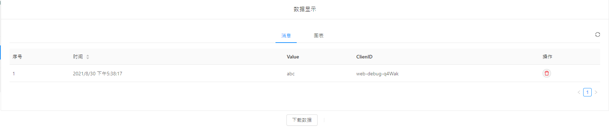
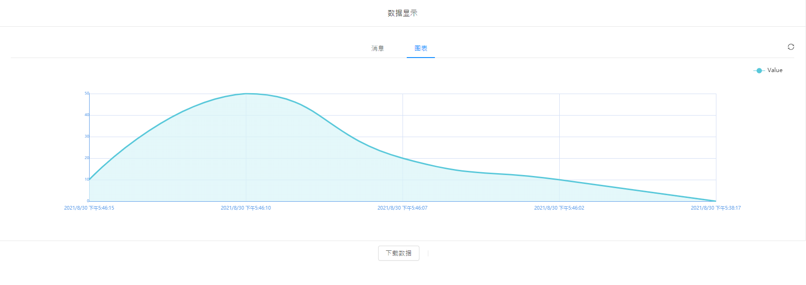
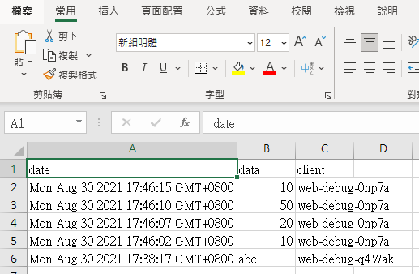

# Kittenbot自家IoT平台:

為了方便大家實踐外網的IoT應用，Kittenbot現已提供一個免費的IoT物聯網平台。

### [Kittenbot自家IoT平台](https://iot.kittenbot.cn/)

## 帳號申請

KittenBot的自家物聯網平台是完全免費的，不過用家需要申請一個帳號。

如欲使用Kittenbot的IoT平台，請以WhatsApp聯絡Kittenbot HK。

[按此WhatsApp KittenBot HK](https://api.whatsapp.com/send?phone=85296480090&text=你好,我想申請免費Kittenbot物聯網平台登入)

## 平台介紹

KittenBot顧及到市場上的物聯網平台大多都需要付費，而且就算免費亦都有不同限制的情況，專為各位KittenBot的用家提供了一個免費的基本物聯網平台，讓大家可以輕易實現到物聯網的應用。

### 平台功能介紹：

- 可在瀏覽器存取IoT平台
- 自訂話題名稱
- 上傳數據到話題
- 手動發佈話題訊息
- 圖表自動生成

## 平台介面介紹

### 1：話題操作

在左邊您可以看到與話題有關的操作。

按下添加話題就可以新增物聯網話題。

由於話題名稱是全平台唯一的，所以名稱請盡量保持獨特。例如/testing或/hello這些就可能已經被人用過了。

訂閱用戶名和密碼是選擇性的，假如留空的話就是公眾話題，代表任何人都可以憑話題名稱上傳或讀取數據。假如設立用戶名和密碼，就只有知道這兩項資訊的人才可以存取了~

### 2：話題主要畫面

這是話題的主要頁面。

您可以從這裡手動發布信息到話題。

話題收到的訊息會在這個面板顯示出來，假如沒有即時顯示，請按一下右手面的刷新按鈕。

你亦可以切換到圖表模式，話題就會自動根據所收到的數據組成圖表。

您可以下載話題數據，數據會以csv的格式保存。

## Makecode 編程與Kittenbot IoT

[Makecode編程教學](../MakeCode/mc_kittenbotiot.md)