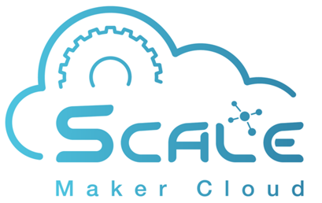

(IoT 平台介紹)

# MakerCloud創客雲

## MakerCloud創客雲簡介

 

MakerCloud創客雲是本港科創企業智方創科Scale Innotech所開發的物聯網IoT平台。

這平台是針對香港教學需求而設的，它的使用介面簡潔易明，即使小學生也能輕鬆學習和使用物聯網。另外，這個平台的功能強大，除了支援MQTT的資料傳送之外，亦支援創建圖表和全球定位等的功能，更支援IFTTT等的物聯網應用，讓大家可以非常簡單地開發不同的物聯網程式。

[官方創客雲官網](www.makercloud.io)

## MakerCloud創客雲官方教學

創客雲也有官方的教學，大家可以前往官方教學，了解如何創建帳號，操作界面和使用WiFiBrick連接創客雲。

官方創客雲教學：<https://learn.makercloud.io/zh_TW/latest/>

 

## Makecode 編程與MakerCloud

[Makecode編程教學](../MakeCode/makercloud.md)