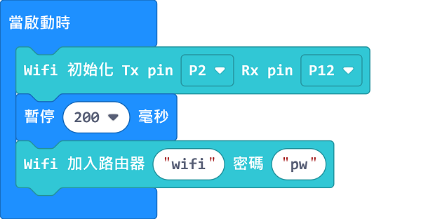
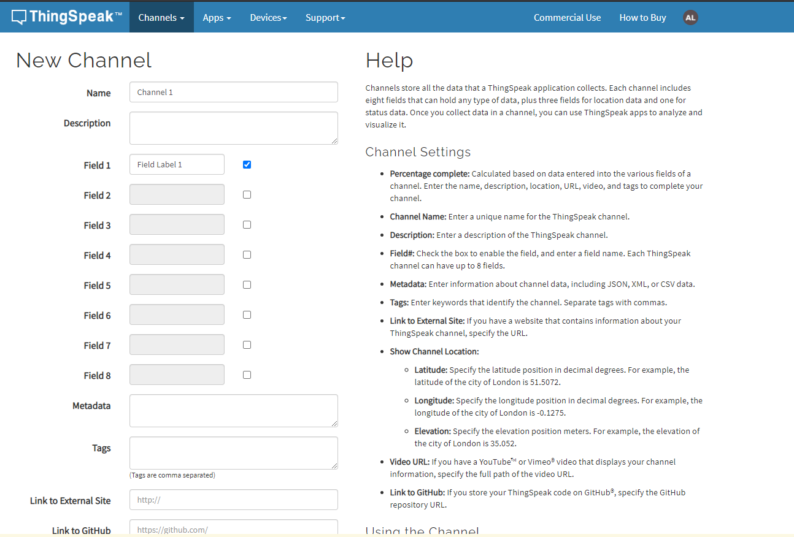
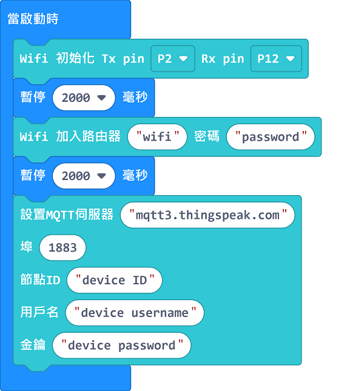
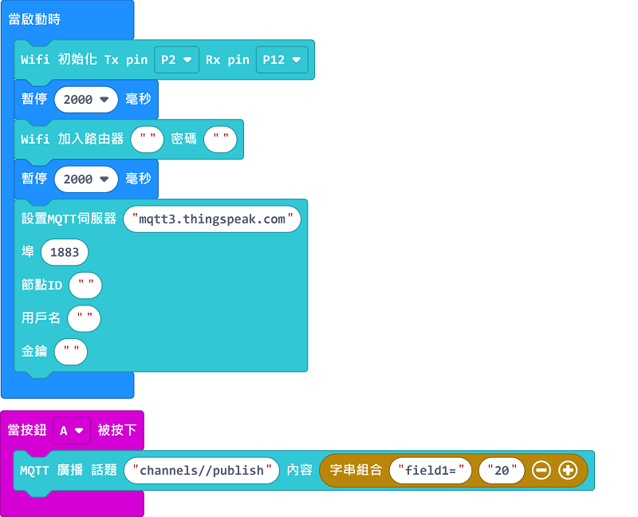
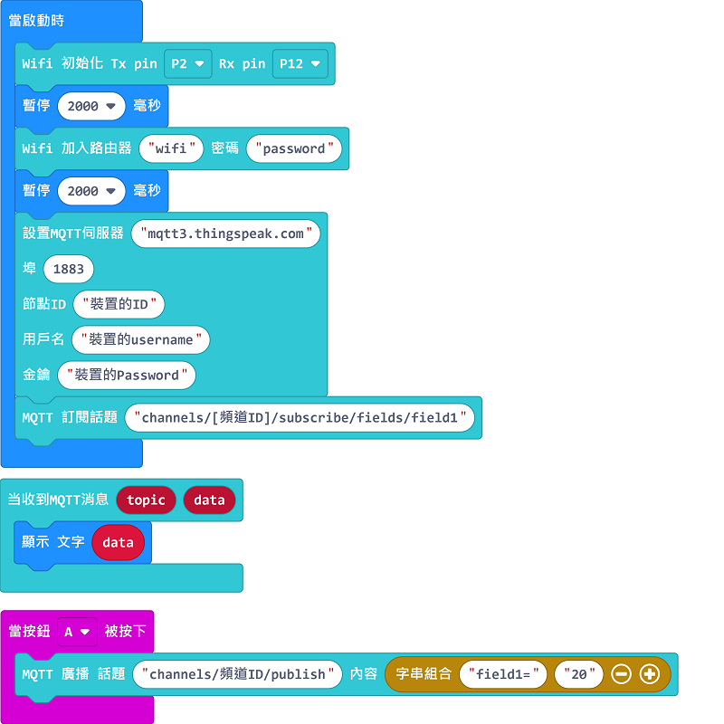

# Makecode 編程與ThingSpeak


## 前言

當硬件及IoT平台準備就緒, 我們便可開始為Micro:bit 編程。

程式會分為3大部份

1. 連線到網絡。

2. 定立mqtt server, 接通thingspeak。

3. 主程式 (發佈/訂閱channel)。

- 本文均以配合Robot:bit  作示範; 如改用Iobit 或 Armourbit, 只需作輕量修改便可。

- 本文的範例程式會基於WiFiBrick做基礎，假如你使用KOI，請按照範例程式和教學自行作出調整。

[KOI與物聯網](../../AI%20Cam/FunctionDemo_MC/KOI14_wifi)

一如以住, 我們要到Makecode 編程平台及相關插件。

**點擊** [MakeCode](https://makecode.microbit.org)

### 加載Kittenbot插件：

### 在擴展頁直接搜尋Kittenbot (Kittenbot已經過微軟認證，可以直接搜尋)

### 選擇KittenWiFi和Powerbrick或Robotbit


      請按自己的硬件選擇Powerbrick或Robotbit插件。

### 假如你使用KOI，請加載KOI插件

### 1. 讓Wifibrick連線到網絡

------

重溫**Wifibrick 介紹與使用說明**編章, 處理好接線。

本章說明如何把wifibrick初始化及網絡連線的積木組織好。最後在後續第2 及3 步驟, 按需要組織廣播與訂閱功能的積木。

把Wifibrick 連經到網絡, 需要在插件中找出2行積木

 

按以下次序組織積木

 

如採用了Armoubit, 初始化部份只需改用以下積木便可

 

1. 按前章接線情況, 修改初始化中Tx , Rx 所對應的Pin號。積木的Rx 及 Tx 是對應micro:bit 的一端。

2. SSID 及 PW 需安用戶的實際情況輸入資料; **SSID**為路由路的名稱; **PW**登入路由器的密碼

   ```
   SSID 及 PW, 只能由英文子母及數字組合, 而且大小階必需一致
   ```

3. WifiBrick只能連接到2.4GHz之網絡，請確保網絡合乎規格。

進入下一步前, 建議先把本章程式下載到microbit 運行, 測試把wifibrick 連到網絡; 如連線順利便可進一步組織核心功能。



[Wifibrick連線到網絡](https://makecode.microbit.org/_ErmXcmDV91cw)

[**短片參考**](https://youtu.be/v6yIrGqzqO4)

### WifiBrick指示燈詳解

1. 當啟動電源後，紅色燈會亮起。
2. 在連接網絡期間，藍色燈會亮起。
3. 成功連網之後，所有燈會熄滅。
4. 成功連接MQTT之後，綠色燈會亮起。

示範短片：
[]()

## MakeCode與ThingSpeak編程

## ThingSpeak帳號申請

請大家首先按照以下教學，申請一個免費的ThingSpeak帳號。

[ThingSpeak 平台介紹](../IoTPlatform/Thinkspeak.md)

## ThingSpeak平台設置

申請帳號之後，我們還未可以開始編程，因為我們要先在ThingSpeak設置好平台。

### 建立新頻道

在My Channel的頁面建立新頻道。


除了頻道名稱之外其他可以不用理會。



完成之後就可以按Save Channel。


進入Sharing。


最方便和簡單地使用ThingSpeak的方法是將頻道設為公開，所以我們選擇第二個選項。


當你看到Access由Private變為Public就代表頻道完成了。


### 添加新裝置

然後請前往Devices，選擇MQTT。


添加一個新裝置。


選擇剛才建立的頻道，點擊Add Channel。


最後就可以點擊Add Device。


添加裝置後，這一個頁面非常重要！這些是大家的未來板用來連接ThingSpeak的登入資料，請大家自行記下，或者下載登入資料，儲存在電腦。


## MakeCode編程

### 連接ThingSpeak

搭建出以下程式，將WifiBrick連接上網絡，然後連接到ThingSpeak的伺服器。

- 伺服器網址: mqtt3.thingspeak.com
- ID: 按照ThingSpeak裝置的ID
- 用戶名: 按照ThingSpeak裝置的username
- 密碼: 按照ThingSpeak裝置的Password



### 發佈到ThingSpeak頻道

在發佈上ThingSpeak頻道之前，我們需要先查看頻道的ID。
頻道ID是一個7位的數字。


搭建出以下程式，按下A鍵發布信息20到ThingSpeak頻道。

- MQTT主題: channels/[頻道ID]/publish
- 信息: field[欄位號碼]=[數字信息]



[WiFiBrick參考程式](https://makecode.microbit.org/_L71FkV3wkEV4)

[KOI參考程式](https://makecode.microbit.org/_UzsL7JKtuJi6)

發佈成功的話，在ThingSpeak的頁面上會看到剛才發布的信息。


### 讀取ThingSpeak頻道信息

使用頻道ID訂閱頻道之後，就可以收取到頻道的訊息。

按A鍵發布信息到頻道，WiFiBrick收到訊息之後會顯示出來。

- MQTT主題: channels/[頻道ID]/subscribe/fields/field[欄位號碼]



[WiFiBrick參考程式](https://makecode.microbit.org/_JKeC421rpUx2)

[KOI參考程式](https://makecode.microbit.org/_a0saR4h5E1Fo)

相信大家已具體掌握如何利用免費thingspeak 的方法, 歡迎把所製作的IoT 項目whatsapp到micro:bit 群組分享與交流！

 

 ## 插件版本與更新

插件可能會不定時推出更新，改進功能。亦有時候我們可能需要轉用舊版插件才可使用某些功能。

詳情請參考: [Makecode插件版本更換](../../Makecode/makecode_extensionUpdate)