# Makecode 編程與MakerCloud

## MakerCloud官方教學

MakerCloud有提供官方的教學，此頁面僅為KittenBot HK提供的教學，一切以官方教學為準。

[Microbit x WiFiBrick教學](https://learn.makercloud.io/zh_TW/latest/ch4_connect/microbit/connect_microbit/)

[Microbit x KOI教學](https://learn.makercloud.io/zh_TW/latest/ch4_connect/KOI/connect_KOI/)

## 前言：

在這節教程，我們將會學習使用WifiBrick在MakerCloud上如何發布資料和接收資料。

我們會使用Robotbit作範例。

    KOI也支援Makercloud。

## 硬件準備

在編程前請確保硬件及接線沒有問題。

[硬件接線方法](../wifibrick/Wifibrick_intro.md#id5)

## 第一步：平台準備

我們首先要登入MakerCloud平台，設立好MQTT主題。

[前往MakerCloud](https://www.makercloud.io/user/login?ref=/)

登入之後前往主頁，點擊『創建項目』。

    你亦可以使用你先前創立的項目。

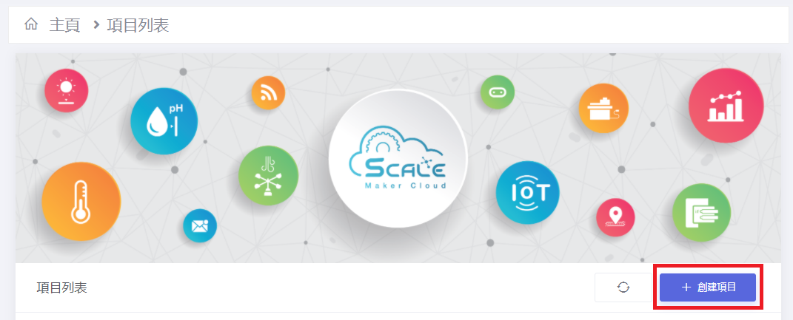

剔選物聯網項目，輸入項目名稱，並點擊『創建項目』。

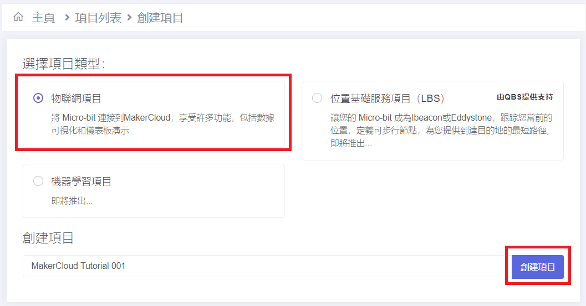

之後我們就可以創建自己的主題。

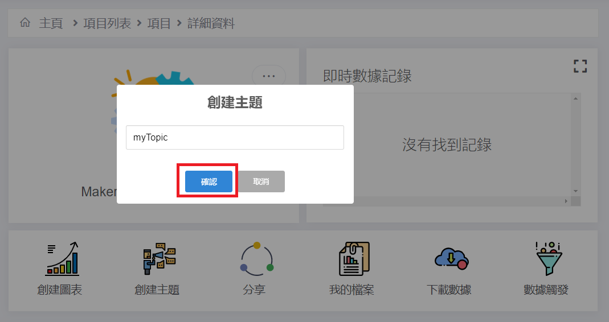

創建之後，我們會在頁面看到我們剛剛創下的頁面，並且寫有主題名稱。

這個主題名稱是你的私密資料，請不要讓其他人得知。

去到這裡，MQTT主題的設立就大功告成了，然後我們就可以開始進行編程。

## 第二步：加載插件

我們要先加載MakerCloud的插件，這樣才可以與MakerCloud的伺服器連接。

wifibrick插件地址：https://github.com/maxwong-scale/pxt-makercloud-V2

koi插件地址：https://github.com/scaleinnotech/pxt-makercloud-koi

### [詳細方法](../../Makecode/powerBrickMC)

## 第三步：編程

### 1：將WifiBrick連上網絡並連接創客雲伺服器。

連接積木塊：

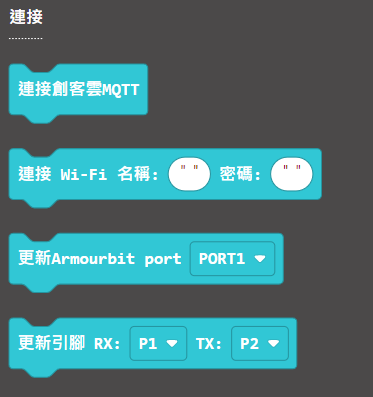

首先更新引腳初始化WifiBrick，然後連接Wifi網絡，再連上伺服器。

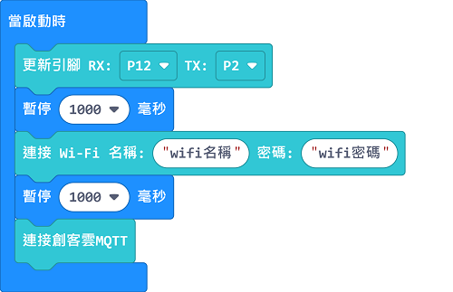

假如你使用Armourbit，只要將更新引腳的積木改為Armourbit的積木就可以了。

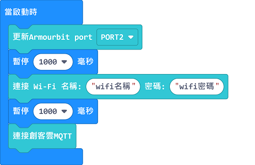

連接網絡的時候Microbit會顯示以下動畫。

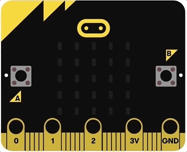

連接創客雲MQTT時會顯示以下動畫。

### 2：發佈到MQTT主題。

發佈積木塊：

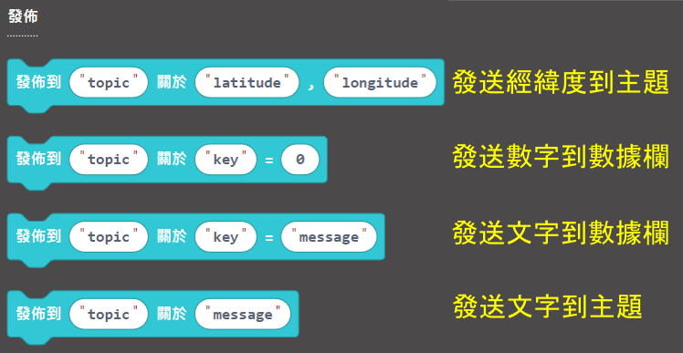

我們會發佈一個隨機數字到我們剛剛設立的主題。

將之前設立的主題名稱複製並貼上。

成功發佈之後，資料會顯示在項目的即時數據紀錄中。

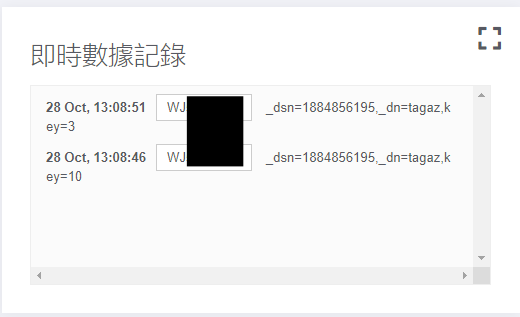

數據亦會自動產生一個圖表。

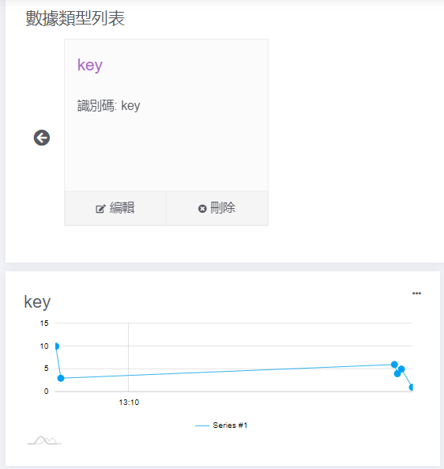

同時，我們亦可以手動在主題中發送訊息。

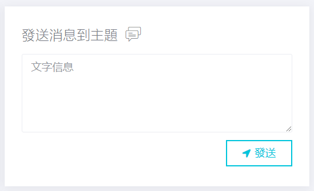

### 3：訂閱MQTT主題。

訂閱積木塊：

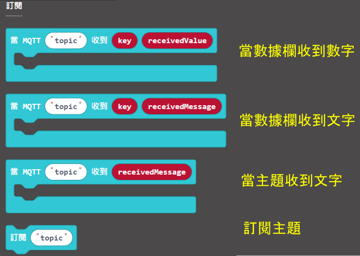

要讀取MQTT主題上的資料，我們一定要訂閱該主題。

以下，我們會訂閱剛才設立了的主題，讀取我們發佈的資料。

## 參考程式

### Wifibrick參考程式

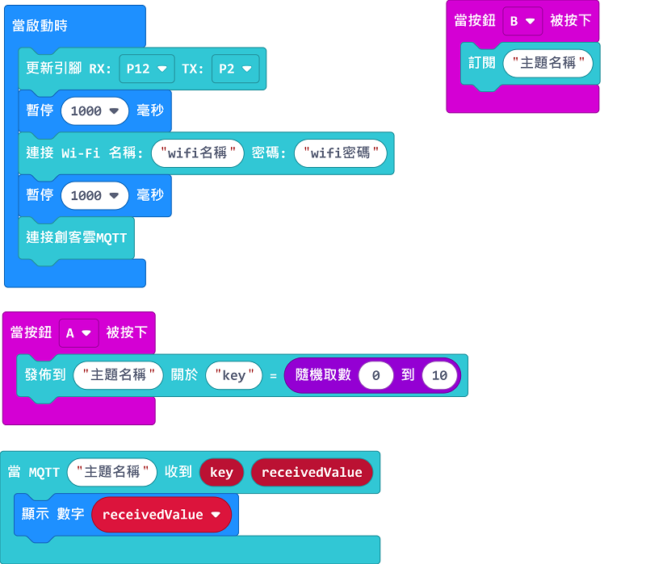

[參考程式下載](https://makecode.microbit.org/_KiMFEa7Kv4p1)

### KOI參考程式

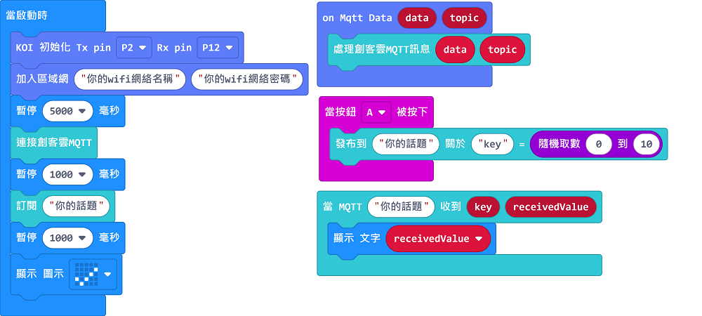

[參考程式下載](https://makecode.microbit.org/_3ue0j0gjbaRY)

## 總結：

看到這裡，相信大家都大概熟悉在WifiBrick使用創客雲的方法吧。其實創客雲還有創建圖表，資料觸發等的功能，所以說大家用創客雲不需要只是局限於MQTT上呢！

 ## 插件版本與更新

插件可能會不定時推出更新，改進功能。亦有時候我們可能需要轉用舊版插件才可使用某些功能。

詳情請參考: [Makecode插件版本更換](../../Makecode/makecode_extensionUpdate)