# Makecode 編程與 ObjectBlock

## ObjectBlock官方教學

ObjectBlock有提供官方的教學，此頁面僅為KittenBot HK提供的教學，一切以官方教學為準。

## 前言：

在這節教程，我們將會學習使用WifiBrick在ObjectBlock上如何發布資料和接收資料。

我們會使用Robotbit作範例。

    KOI也支援ObjectBlock。

## 第一步：平台準備

我們首先要登入ObjectBlock平台，設立好MQTT主題。

登入之後在上方的選項欄中選擇新增專案。

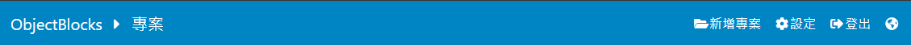

新增專案。

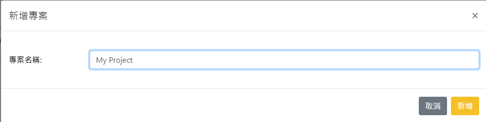

打開渠道。

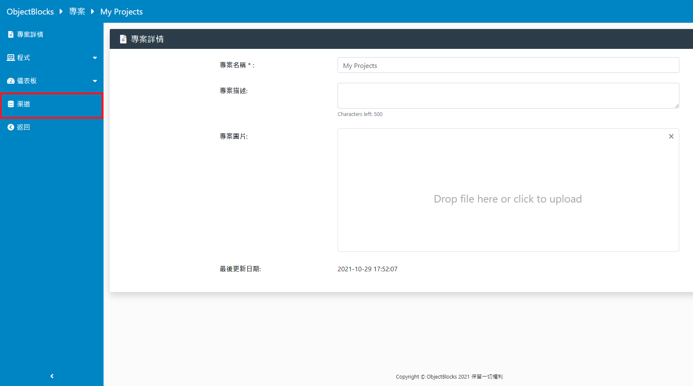

新增渠道。

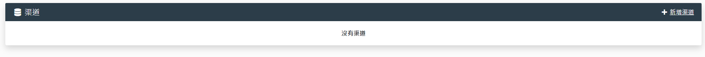

可以選擇數字或者文字，在今次示範請選擇數字。

在新增渠道的選項裡，**一定要剔選產生網絡鈎手這個選項**。

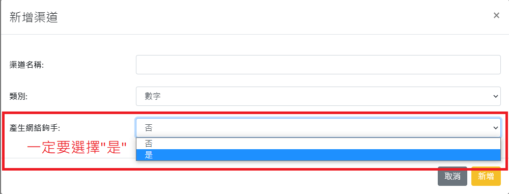

完成之後會在渠道列表上看到。

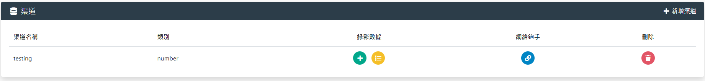

在渠道裡面有一個網絡鈎手的選項，請妥善保管選項裡面的登入資料，不要讓人知道。

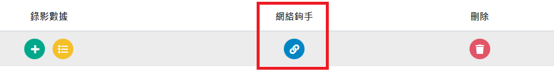

憑著這些登入資料，我們可以發佈或讀取渠道數據。

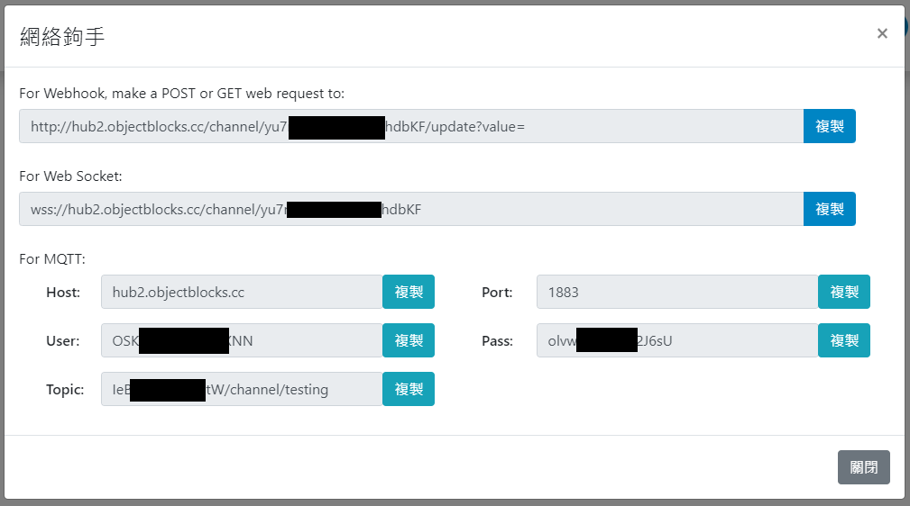

假如我們想在ObjectBlocks平台看到發送的資料，我們需要建立一個儀表板。
在儀表板一欄裡面選擇新增儀表板。

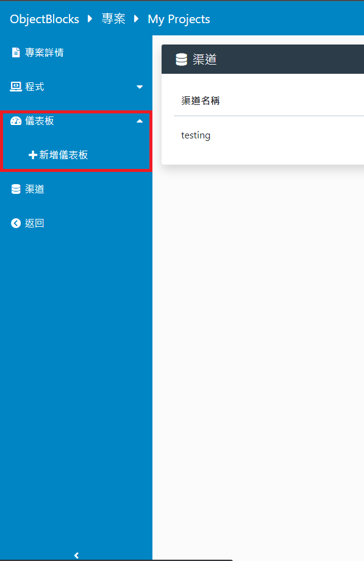

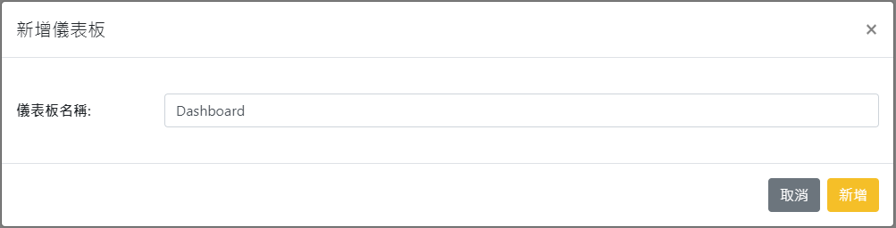

在儀表板的菜單添加一個工具。

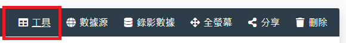

可以添加不同種類的工具，在這次示範請選擇文字。

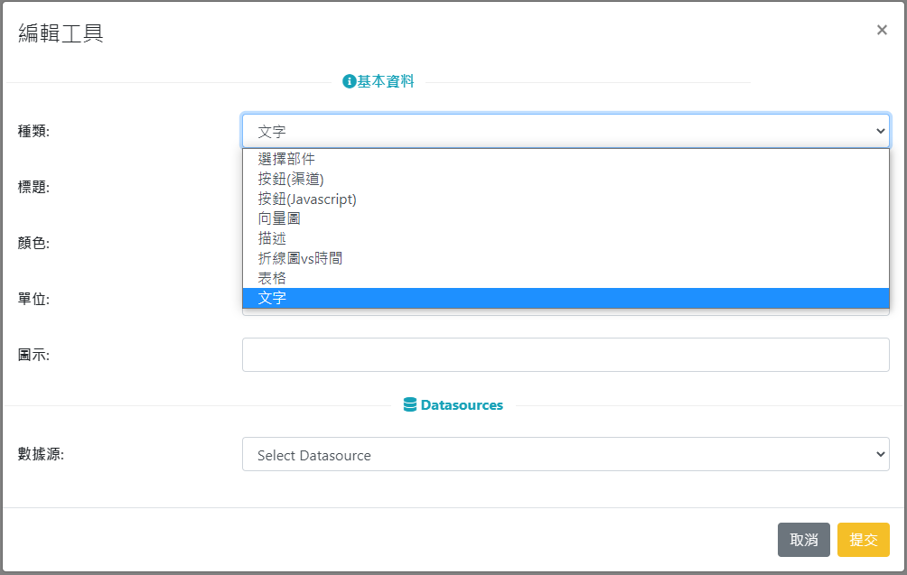

在數據源中選擇渠道，然後選擇剛建立的頻道。

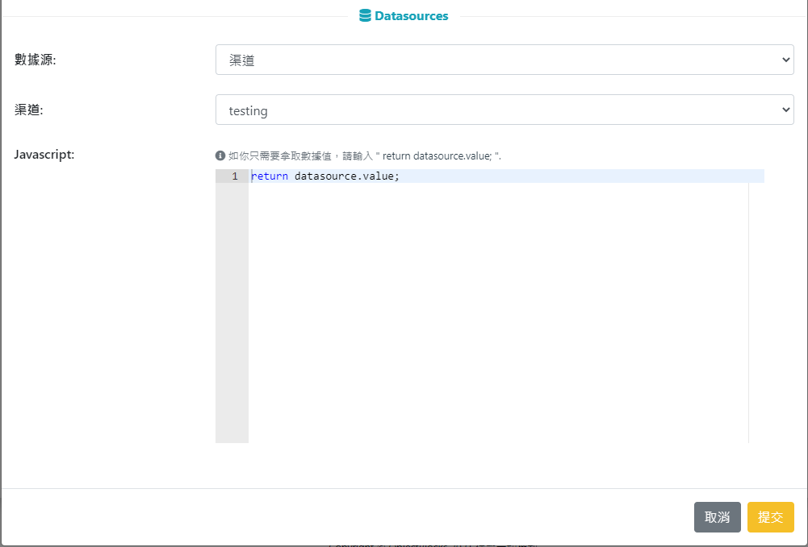

去到這一步，IoT平台的設定就完成了，可以開始進行編程。

## MakeCode編程教學

### 加入WifiBrick插件

在插件搜尋欄輸入Kittenbot然後選擇KittenWifi。

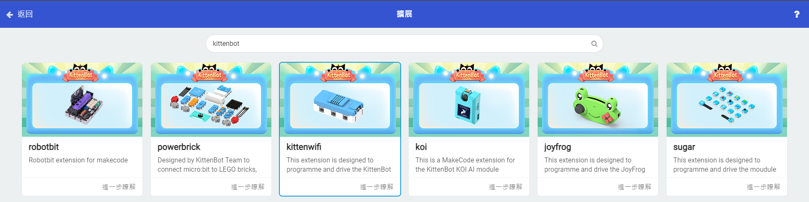

    假如使用KOI，請加入KOI插件。

### 第一步: 連接ObjectBlocks平台

在連接MQTT的積木裏填入你渠道的用戶名(Host)和密碼(Pass)。

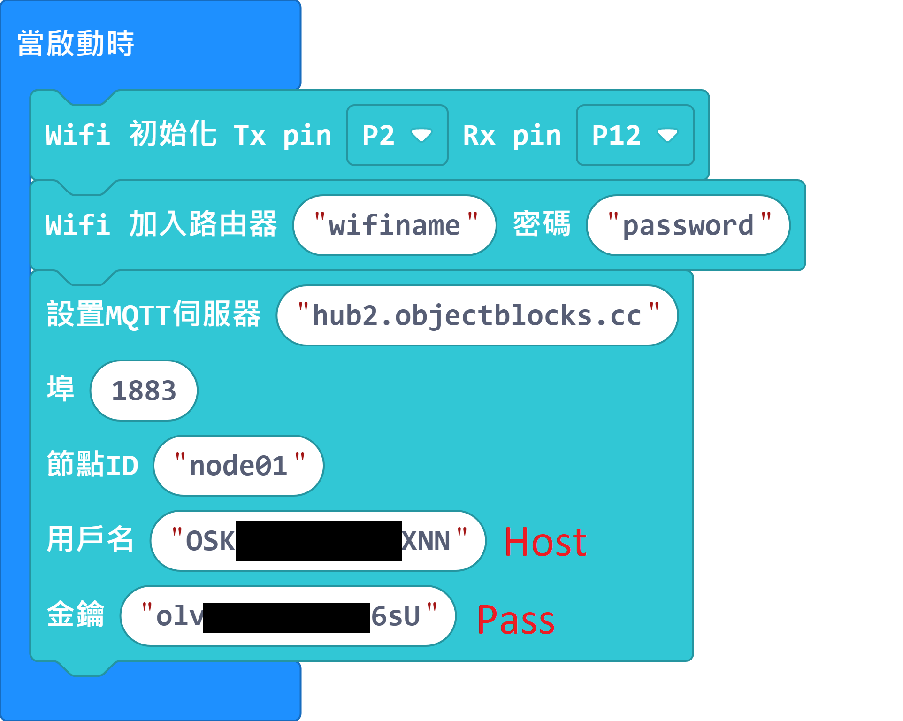

### 第二步: 發送數據到ObjectBlocks

將渠道的topic填入發送數據的積木。

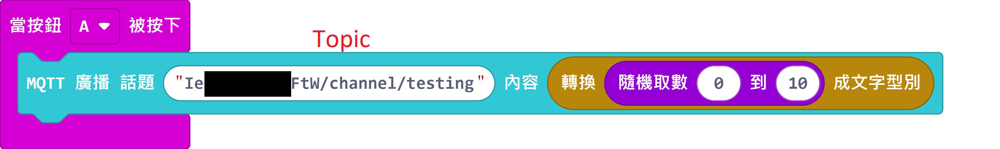

### 第三步: 收取數據

收取數據需要先訂閱話題，然後就可以利用收取話題的積木獲取數據。

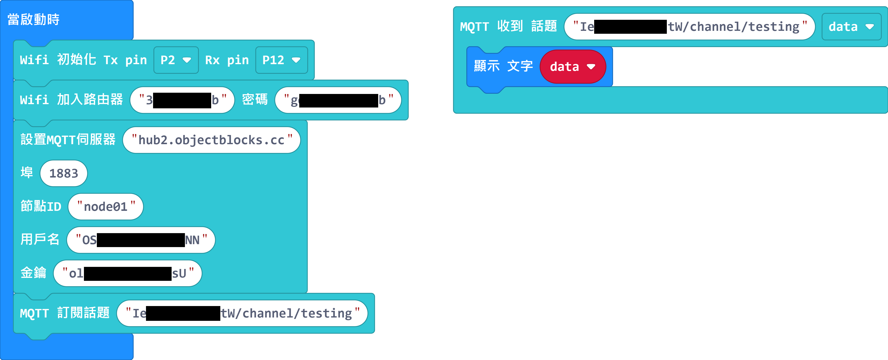

### 程式結果

在Micro:bit按下A鍵，WifiBrick就會發布數據到ObjectBlocks。數據會在ObjectBlocks的儀表板裏顯示出來，WifiBrick自動收到數據之後亦會顯示在Micro:bit上。

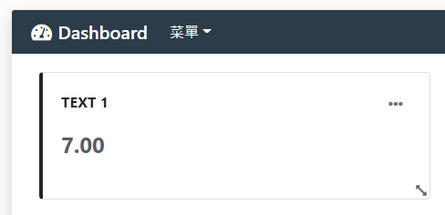

### 參考程式

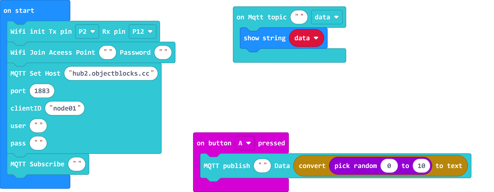

[參考程式](https://makecode.microbit.org/_3Picjj2KRChw)

## 插件版本與更新

插件可能會不定時推出更新，改進功能。亦有時候我們可能需要轉用舊版插件才可使用某些功能。

詳情請參考: [Makecode插件版本更換](../../Makecode/makecode_extensionUpdate)