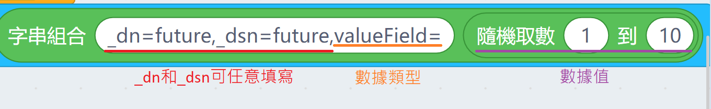
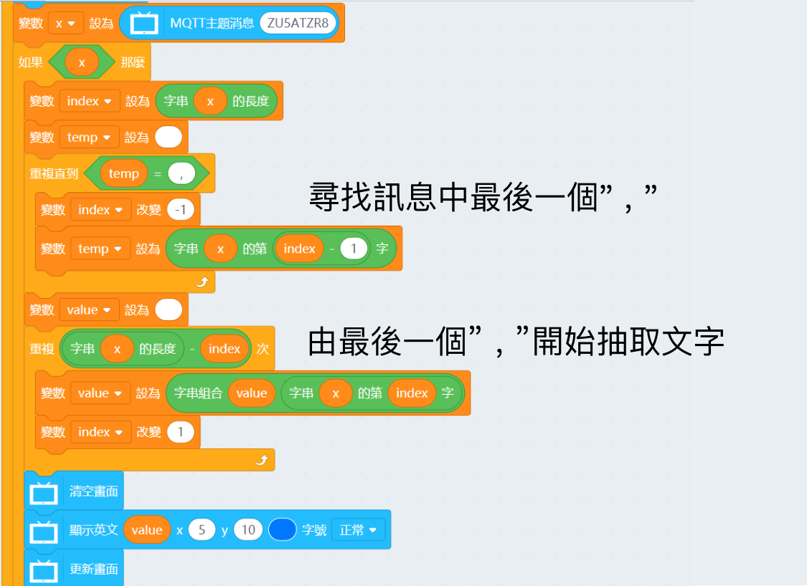

# 未來板與MakerCloud編程快速教學

未來板方便用家設計IoT應用項目，假如搭配MakerCloud使用，可以延伸到IFTTT等的應用。

## MakerCloud平台設置

由於在其他篇章已經有MakerCloud平台的設置教學，本篇章將不會重複，請參考以下篇章了解MakerCloud平台的使用方法。

### [MakerCloud平台使用方法](../MakeCode/makercloud.md)

## 未來板KittenBlock編程教學

### 連接MakerCloud

搭建出以下程式，連接到MakerCloud。

- 伺服器網址: mqtt.makercloud.scaleinnotech.com
- ID: 隨意填寫

### 發佈信息到MakerCloud

搭建出以下程式，按下A鍵將數據發送到MakerCloud。數據發布的格式請參考下圖。

發佈之後檢查MakerCloud，你應該會看到發布的數據。

### 讀取MakerCloud信息

搭建出以下程式，讀取MakerCloud上的數據。

讀取的數據會顯示在屏幕上面。

測試程式後你會發現顯示的數據會包含_dn和_dsn。

要解決這個問題，您可以參考以下程式，將訊息裏數據的部分單獨地抽取出來。

或者你可以使用包含積木來進行條件比較。

