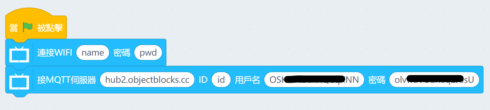
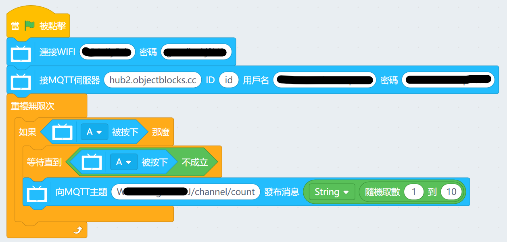
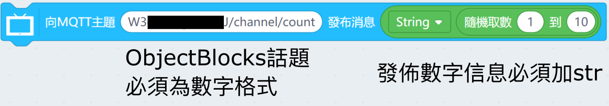
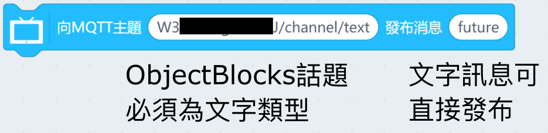
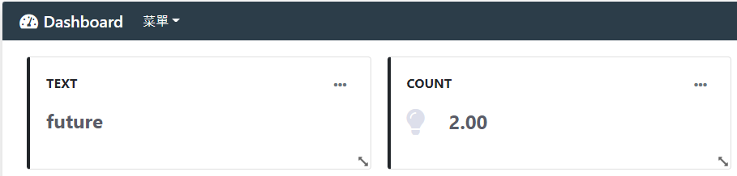
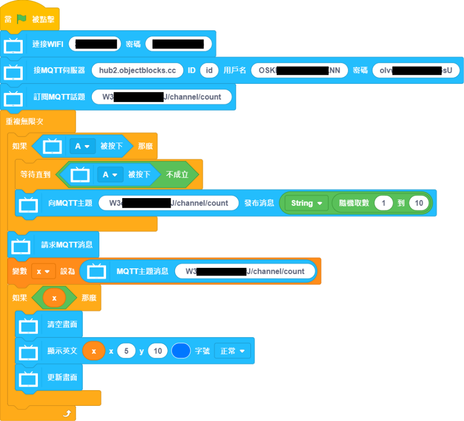
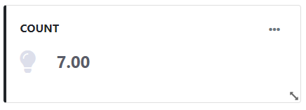
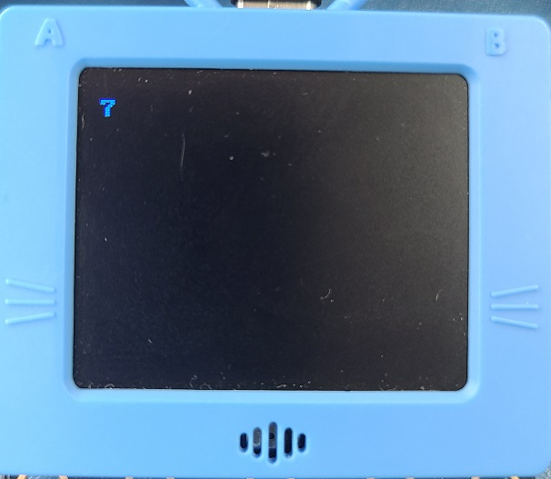

# 未來板與ObjectBlocks編程教學

未來板亦都可以支援ObjectBlocks的IoT應用。

## ObjectBlocks平台設置

由於在其他篇章已經有ObjectBlocks平台設置的教學，本篇章將不作重複，請參考以下篇章了解MakerCloud平台的使用方法。

### [ObjectBlocks平台使用方法](../MakeCode/objectblock.md)

## 未來板KittenBlock編程教學

### 連接ObjectBlocks平台

搭建以下程式，連接ObjectBlocks。

- 伺服器網址：hub2.objectblocks.cc
- clientID：隨意填寫
- username：按照ObjectBlocks
- password：按照ObjectBlocks

### 發佈信息到ObjectBlocks

搭建以下程式，按A鍵發布信息到ObjectBlocks。

發佈數字或文字訊息有少許分別需要注意。

測試程式，在ObjectBlocks儀錶板裡面會看到發布的信息。

### 在未來板接收ObjectBlocks平台訊息

搭建以下程式，讀取ObjectBlocks平台上的信息。

發佈的信息會顯示在ObjectBlocks儀錶板和未來板上。

