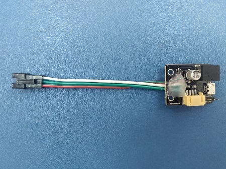

# 流光溢彩屏介紹

0832流光溢彩屏 (HKBM8008A) / 1616流光溢彩屏 (HKBM8009A)

## 產品簡介

這是一塊全彩RGB軟屏，它的特點在於容易攜帶與靈活性高。只要使用官方的拓展就能夠進行編程。

## 產品特色

- 圖像化介面編程
- 支援模組式串聯
- 支援外部供電
- 輕便小巧
- 柔軟可屈

## 產品資料
 
__8x32柔性屏(HKBM8008A)__

- 長x闊x高：320mm x 80mm x2mm
- 重量：55g
- 物料：軟銅板
- 256顆全彩LED

__16x16柔性屏(HKBM8009A)__

- 長x闊x高：160mm x 160mm x2mm
- 重量：55g
- 物料：軟銅板
- 256顆全彩LED

## 產品內容：

### 1x燈板(16x16或32x8)

### 1x供電轉接板

每一塊彩屏都附有一個供電轉接板，它是彩屏與Robotbit之間的介面，將彩屏的接口轉為杜邦線，並附有5V USB供電接口。
在長時間使用時可以取代robotbit的18650鋰電池；提供比較穩定的電源，避免損毀robotbit。

## 產品展示

## 技術參數 

- 電壓：5V
- 電流：1A、長時間使用建議使用USB供電
- 功率: 0.3W
- 材料：軟銅板
- 亮度分級：256級
- 流明：120

