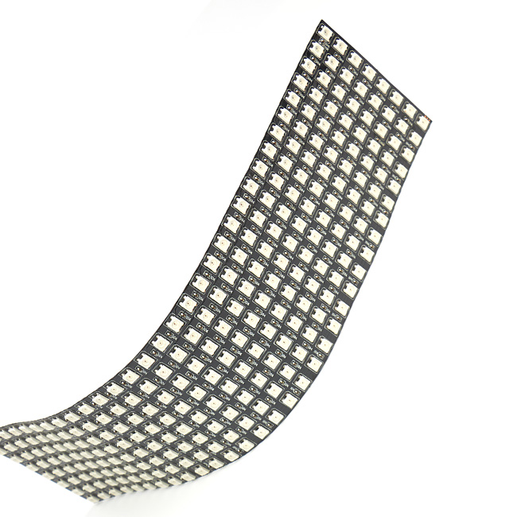

# 流光溢彩屏介紹

## 產品簡介

這是一塊全彩RGB軟屏，它的特點在於容易攜帶與編程簡易。只要使用喵家官方的拓展就能夠輕易進行編程。

## 產品特色

- 圖像化介面編程
- 支援單線多屏控制
- 支援模組式串聯
- 支援外部供電
- 輕便小巧
- 柔軟可屈

## 產品資料
 
__8x32柔性屏__

- 長*闊*高：320mm x 80mm x2mm
- 重量：55g
- 物料：軟銅板
- 支持PH2.0接口
- 256顆全彩LED

__16x16柔性屏__

- 長*闊*高：160mm x 160mm x2mm
- 重量：55g
- 物料：軟銅板
- 支持PH2.0接口
- 256顆全彩LED

## 技術參數 

- 電壓：5V
- 電流：1A、長時間使用建議使用10A火牛
- 功率: 0.3W
- 材料：軟銅板
- 亮度分級：256級
- 流明：120

##產品內容：

- 1x燈板(16*16或32*8)
- 1x供電轉接板

