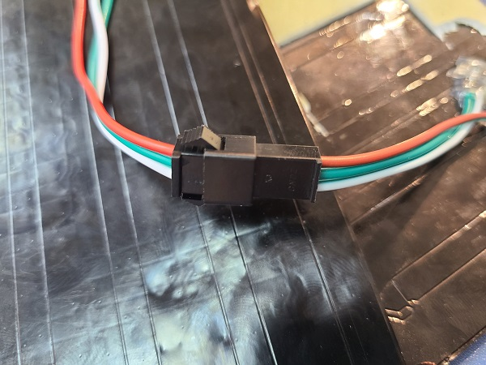
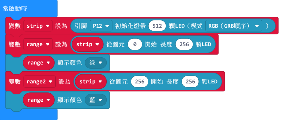
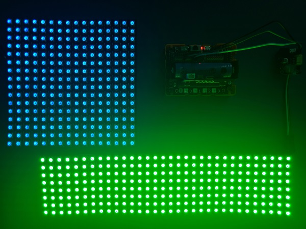
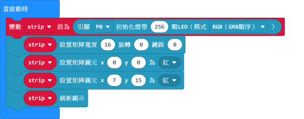
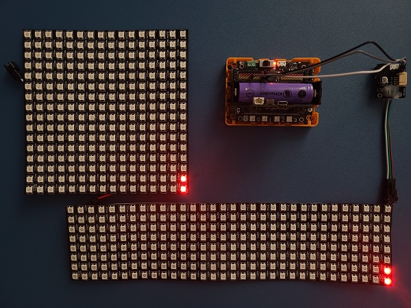
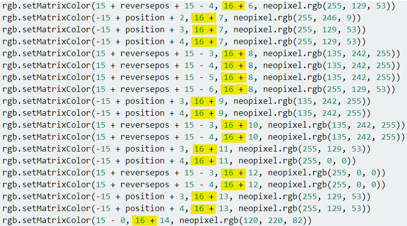

# 流光溢彩屏之Neopixel串聯教程

本節教程將會介紹流光溢彩屏支援多塊燈板的串聯操作，令屏幕的大小倍增。

## 流光溢彩屏串聯

### 串聯接線

串聯情況下，請將燈板1的dout（公頭）與燈板2的din（乸頭）連接。

    一般不建議連接2塊形狀不同的燈板，因為計算會比較複雜。
    
### 串聯情況的編程

#### 此節教程將會運用neopixel插件，請將插件加載。

串聯情況下，我們必須在初始燈板的時候將數值設為LED燈的總數。

我們可以用圖元0-255和256-511分別控制2塊燈板。

[參考程式下載](https://bit.ly/LEDMatrixT3_06Hex)

### 串聯與矩陣的編程

串聯燈板可以與矩陣同時操作。我們設置矩陣的時候可以先將闊度設為1塊燈板的闊。
我們用了2塊16x16的燈板，所以我們構成了一個16x32的矩陣。

在這裡我們分別點亮 2塊彩屏的頭 2顆LED燈。

    Y=0和Y=16分別代表2塊燈板的第一行。        
    在旋轉為0或2的時候，第二塊燈板會往Y軸伸展。旋轉為1的時候，則會往X軸伸展。

[參考程式下載](https://bit.ly/LEDMatrixT3_07Hex)

## 串聯情況之下的流水走字效果

串聯情況下要做到流水走字的話需要參考《1616溢彩屏動態效果教程》。

[1616溢彩屏動態效果教程](./LEDMatrixNeoMatrix3.md)

編程邏輯和本教程類似，我們只需要使用Y來控制第二塊彩屏的動畫，

例如：我們在Y加上16來操控第二塊彩屏的動畫。

假如你想做多幀動畫的話你可能要將幀的次序調節才能夠無縫連接。

[參考程式](https://bit.ly/LEDMatrixT4_03Hex)

    例如：在2塊燈板的串聯之下要播放2幀動畫，燈板1的幀次序為幀1->幀2，但燈板2的幀次序會變成幀2>幀1。

## FAQ

問：為什麼我點亮燈板的時候，燈板未能顯示我定下的顏色，燈板只點亮了紅色？

答：電源不足夠。

解決方法：將robotbit的電源打開，或者在供電轉接板加插外部USB電源）。

## 注意事項
- 請勿接駁電壓高於5V的電源。
- 長時間使用請接駁USB外部電源。
- 要點亮大量LED的時候請將亮度減低。
- 本產品只適合14歲以上的兒童獨立使用，8-14歲兒童請在成年人的陪同下使用。
- 使用前請參考Kittenbot官方資料，不要隨便接駁電路，請勿外接大電流電機舵機。
- 請勿在金屬表面或導電性物料上使用，以免短路。
- 請勿在有水或潮濕的地方使用，以免短路。
- 請勿用手觸碰燈板外露的電線。

