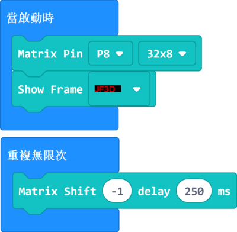

# 0832溢彩屏之動態效果教程

本教程將會教大家使用neomatrix插件對溢彩屏進行編程，顯示走馬燈動畫效果。

## 接線

0832溢彩屏需要配合robotbit使用，請按照下圖將屏幕與robotbit接線。

### 1. 將彩屏與轉接板連接。

### 2. 將轉接板連接到robotbit。

### 3. 長時間使用請使用USB供電。

USB供電時，不需要使用Robotbit供電，請將5V電源線拔走。

### 4. 完整接線示範

## Makecode編程教學（只限離線版makecode）

假如我們想顯示文字或圖形，使用neopixel實在太麻煩了，有見及此kittenbot推出了neomatrix插件，容許圖像化的圖案編輯。

#### (注意，本插件只支援離線版makecode)

KittenBot官方離線版Makecode下載：https://www.kittenbot.cn/software
 
### 1.加載neomatrix插件

#### neomatrix插件: https://github.com/KittenBot/pxt-neomatrix

 

 

#### neomatrix積木塊:

    注意：現階段溢彩屏並不兼容powerbrick！請使用robotbit！
    PowerBrick只支援套件中的全彩點陣屏。

### 2.點擊NeoMatrix Editor進入編輯器

首先選擇溢光屏類型（16x16/8x32）

我們亦可以在文字欄輸入文字，按Render生成圖案。

可以在黑色像素格上點擊，畫出你想要的圖案。（單擊填色，雙擊清除）

我們可以按Add Frame增加一幀。

我們亦可以按Open Image直接生成圖案。

我們需要製作2幀圖案，完成後在Output欄中點擊Matrix Panel，生成積木。

返回makecode主介面後我們可以看到NeoMatrix中新增了一塊叫Show Frame的積木。

### 3.編寫程式

### 單幀走馬燈：

[參考程式下載](https://bit.ly/LEDMatrixT2_02Hex)

### 雙幀走馬燈：

[參考程式下載](https://bit.ly/LEDMatrixT2_03Hex)
    
## FAQ

問：為什麼我點亮燈板的時候，燈板未能顯示我定下的顏色，燈板只點亮了紅色？

答：電源不足夠。

解決方法：將robotbit的電源打開，或者在供電轉接板加插外部USB電源。

## 注意事項
- 請勿接駁電壓高於5V的電源。
- 長時間使用請接駁USB外部電源。
- 要點亮大量LED的時候請將亮度減低。
- 本產品只適合14歲以上的兒童獨立使用，8-14歲兒童請在成年人的陪同下使用。
- 使用前請參考Kittenbot官方資料，不要隨便接駁電路，請勿外接大電流電機舵機。
- 請勿在金屬表面或導電性物料上使用，以免短路。
- 請勿在有水或潮濕的地方使用，以免短路。
- 請勿用手觸碰燈板外露的電線。