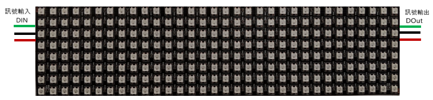
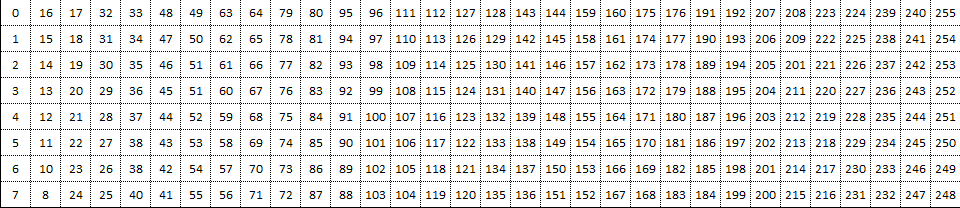
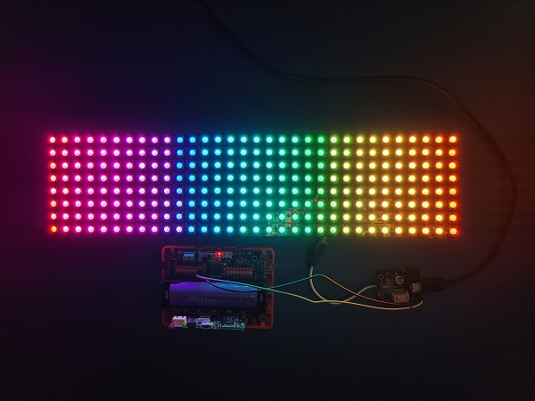
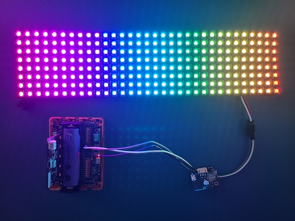
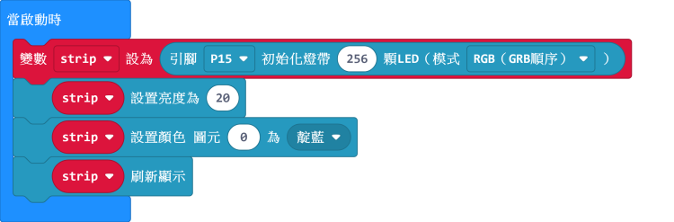
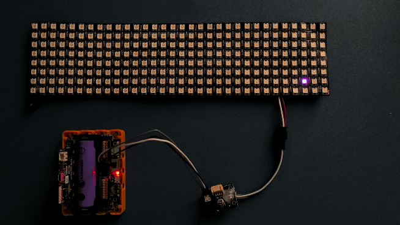
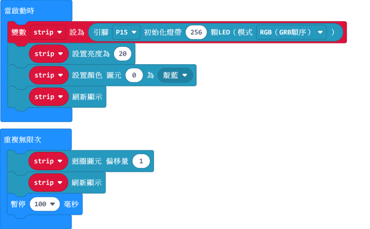
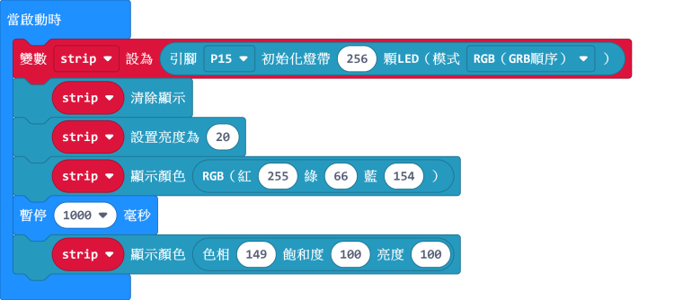
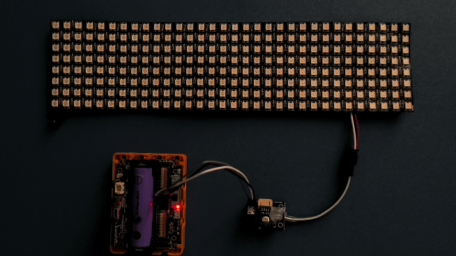

# 流光溢彩屏之Neopixel教程

本教程將會教大家使用neopixel插件對溢彩屏進行編程。

大家將會學習如何點亮燈板包括：全屏單色點亮、全屏彩虹點亮、範圍點亮、流水效果等。

## 接線

0832溢彩屏需要配合robotbit使用，請按照下圖將屏幕與robotbit接線。

### 1. 將彩屏與轉接板連接。

### 2. 將轉接板連接到robotbit。

### 3. 長時間使用請使用USB供電。

於轉接板加插USB電源即可。不需要使用Robotbit供電，請將5V電源線拔走。

### 4. 完整接線示範

### LED排位：

由於彩屏是用蛇形路線將LED燈帶排列成長方形，每顆燈都可以獨立使用，LED排列請參考下圖。

#### 8x32彩屏

#### 16x16彩屏

## Makecode編程教學

#### 加載robotbit擴展。

 

 

#### neopixel積木塊:

 

### 初始化溢彩屏

    由於8*32和16*16均有256顆LED，我們初始一條256顆燈的燈條。

### 全屏單色點亮

我們可以將整個屏幕以單一顏色點亮。

    我們可以選擇多款預設顏色。
    

[參考程式下載](https://bit.ly/LEDMatrixT1_01Hex)

[參考程式網址](https://makecode.microbit.org/_XDpRDjarw5cH)

### 彩虹色點亮

我們可以將整個屏幕以彩虹色點亮。

    彩虹效果使用的是HSL格式（色相，飽和度，亮度）
    彩色的電流比較大，在高亮度的情況下需要外接USB電源。
    流動充電器電流可能不夠，所以這裡外接了手機充電器。
    

[參考程式下載](https://bit.ly/LEDMatrixT1_02Hex)

[參考程式網址](https://makecode.microbit.org/_Kj80s46jqCju)

### 亮度調節

為了眼睛健康建議大家調低亮度。

    
    亮度數值範圍由0-255
    在較低亮度的情況下電流需求較低，所以即使彩虹色也不需外接電源。

[參考程式下載](https://bit.ly/LEDMatrixT1_03Hex)

[參考程式網址](https://makecode.microbit.org/_2diVmMKc4ThV)
    
### 單一顆燈點亮

我們可以單獨控制每顆燈。

    設置後需要運行刷新顯示才會點燈。
    

[參考程式下載](https://bit.ly/LEDMatrixT1_04Hex)

[參考程式網址](https://makecode.microbit.org/_AsPV8k5RqTbR)
  
### 流水效果
   
流水效果可以將圖元移動，有移動和迴圈兩種模式選擇。

注意效果要使用刷新才會顯示。

[參考程式下載](https://bit.ly/LEDMatrixT1_05Hex)

[參考程式網址](https://makecode.microbit.org/_J0hJf2AmrUsY)
  
#### 或者

[參考程式下載](https://bit.ly/LEDMatrixT1_06Hex)

[參考程式網址](https://makecode.microbit.org/_RACcp4VzPD21)

    移動和迴圈的分別在於移動模式達至盡頭會消失，迴圈模式達至盡頭後仍然會重複。
    
### 範圍點亮

我們可以選擇某一部分的圖元進行個別點亮。

    這裡由圖元10開始選擇4顆圖元，等於燈板上的10、11、12和13圖元。

[參考程式下載](https://bit.ly/LEDMatrixT1_07Hex)

[參考程式網址](https://makecode.microbit.org/_FTRb2M4hm2Ke)

### 自訂顏色

除了預設的顏色之外，我們亦可以透過RGB和HSL來自訂顏色。

    在Google搜尋RGB Color Picker可以方便地獲取顏色的數值。
    

[參考程式下載](https://bit.ly/LEDMatrixT1_08Hex) 

[參考程式網址](https://makecode.microbit.org/_KirTzVa9JX6q)

## 插件版本與更新

插件可能會不定時推出更新，改進功能。亦有時候我們可能需要轉用舊版插件才可使用某些功能。

詳情請參考: [Makecode插件版本更換](../../../Makecode/makecode_extensionUpdate)

## FAQ

問：為什麼我點亮燈板的時候，燈板未能顯示我定下的顏色，燈板只點亮了紅色？

答：電源不足夠。

解決方法：將robotbit的電源打開，或者在供電轉接板加插外部電源（支援USB）。

## 注意事項
- 請勿接駁電壓高於5V的電源。
- 長時間使用請接駁USB外部電源。
- 要點亮大量LED的時候請將亮度減低。
- 本產品只適合14歲以上的兒童獨立使用，8-14歲兒童請在成年人的陪同下使用。
- 使用前請參考Kittenbot官方資料，不要隨便接駁電路，請勿外接大電流電機舵機。
- 請勿在金屬表面或導電性物料上使用，以免短路。
- 請勿在有水或潮濕的地方使用，以免短路。
- 請勿用手觸碰燈板外露的電線。

