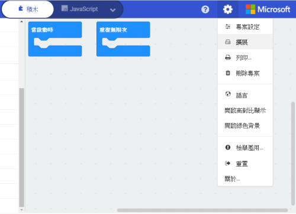
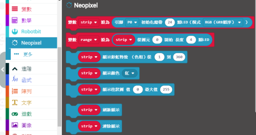
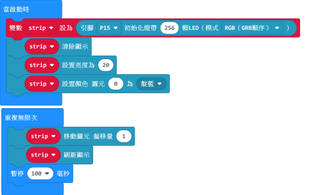
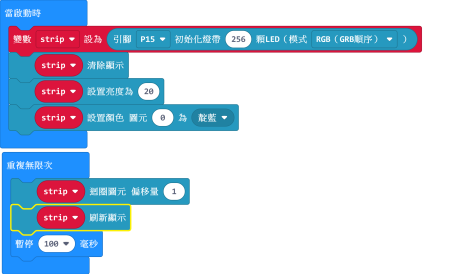
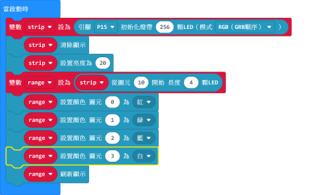
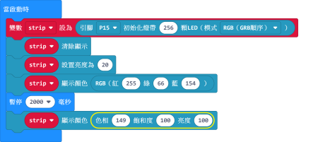

# 流光溢彩屏教程（上）

本教程將會教大家使用neopixel插件對溢彩屏進行編程。

## 接線

溢彩屏需要配合robotbit使用，請如圖將屏幕與robotbit接線。

## Makecode編程教學

#### 加載robotbit擴展

 

 

完成後可以看到積木欄裏加入了neopixel的積木。

 

- 初始化溢彩屏

    由於8*32和16*16均有256顆LED，我們初始一條256顆燈的燈條。

- 單色點亮

    我們可以選擇多款預設顏色。

[參考程式下載](https://bit.ly/LEDMatrixT1_01Hex)

- 彩虹色點亮

[參考程式下載](https://bit.ly/LEDMatrixT1_02Hex)

    彩虹效果使用的是HSL格式（色相，飽和度，亮度）

- 亮度調節

為了眼睛健康建議大家調低。

[參考程式下載](https://bit.ly/LEDMatrixT1_03Hex)
    
    亮度數值範圍由0-255
    
- 單燈點亮

[參考程式下載](https://bit.ly/LEDMatrixT1_04Hex)

    設置後需要運行刷新顯示才會點燈。
  
- 流水效果
   
流水效果可以將圖元移動，有移動和迴圈兩種模式選擇。

注意效果要使用刷新才會顯示。

[參考程式下載](https://bit.ly/LEDMatrixT1_05Hex)

或者

[參考程式下載](https://bit.ly/LEDMatrixT1_06Hex)

    移動和迴圈的分別在於移動模式達至盡頭會消失，迴圈模式達至盡頭後仍然會重複。
    
- 範圍點亮

我們可以選擇某一部分的圖元進行個別點亮。

[參考程式下載](https://bit.ly/LEDMatrixT1_07Hex)

    這裡由圖元10開始選擇4顆圖元，等於燈板上的10、11、12和13圖元。

- 自訂顏色

除了預設的顏色之外，我們亦可以透過RGB和HSL來自訂顏色。

[參考程式下載](https://bit.ly/LEDMatrixT1_08Hex)

    在Google搜尋RGB Color Picker可以方便地獲取顏色的數值。
    

## FAQ

問：為什麼我點亮燈板的時候，燈板未能顯示我定下的顏色，燈板只點亮了紅色？

答：電源不足夠。

解決方法：將robotbit的電源打開，或者在供電轉接板加插外部電源（支援USB或5V火牛）。

## 注意事項
- 請勿接駁電壓高於5V的電源。
- 長時間使用請接駁外部電源。
- 本產品只適合14歲以上的兒童獨立使用，8-14歲兒童請在成年人的陪同下使用。
- 使用前請參考Kittenbot官方資料，不要隨便接駁電路，請勿外接大電流電機舵機。
- 請勿在金屬表面或導電性物料上使用，以免短路。
- 請勿在有水或潮濕的地方使用，以免短路。
- 請勿用手觸碰燈板外露的電線。

