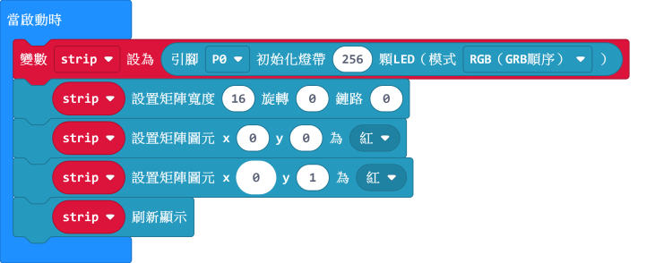
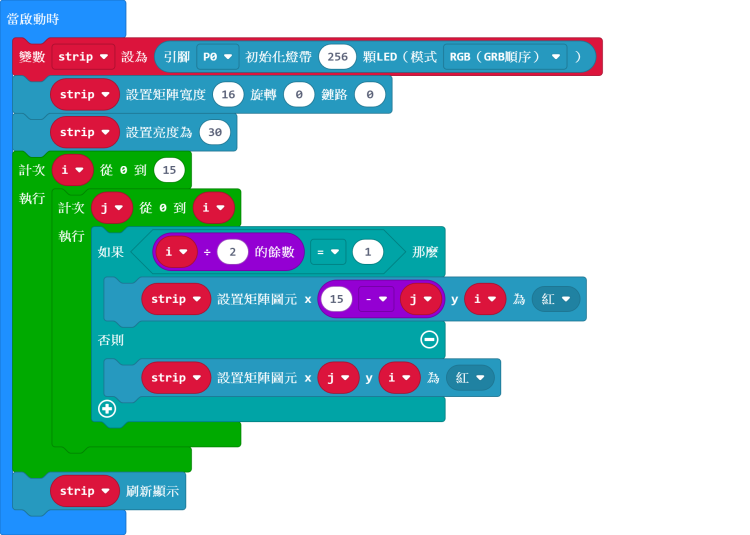
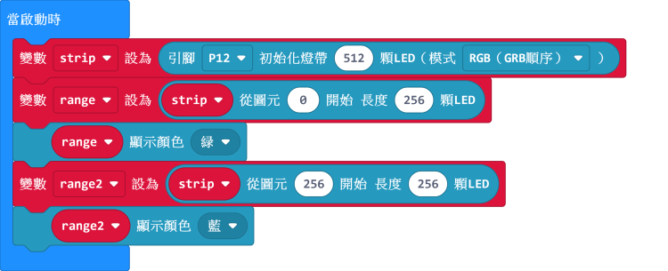

# 流光溢彩屏教程（下）

本節教程將會介紹流光溢彩屏的矩陣和串聯操作。

## 流光溢彩屏與矩陣

矩陣(matrix)可以理解為一個有X和Y軸的表格，例如一個有10個列和10個欄的表格可以被稱之為一個10x10的矩陣。

以電腦屏幕為例，大家口中的1920x1080其實就等於一個1920x1080的矩陣了。

換而言之，我們現在手上的流光溢彩屏都可以矩陣來表達為8x32或者16x16的矩陣。透過矩陣，我們就可以做更多不同的效果。

### 此節教程將會運用neopixel插件。

我們先來試試初始燈板為一個16x16的矩陣。 然後我們可以透過X和Y座標控制個別圖元。

[參考程式下載](https://bit.ly/LEDMatrixT3_01Hex)

    這裡使用的是一塊16x16燈板，所以我們將闊度設為16。

現在我們來試試點亮首2行的第一顆圖元。

[參考程式下載](https://bit.ly/LEDMatrixT3_02Hex)

大家可以看到雖然在Y為0和1這兩行上；

我們均點亮X為0的圖元時，2行中被點亮圖元卻不一樣。
    

這是因為燈板是一條蛇狀的燈條所摺成的，所以X的方向會因Y軸而改變。（請參考下圖）

以圖中最上2行為例，在第一行(Y為0)中X的方向是由右至左；

在第二行(Y為1)中X的方向卻變成由左至右了。

因應這個情況，我們需要當在Y為單數的時候，將X的方向手動調轉。

    電腦由0開始計算，所以第一行的Y其實是0，第二行才是1。

調轉的方法十分簡單，只需要用矩陣的闊度減去X就可以了。

[參考程式下載](https://bit.ly/LEDMatrixT3_03Hex)

    雖然矩陣的闊度為16但由於電腦以0開始計算，我們需要減去1。（16-1=15）
    用PowerBrick套件中的全彩點陣屏的話不需要更改。
    

所以，當我們想用燈板顯示一些圖案的時候，我們必須因應Y軸而改變X。

[參考程式下載](https://bit.ly/LEDMatrixT3_04Hex)
    
## 流光溢彩屏旋轉

我們可以在這程式中看到旋轉對於X和Y軸的影響。

有時候我們把燈板的方向旋轉會方便我們的操作。

[參考程式下載](https://bit.ly/LEDMatrixT3_05Hex)

    由於旋轉方向有0、1、2這3種，我們使用除以3的餘數操控旋轉。
    
X和Y軸的方向可以參照下圖。

## 流光溢彩屏串聯

流光溢彩屏支援多塊燈板的串聯操作，令屏幕的大小倍增。

### 串聯接線

串聯情況下，請將燈板1的dout（公頭）與燈板2的din（乸頭）連接。

    一般不建議連接2塊形狀不同的燈板，因為計算會比較複雜。
    
### 串聯情況的編程

串聯情況下，我們必須在初始燈板的時候將數值設為LED燈的總數。

我們可以用圖元0-255和256-511分別控制2塊燈板。

[參考程式下載](https://bit.ly/LEDMatrixT3_06Hex)

### 串聯與矩陣

串聯燈板可以與矩陣同時操作。我們設置矩陣的時候可以先將闊度設為1塊燈板的闊。

在旋轉為0或2的時候，第二塊燈板會往Y軸伸展。旋轉為1的時候，則會往X軸伸展。

[參考程式下載](https://bit.ly/LEDMatrixT3_07Hex)

    Y=0和Y=16分別代表2塊燈板的第一行。
    這裡用了2塊16x16的燈板，所以我們構成了一個16x32的矩陣。
    
## FAQ

問：為什麼我點亮燈板的時候，燈板未能顯示我定下的顏色，燈板只點亮了紅色？

答：電源不足夠。

解決方法：將robotbit的電源打開，或者在供電轉接板加插外部電源（支援USB或5V火牛）。

## 注意事項
- 請勿接駁電壓高於5V的電源。
- 長時間使用請接駁外部電源。
- 本產品只適合14歲以上的兒童獨立使用，8-14歲兒童請在成年人的陪同下使用。
- 使用前請參考Kittenbot官方資料，不要隨便接駁電路，請勿外接大電流電機舵機。
- 請勿在金屬表面或導電性物料上使用，以免短路。
- 請勿在有水或潮濕的地方使用，以免短路。
- 請勿用手觸碰燈板外露的電線。

