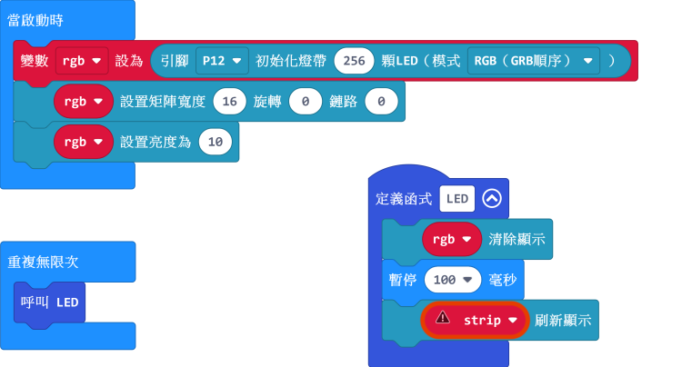
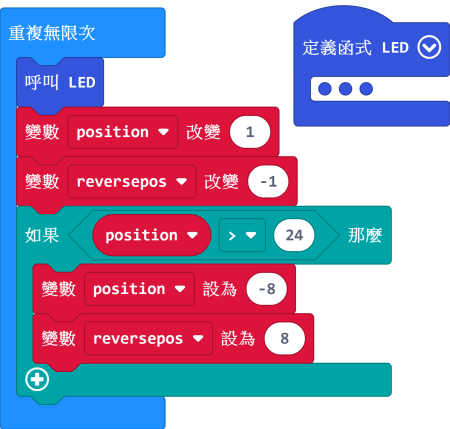

# 流光溢彩屏進階教程

本節為流光溢彩屏的進階教程。

先前教程提及過，neomatrix的流水走字效果並不支援16x16的燈板。

本節教程將會教大家手動編寫16x16的流水效果。

## 流光溢彩屏進階Makecode編程

1. 本節教程將會用到neopixel的插件，請將插件加載於makecode。

2. 本節教程亦會用到neomatrix的編輯器。

    - [neomatrix編輯器](https://kittenbot.github.io/pxt-neomatrix/index.html)
    
    
    請勿加載neomatrix插件！否則將會出現錯誤！
    只需要在瀏覽器打開編輯器即可。

### 單幀流水動畫

請先將燈板設置為矩陣。

    注意：這裡我們設置變數strip改為rgb，這有助我們之後的操作。

接下來我們要添加一個函式。

現階段我們只需要將以下積木添加至我們剛剛做的函式和無限重複積木塊裏。

接下來我們轉到neomatrix的編輯器。

在編輯器繪畫我們想要的圖畫。

完成之後我們要在Input中按Makecode JS。

生成Javascript編碼之後我們將rgb.clear()至到rgb.show()之內的程式複製。

        
在makecode之中我們需要按JavaScript切換至JavaScript模式。

現在我們找出我們剛才做的函式。

然後將剛才複製的程式在strip.clear()和basic.pause()中間貼上。

之後我們需要手動檢查Y的數值以修正X。假如Y的數值為雙數，我們要用矩陣闊度與X相減。

    電腦由0開始計算，所以我們需要用15來修正X。
    用PowerBrick套件中的全彩點陣屏的話不需要更改。

確認圖案正確無誤之後就可以進行下一步。

在變數欄中增加2項變數，用來控制燈板動畫。

    注意：因為X的方向會左右相反，我們必須2項變數，1項為順序(position)，另1項為倒序(reversepos)。
    這教程是想控制圖畫的左右移動，如欲做到上下移動，請參考本教程自行修改程式。

完成後我們在程式增加以下積木。

我們切換至JavaScript模式，手動檢查Y的數值。假如Y為單數，我們在X加上position +，否則我們加上reversepos +。

大功告成！

[參考程式](https://bit.ly/LEDMatrixT4_01Hex)

### 雙幀流水動畫

上文教了大家創作地單一幅幀數的動畫，有了這個基礎，我們製作多幀動畫時就較容易上手。

我們會沿用上部分已完成的程式。我們先到neomatrix編輯器生成第二幅圖畫。

生成之後將JavaScript程式碼貼在第一幀後。
按照上部分手動更改X的數值。

為第二幀圖畫增添一個抵銷(offset)。Y為單數的時候要-15，否則+15。

    抵銷的數值為燈板闊度並因幀數調節，這裡添加了一幀，所以我們加減15(15x1=15)。
    
 切換至積木模式，更改動畫重置的臨界點。

    臨界點數值和重置位置可能因應圖畫而轉變。
    這裡設置臨界點為24，重置點為-8，代表動畫重置前移動32格(2幀圖畫的總闊度)。
    假如你想較早重置，您可以將臨界點調低，反之亦然。
    一般而言，重置點都會設在0以下，這可以避免動畫突然重置到畫面上。

大功告成！

[參考程式](https://bit.ly/LEDMatrixT4_02Hex)

## 串聯情況之下的編程

串聯情況下邏輯基本上相同和上部分，關於串聯操作詳情請參考上一教程。

假如你想做多幀動畫的話你可能要將幀的次序調節才能夠無縫連接。

    例如：在2塊燈板的串聯之下要播放2幀動畫，燈板1的幀次序為幀1->幀2，但燈板2的幀次序會變成幀2>幀1。

[參考程式](https://bit.ly/LEDMatrixT4_03Hex)

## FAQ

問：為什麼我點亮燈板的時候，燈板未能顯示我定下的顏色，燈板只點亮了紅色？

答：電源不足夠。

解決方法：將robotbit的電源打開，或者在供電轉接板加插外部電源（支援USB或5V火牛）。

## 注意事項
- 請勿接駁電壓高於5V的電源。
- 長時間使用請接駁外部電源。
- 本產品只適合14歲以上的兒童獨立使用，8-14歲兒童請在成年人的陪同下使用。
- 使用前請參考Kittenbot官方資料，不要隨便接駁電路，請勿外接大電流電機舵機。
- 請勿在金屬表面或導電性物料上使用，以免短路。
- 請勿在有水或潮濕的地方使用，以免短路。
- 請勿用手觸碰燈板外露的電線。    
