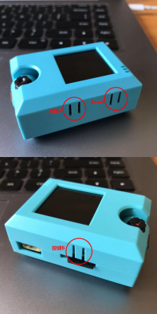
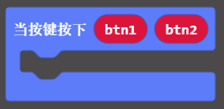

# A與B鍵應用

KOI上自帶兩個AB側按鍵與一個Reset按鍵。

 

## 編寫A,B按鍵程式

**加載KOI插件：https://github.com/KittenBot/pxt-koi**

[詳細方法](https://kittenbothk.readthedocs.io/en/latest/functional%20module/AI%20Cam/makecodeQs.html)

按鍵積木塊：

 

btn1和btn2分別指的是按鍵A與按鍵B的按鍵狀態。

當按鍵按下時，狀態為1，否則為0。通過判斷btn1或者btn2的變數是否為1時，就可判斷按鍵是否按下。

  

完整參考程式：

## **程式運行流程**

把程式下載到Microbit上, 當按下KOI的按鍵A，Microbit點陣顯示笑臉，且蜂鳴器播放一個短曲 power up; 當按下KOI 的按鍵B，Microbit點陣顯示張嘴的表情，且蜂鳴器播放一個短曲 ba ding。

## 參考程式下載

[KOI AB 按鍵應用HEX](https://bit.ly/KOIButtonTestHex)

## FAQ

1，為什麼我打開電源，按KOI的按鍵A或者按鍵B，怎麼沒反應？

·    答：打開電源後, KOI 及microbit 同時起動; 相對上, Microbit 所需的起動時間比KOI魔塊短, 引致 Microbit的初始化程式（串口指令中, 控制載入Yolo模型）已經跑完了，KOI還沒完全起動, 最後會在螢幕中呈現報錯資訊。

·    解決辦法：打開電源後，重新按下Microbit背後的Reset按鍵，讓Microbit重新開始運行（秘訣就是讓KOI魔塊先完全運行起來，再讓Microbit 跑初始化程式）

