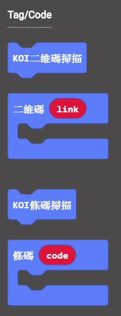
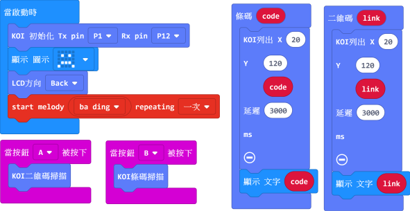
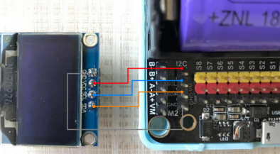
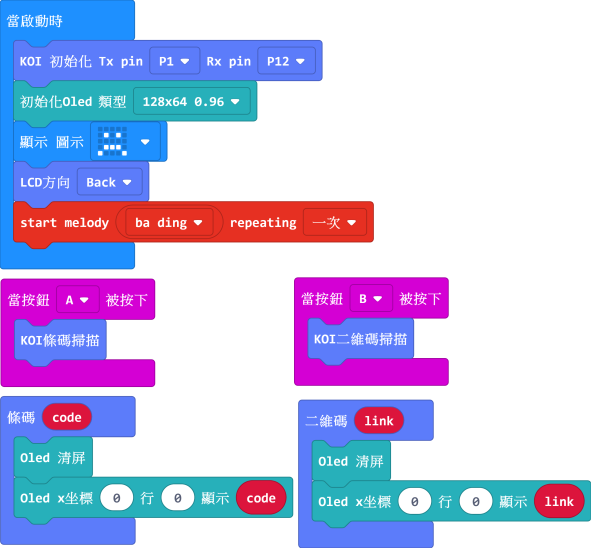

# **讀取條碼Bar Code 及 二維碼QR Code**

·    條碼 (Bar Code) 廣泛用於我們生活中，例如產品的識別標籤。

·    二維碼(QR Code)用於支付場景或者社交場景。

## 編寫Bar Code及QR Code讀取程式

**加載KOI插件：https://github.com/KittenBot/pxt-koi**

按鍵積木塊：

 

完整參考程式：

  

## **程式運行流程**

把程式下載到Microbit 上, 

1. 把Bar Code 放到KOI 鏡頭前, 按下Microbit的按鍵A，進行識別;  Bar Code 數字便會顯示在KOI 的螢幕上。
2. 把QR Code 放到KOI 鏡頭前, 按下Microbit的按鍵B，進行識別;  QR Code 所含的資訊便會顯示在KOI 的螢幕上。

## 進階程式

讀取Bar Code 及 QR Code 後可能出現大量資訊, 在KOI 的螢幕上未必有足夠時間閱讀; 此時我們便可考慮多加一塊OLED顯示屏, 以提高資訊的可讀性。

### OLED接線

本例子以Robotbit 示範, 把OLED 屏接到I2C 接口上

 

### 編寫程式

**加入OLED的插件： https://github.com/KittenBot/pxt-oled**

 

## 參考程式下載

[1. 讀取Bar Code及QR Code Hex](https://bit.ly/KOIQRBarCodeScannerHex)

[2. 讀取Bar Code 及QR Code, OLED顯示](https://bit.ly/KOIBarAndQRCodeReadOLEDHex)

[Bar Code 及 QR Code Sample](https://bit.ly/KOIBarAndQRCodeSample)

## FAQ

1. **為什麼我打開電源，按Microbit的A按鍵，怎麼沒反應？**

​       ·    答：打開電源後, KOI 及microbit 同時起動; 相對上, Microbit 所需的起動時間比KOI魔塊短, 引致 Microbit 的初始化程式已經跑完了，KOI還沒完全起動。

​       ·    解決辦法：打開電源後，重新按下Microbit背後的Reset按鍵，讓Microbit重新開始運行（秘訣就是讓KOI魔塊先完全運行起來，再讓Microbit 跑初始化程式）

2. **為什麼不能成功讀取Bar Code 或QR Code？**

   ·    答：條碼及二維碼的寬度要求不小於3.5cm; 若條碼太小，會因解析度太小的原因無法識別。另掃描時保證完全條碼或二維碼入鏡且清晰。

   

   

