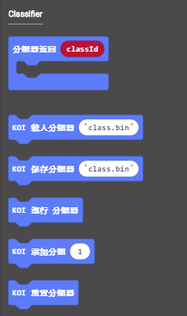
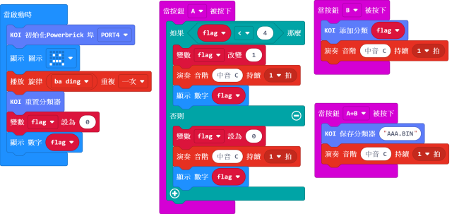
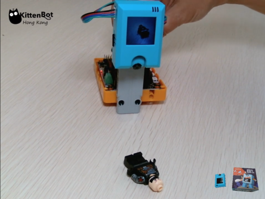

# **機器學習--自定義物件識別（模型訓練）**

機器學習（Machine Learning）聽起來好像一個很遙遠，高攀不起的課題。其實AI鏡頭已經搭載機器學習的功能，能夠分析物件特徵，容許自定義物件辨識。

在本節教程，大家將會學到如何使用內建的機器學習功能，輕鬆簡易地為機器學習模型進行訓練。

## 插入MicroSD卡

雖然使用機器學習辨認特徵並毋須MicroSD卡，但是想永久儲存訓練模型的話就一定要加插MicroSD卡了。

## 編寫模型訓練程式

加載KOI插件：https://github.com/KittenBot/pxt-koi

按鍵積木塊：

參考程式：

## 程式流程

1：將程式下載到Microbit上

2：將第一件要辨識的物件放到鏡頭前，按下按鍵B為物件拍照，然後更換角度再按下按鍵B，直至拍下大約3張照片為止。

3：按下按鍵A開始訓練下一件物件。

4：重複步驟 2、3，直至完成所有物件的訓練。

    參考程式設置變數flag為4，代表可以辨識4件物件，變數可以隨情況更改。
    
    AI鏡頭支援最多40張圖片和20種物件。所以要辨識20件物件的話，每件物件最多可以拍照2張。

5：同時按下A和B按鍵，將模型儲存到MicroSD卡上。

    本教程將模型命名為AAA.BIN，名稱可以隨喜好更改，只要名稱以.BIN結尾即可。

參考短片：

## 參考程式下載

[KOI 分類Trainer HEX](https://bit.ly/KOIClassifierTrainer)

## FAQ
1：為什麼我重新開機，按下按鍵A，但按下A鍵沒有反應？

·    答：打開電源後, KOI 及microbit 同時起動; 相對上, Microbit 所需的起動時間比KOI魔塊短, 引致 Microbit的初始化程式已經跑完了，KOI還沒完全起動, 因此按下A鍵沒有反應。

·    解決辦法：打開電源後，重新按下Microbit背後的Reset按鍵，讓Microbit重新開始運行（秘訣就是讓KOI魔塊先完全運行起來，再讓Microbit 跑初始化程式）

2：KOI鯉魚魔塊我直接3V電源可以嗎？

·    答：不行，必須要接5V！

