# **快速入門**

## 連接Micro:bit

### 1. 與Armourbit 連接

因為接線系統上, Armourbit 相對簡易便捷; 小編推薦新手使用Armourbit, 這樣可以減少因接線失誤而導致白忙半天呢~

Armourbit與KOI配合使用時，KOI必須額外提供5V電。

用家不用擔心, 大家可以從Armourbit的電池盒, 以USB介面進行引出(如下圖)。

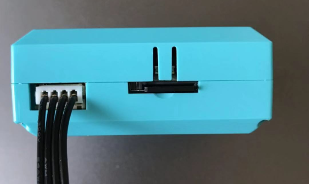  

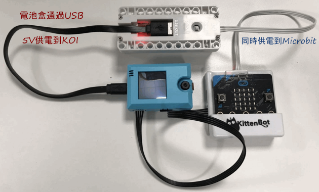  

### 2. 與Robotbit連接

由於Robobit 上提供了5V 的輸出接口, 我們可以不用再接USB線為KOI 供電。

但用家必須**注意**, 在接駁4條杜邦線時, 要格外留意**5V** 及**GND** 的插線, 

##### xxx **切勿反接** xxx

否則KOI有機會不能再運作了 >.<

使用隨盒附送的4pin 線, 白色大插頭插入KOI 中

另一端顏色順序為 - 黑, 紅, 藍, 綠

分別對應Robitibit 上 - GND, 5V, P2, P1

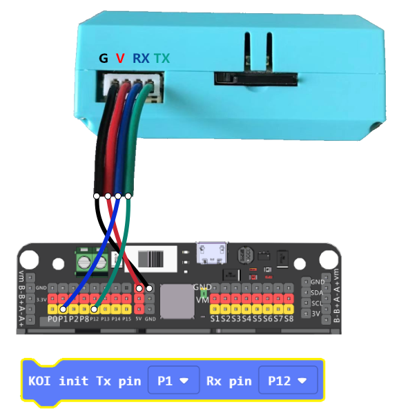 

#### 重要事項: 黑 (GND) 及 紅(5V) 切勿反接!!!

再次*檢查接線無誤* 後, 就可以打開Robitbit 的開關, 便會看到KOI 的屏幕顯示出鏡頭當下所拍到的畫面。

 

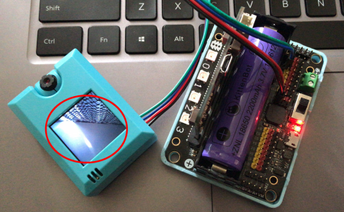 

## 準備Makecode編程

可以使用線上版本或者離線版本的Makecode

[https://makecode.microbit.org](https://makecode.microbit.org/)

  

### **加入插件 (extension)**

------

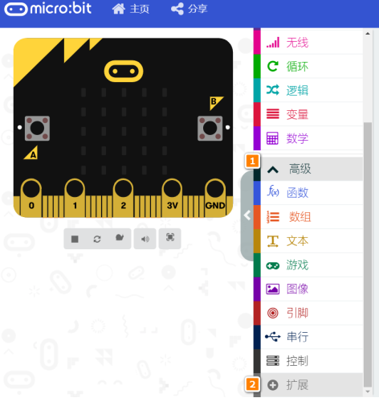  

把以下連結copy & paste 到Makecode 上：

#### **https://github.com/KittenBot/pxt-koi**

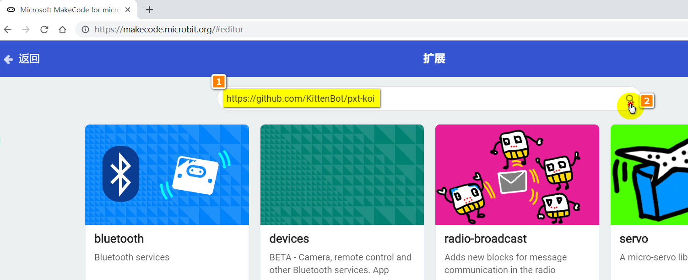

KOI 插件成功載入，如圖所示                                                                       

​                                                              

  

### 積木介紹

------

#### 連接初始化

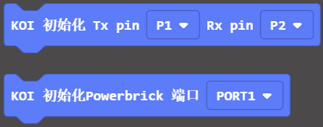  

第一個積木——針對是Robotbit或者其它Microbit擴展板

第二個積木——針對是能量魔塊的Armourbit，新手推薦使用能量魔塊套件

#### ML5類器

如果大家熟悉PC端的KittenbotML5外掛程式，那麼理解KOI的ML5積木塊也就很簡單了。

ML5分類器用於自訂學習特定的物體或者場景等等

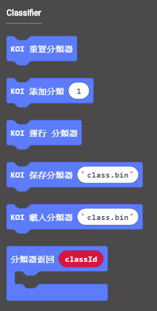 

#### **截圖與顯示**

使用此功能前，要求TF記憶體卡必須已經插在KOI魔塊上，否則截圖無法保存。

調用截圖積木塊，會以“XXX.png”存儲一張圖片到記憶體卡中。**如無記憶體卡，顯示截圖失敗！**

調用顯示積木塊，會在記憶體卡中尋找一張以“XXX.png”為名的圖片，並以顯示，顯示持續1S左右。若記憶體卡中無此圖片，則螢幕回饋資訊無法無法打開此檔。

 

#### **顯示資訊**

調用列印積木塊，可在螢幕上顯示資訊，螢幕是處於不斷刷新狀態，因此顯示資訊只是一瞬間就會消失了。

列印座標用於設置字串的起始座標。

 

#### **設置螢幕顯示**

前置與後置兩種選擇，因為模組無法自動檢測當前攝像頭是前置或者後置的狀態。因此需要手動選擇設置。螢幕對應會根據選擇進行畫面翻轉處理。

 

#### **圓形追蹤**

閾值越大，排除干擾越強，但閾值太大，圓形檢測會越難。

x與y為檢測圓形在螢幕上的橫縱坐標，r為圓形半徑。

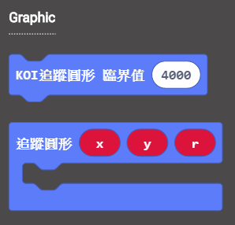v

#### **矩形追蹤**

與圓形追蹤功能同理

w與h為檢測矩形時，框選出矩形的 線框長與寬

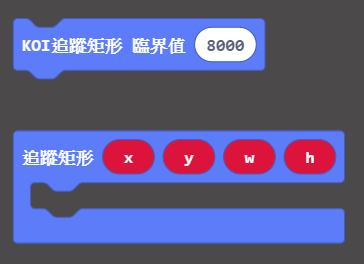 

#### **顏色巡線與顏色追蹤**

顏色巡線與顏色追蹤前，必須進行顏色校準

視覺巡線對應的座標是直線段的兩點座標（x1，y1）（x2，y2）

色塊參數與矩形追蹤同理

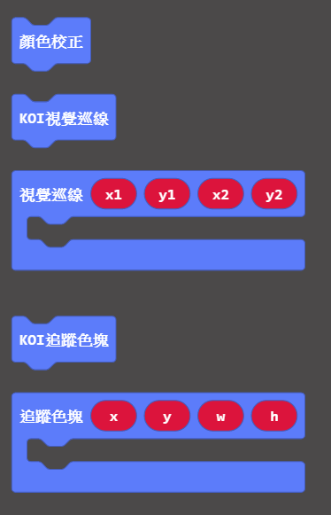 

#### **二維碼**

掃描檢測二維碼，返回二維碼結果。

二維碼寬度要求不小於3.5cm，一般微信名片二維碼大於3.5cm。若二維碼太小，會因解析度太小的原因無法識別。

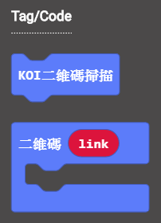 

#### **條碼**

掃描檢測條碼，返回條碼結果

條碼要求不小於3.5cm。若條碼太小，會因解析度太小的原因無法識別。

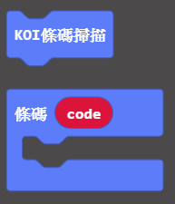 

#### Apriltag

Apriltag簡單理解為簡化版的二維碼，Apriltag還能監測出座標與其三軸的旋轉角度。

Apriltag廣泛應用到機器人視覺識別的場景中

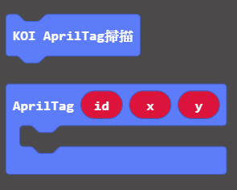 

#### **人臉模型yolo檢測**

初始化需要載入人臉模型

每次調用人臉追蹤，檢測到人臉即返回人臉座標xy

檢測人臉，返回人臉的座標

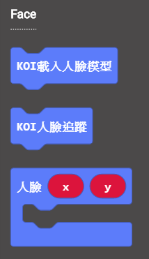 

