# Wifibrick 介紹與使用

## 簡介

Wifibrick 是Kittenbot Powerbrick 延申的一款功能方塊; 顧名思義, Wifibrick 提供了一個渠通, 把micro:bit 為核心的系統, 通過wifi 連接到各IoT 平台, 如國外的Thinkspeak, 本地的Makercloud 或中國移動的OneNet。

 

它的外型跟Powerbrick 中的溫濕度方塊是同一個模樣; 但Wifibrick 上多了一個logo

 

## 規格	

工作電壓:  3.3 - 5V  

工件電流:  ~65mA

尺寸: 56 (L) x 25 (W) x 20 (H)

接線位置: PH2.0, 4 pin 公

 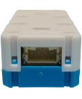

支持 STA / AP / STA+AP 模式; 支持Smart Config 功能

## 特點	

- 巿面上較少能直接配合micro:bit 使用的3.3V Wifi 模塊, 由Kittenbot 自家開發固件及makecode 編程積木, 方便易用。

- 內置紅﹑藍﹑綠指示燈, 連線狀態一目了然。

- 單插頭防反設計, 接線簡單減少失誤。

     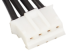

- 2則及背面帶有能配對樂高科技系列的插孔, 更易融合到模型中。

     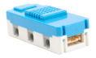

## 接腳解讀

在Wifibrick 背面, 會看4支針腳的標示, 分別為 G﹑V﹑ A﹑ B, 

 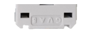

對應針腳功能如下:

 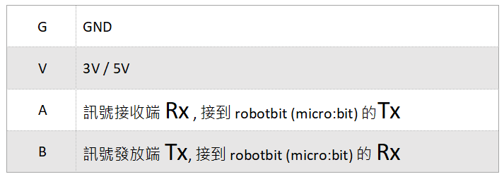

Tx = 發送數據 Transmit(*tx*) Data 的簡寫

Rx = 接收数據 Receive(*rx*) Data 的簡寫

## 接線方法

 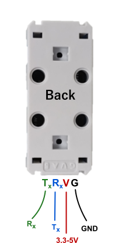

把wifibrick 連接到micro:bit 的方法很多, 建議配合Kittenbot 的擴展板 / breakout board 一拼使用。

詳細見下文:

### Armourbit

Armourbit 是Powerbrick 套件中的micro:bit擴展盒。只要把micro:bit 插進去, 就能通過armourbit 4則及背面的port 位, 把wifibrick 或 sensor 等配件連接到micro:bit 的pin 位。

 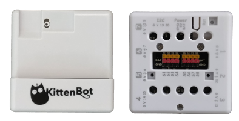

[Armourbit 詳細介紹](https://kittenbothk.readthedocs.io/en/latest/Microbit%20eboard/Armourbit.html)

採用2端都是ph2.0 4pin 的接線

 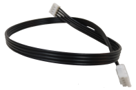

利用接線, 可把Wifibrick 接到Port 1 (需關閉buzzer), Port 2, Port 3 或 Port 4 也可。

下圖示範用上了Port 2, 對應的就是micro:bit 的p1 及 p12

#### 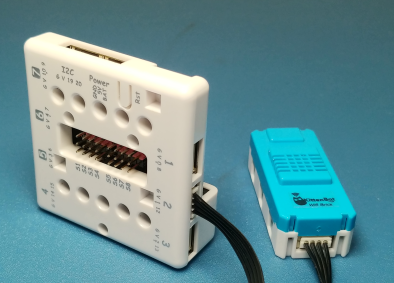

下圖解有助稍後了解在編程中的設定

 

### Robotbit

Robotbit 是Kittenbot 一款長青的擴展板, 兼容自家大部份外置模組, 包括Wifibrick

[Robotbit 詳細介紹](https://kittenbothk.readthedocs.io/en/latest/Microbit%20eboard/Robotbitfull.html#)

採用ph2.0 4pin 轉杜邦線; 利用杜邦端, 分別接到Robotbit 的G, V, P1, P2 (P12也可)

 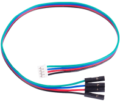

接線示意圖

 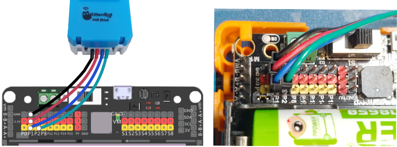

 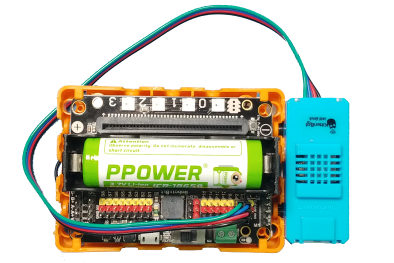

下圖解有助稍後了解在編程中的設定

 

### IoBit

IoBit 接Wifibrick 的方法跟上述接Robotbit 的方法大同小異, 都是選定Rx, Tx 接到那支pin 就可以了。

下圖是接到IoBit 的G, V, P1, P2

 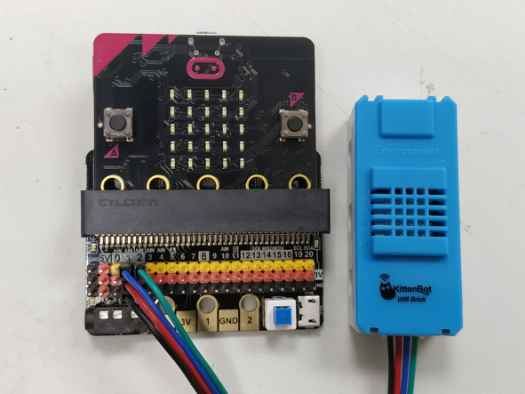

