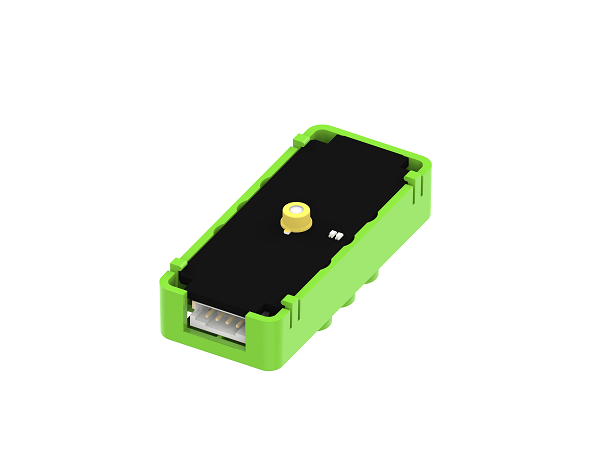
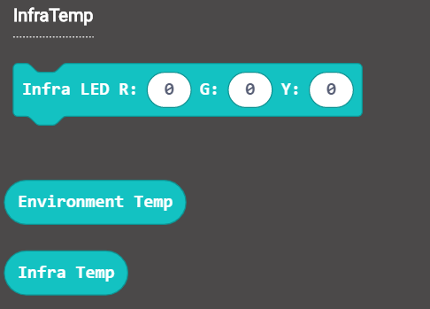
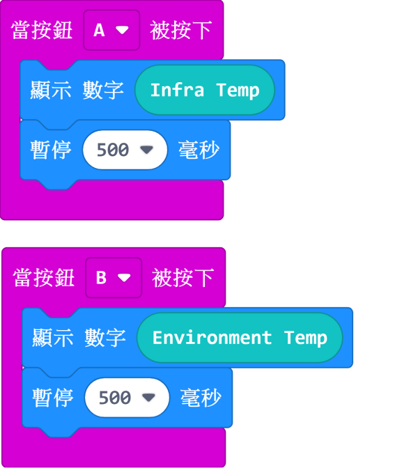

# 紅外線測溫魔塊

紅外線測溫魔塊

這是一個紅外線測溫魔塊，它可以偵測環境或人體的溫度。

## 產品參數

工作電壓：3.3V~5V
型號：MRT-311
工作溫度：-30°C~100°C
感測面積：0.35x0.35mm

## 接線教學

## MakeCode編程教學

加載PowerBrick插件：https://github.com/KittenBot/pxt-powerbrick

### 紅外線測溫積木塊：

### 紅外線測溫魔塊編程

#### 測溫編程：

#### LED編程：

