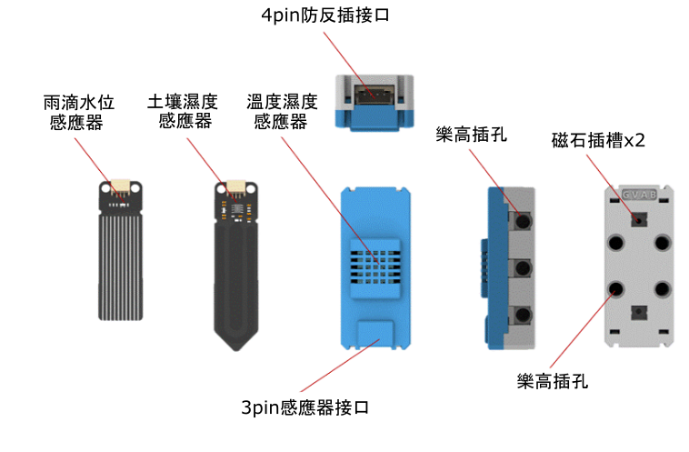
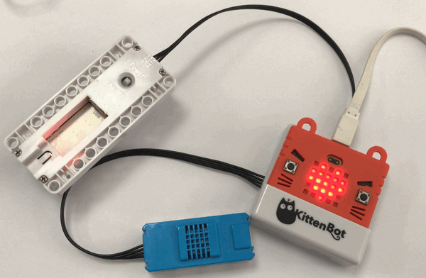
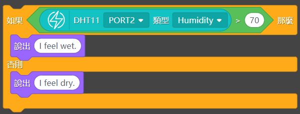
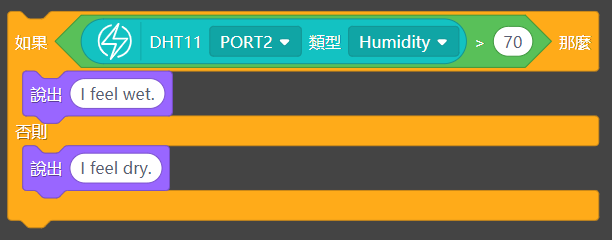

# 溫度濕度魔塊

溫度濕度魔塊 (HKBM8012D)

此模塊用於探測環境的溫度和濕度。附有3pin防反插接口，可以加插雨滴或土壤魔塊。

## 詳細介紹

## 產品參數

- 支援電壓：3V-5V
- 尺寸：56mm X 24mm X 19mm
- 接口：4pin防反插接口；3PIN防反插接口。
- 溫度測量範圍：0-50°C，精準度±2°C
- 濕度測量範圍：20-90%RH，精準度±5%RH
- 模擬數值測量範圍(雨滴或土壤魔塊)：0-1023

## 使用注意事項

- 這魔塊不能放入水中，放入水中會導致短路。

## 接線方法

將溫度濕度魔塊用4pin排線連接至Armourbit。

## MakeCode編程教學

### 加載PowerBrick插件：https://github.com/KittenBot/pxt-powerbrick

### 溫度濕度魔塊積木塊:

### 溫度測量編程

[參考程式下載](https://bit.ly/PowerbrickM1_01Hex)

### 相對濕度測量編程

[參考程式下載](https://bit.ly/PowerbrickM1_02Hex)

### Makecode教學短片

## KittenBlock編程教學

### 加載PowerBrick插件

離線版與在線版同樣操作。

在左上角小貓logo旁邊的硬件欄選擇PowerBrick，加載Microbit與Powerbrick插件。

### 環境積木塊

### 溫度測量編程

[參考程式下載](https://bit.ly/PowerbrickM1_01sb3)

### 相對濕度測量編程

[參考程式下載](https://bit.ly/PowerbrickM1_02sb3)

## FAQ

1：為什麼我點擊積木塊沒有反應呢？

首先確保已經連接好Microbit，然後上載韌體再試一試。