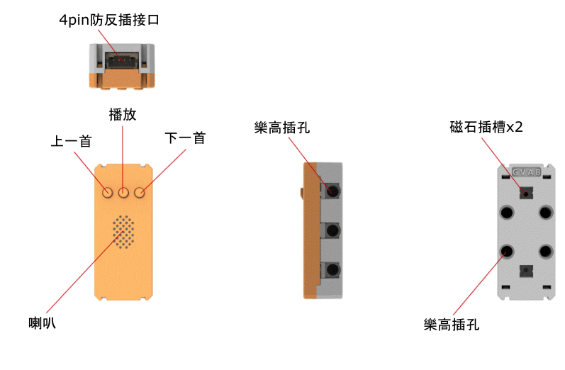
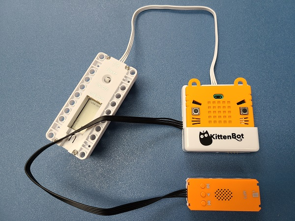
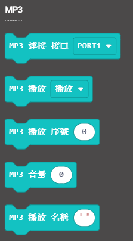
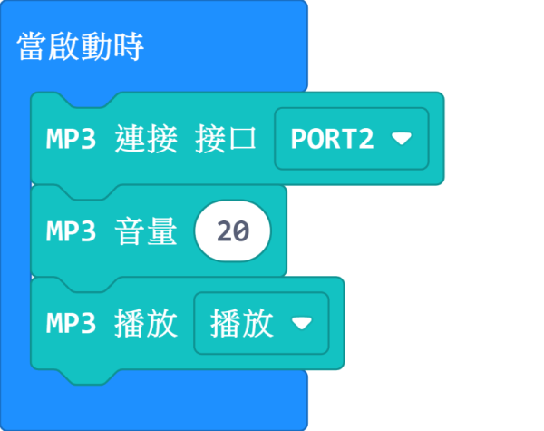
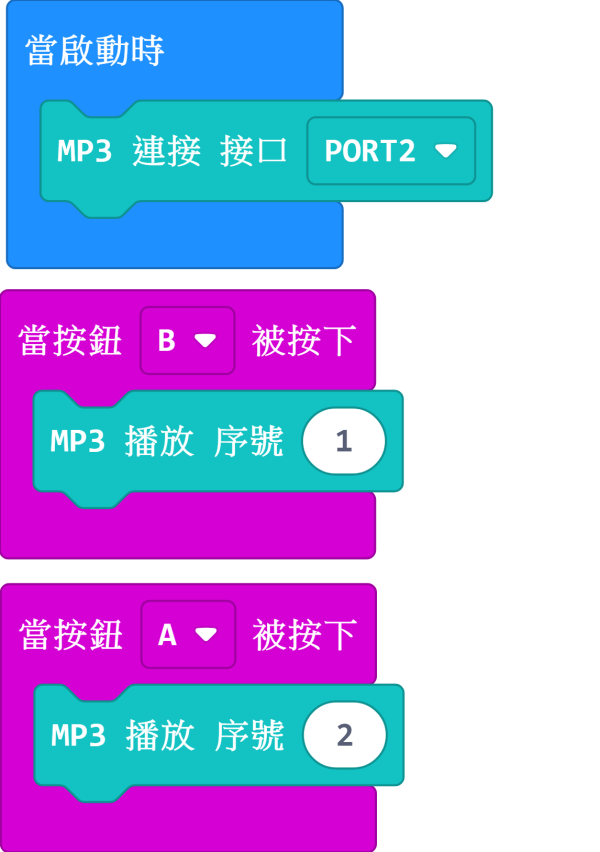
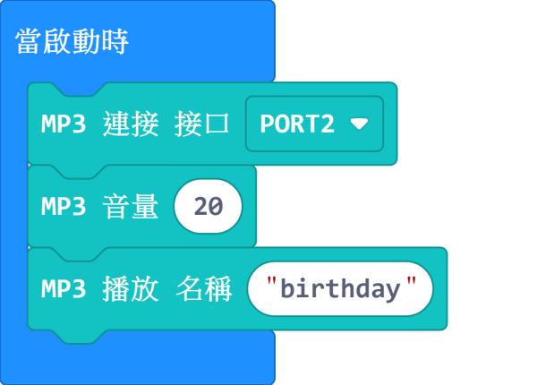
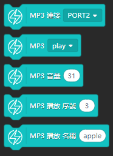
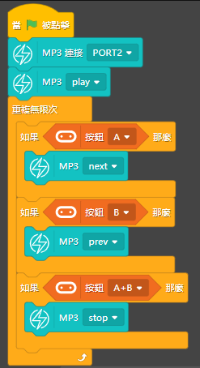
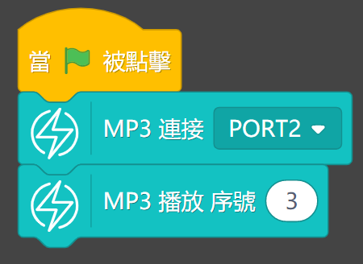
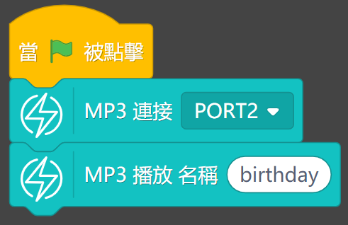

# MP3魔塊

MP3魔塊 (HKBM8012E)

這是一塊MP3魔塊，內建小喇叭和microSD卡插槽，可以播放SD卡裏的mp3檔案。上面還自帶按鍵，包括播放、上一首和下一首。配合Armourbit使用，可以用程式播放SD卡的指定歌曲等。

## 詳細介紹

## 產品參數

- 支援電壓：3V-5V
- 尺寸：56mm X 24mm X 16mm
- 接口：4pin防反插接口
- 内存卡支持：microSD卡，最大支持32G,FAT32格式
- 支援音頻格式：MP3、WAV
- 自帶按鍵：播放、上一首、下一首
- 音頻上載：將microSD卡插入電腦，將檔案拖曳到卡上即可

## 使用注意事项

- PowerBrick套件並沒有附送microSD卡，請自行購買。
- MP3魔塊一定要有內存卡，且内存卡中存有可播放的音頻，才可以播放音樂。
- 安裝microSD卡時請注意，聽到「卡嚓」一聲才代表安裝好。
- 取出microSD卡時請不要直接用力拔，按一按microSD卡即會彈出。

## 接線方法

將MP3魔塊用4pin排線連接至Armourbit。

## MakeCode編程教學

加載PowerBrick插件：https://github.com/KittenBot/pxt-powerbrick

### MP3魔塊積木塊

### 音頻播放

[參考程式下載](https://bit.ly/PowerbrickM10_01Hex)

### 指定序號播放音頻

[參考程式下載](https://bit.ly/PowerbrickM10_02Hex)

### 指定名稱播放音頻

    名稱只支援英文和數字，長度不能長於8位。

[參考程式下載](https://bit.ly/PowerbrickM10_03Hex)

### Makecode教學短片

## KittenBlock編程教學

### 加載PowerBrick插件

離線版與在線版同樣操作。

在左上角小貓logo旁邊的硬件欄選擇PowerBrick，加載Microbit與Powerbrick插件。

### MP3積木塊

### 音頻播放

[參考程式下載](https://bit.ly/PowerbrickM10_01sb3)

### 指定序號播放音頻

[參考程式下載](https://bit.ly/PowerbrickM10_02sb3)

### 指定名稱播放音頻

    名稱只支援英文和數字，長度不能長於8位。

[參考程式下載](https://bit.ly/PowerbrickM10_03sb3)

## FAQ

1：為什麼我點擊積木塊沒有反應呢？

首先確保已經連接好Microbit，然後上載韌體再試一試。