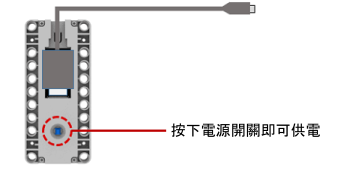
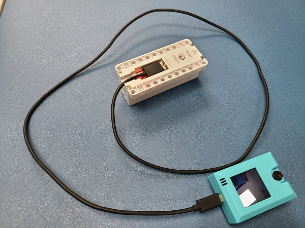

# 電池盒

電池盒 (HKBM8012A)

這是PowerBrick的電源魔塊，用於Armourbit的供電，為Microbit與電機、舵機和各種魔塊進行供電电。使用3pin防反插排線連接，附帶Micro USB充電口，帶短路過流保護電路。另外也可透過USB提供5V電源，為其他主板（例如robotbit，AI鏡頭KOI）。需要使用18650鋰電池。

## 使用注意事項

- 電池盒首先安裝好電池，才按下電源按键。
- 安装電池需要注意正負極，根據電池盒的標籤進行安裝。
- 18650電池首次使用前，請把電池盒的絕緣塑料隔片拿走。
- 長期不使用的話請把電池取出，保管在合適的地方。
- 請勿用金屬物件去短路電池接口。
- 電池盒盡量避免過充過放，充電時請確保有人看管。
- 電池盒如果過流或短路時，保護電路會啟動，並斷開電源。需要自行查找問題，才重啟電源。

## 詳細介紹

## 供電方式

### Armourbit專用供電方式

### 5V USB供電方式

### 18650電池安裝演示

1. 注意電池正負極
2. 按下電池啟動
3. 按下電源按鍵

### 電池盒接線短片

### 為電池盒充電演示

**外部5V電源**（如手機5V充電器或者電腦USB口）可以給電池盒充電

### 電池盒給其它5V電路板供電演示

可以給其他5V電路板供電，例如KOI智能鏡頭，Arduino。

