# 全彩點陣魔塊

全彩點陣魔塊 (HKBM8012J)

這是一塊8x8的全彩點陣屏，可以單獨控制任意一點的顏色或者整個屏幕的顏色。支持多塊點陣屏串聯，组成16x16或者8x32等點陣屏，令顯示效果更加豐富。

## 詳細介紹

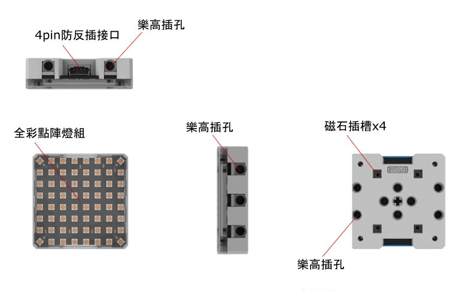

## 產品參數

- 支援電壓：3V-5V
- 尺寸：56mm X 24mm X 16mm
- 接口：4pin防反插接口
- 像素：8x8全彩

## 使用注意事項

- 點陣屏上有兩個接口，輸入和輸出，單獨使用，請使用輸入接口與Armourbit連接。
- 點陣屏進行串聯需要將第一塊點陣屏的輸出與下一塊的輸入接口連接。
- 用電池盒時最多支援串聯4塊點陣屏。如需接更多，需外接電源，或者降低點陣亮度，以此減少電流。
- 長時間使用彩色點陣屏請注意散熱。

## 接線方法

將點陣魔塊用4pin排線連接至Armourbit。

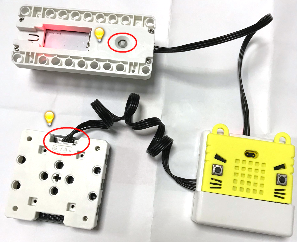

## MakeCode編程教學

加載PowerBrick插件：https://github.com/KittenBot/pxt-powerbrick

### 點陣魔塊積木塊

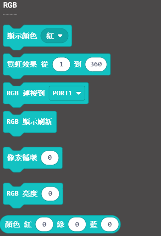

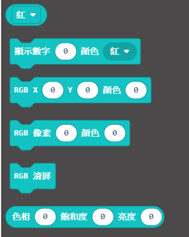

### 單色點亮

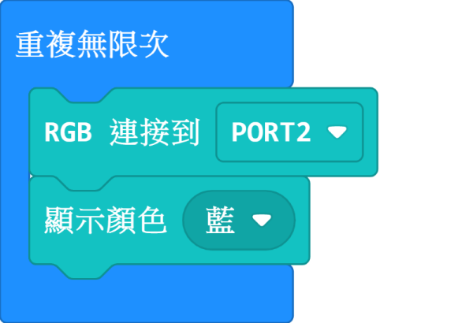

[參考程式下載](https://bit.ly/PowerbrickM9_01Hex)

### 彩虹色點亮

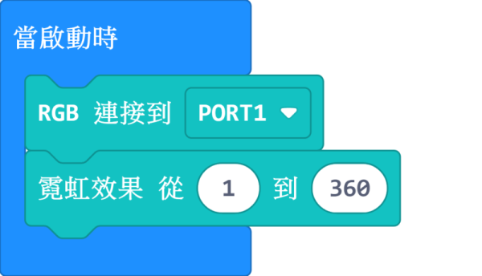

[參考程式下載](https://bit.ly/PowerbrickM9_02Hex)

### 單顆燈點亮

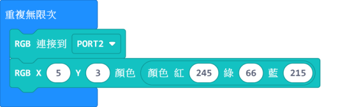

[參考程式下載](https://bit.ly/PowerbrickM9_03Hex)

### 圖案點亮示範

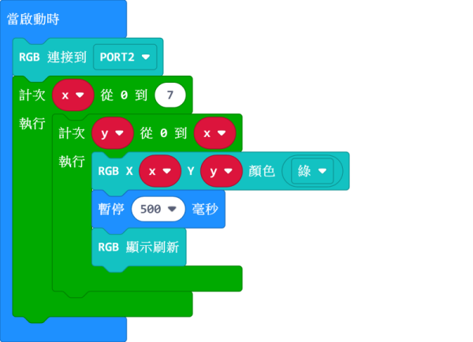

[參考程式下載](https://bit.ly/PowerbrickM9_04Hex)

### Makecode教學短片

[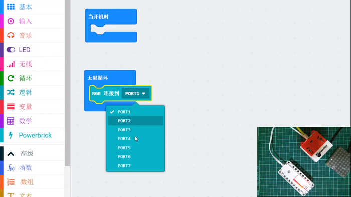](https://www.youtube.com/watch?v=Pmg6Gvg29jo)

## 串聯與圖像化編輯器教學

透過串聯連結多個點陣屏。

### 串聯接線：

請將點陣屏A的out與點陣屏B的in連接。

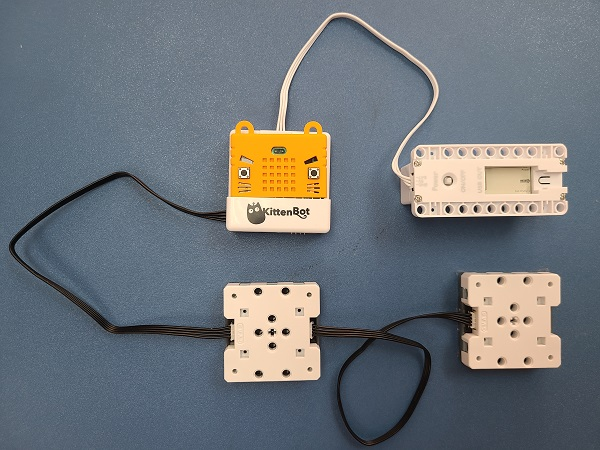

串聯情況下支援圖像化編輯器，詳情請參考流光溢彩屏教學。

[按此前往](....//../accessories/LEDMatrix/LEDMatrixDaisyChain.md)

#### 串聯效果演示

## KittenBlock編程教學

### 加載PowerBrick插件

離線版與在線版同樣操作。

在左上角小貓logo旁邊的硬件欄選擇PowerBrick，加載Microbit與Powerbrick插件。

### 點陣魔塊積木塊

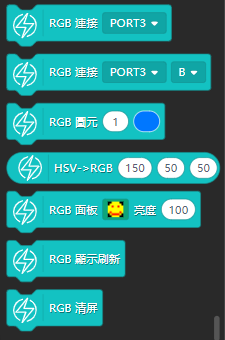

### 逐顆點亮

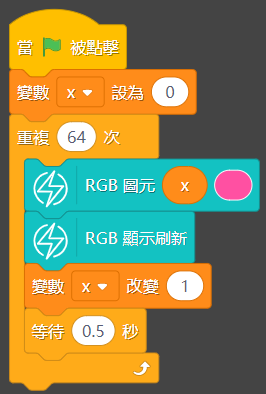

[參考程式下載](https://bit.ly/PowerbrickM9_01sb3)

由於顯示色彩只支援RGB，假如你有一組HSV顏色，你必需要將其轉換至RGB格式。

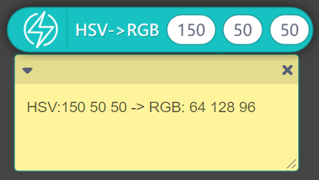

## FAQ

1：為什麼我點擊積木塊沒有反應呢？

首先確保已經連接好Microbit，然後上載韌體再試一試。
