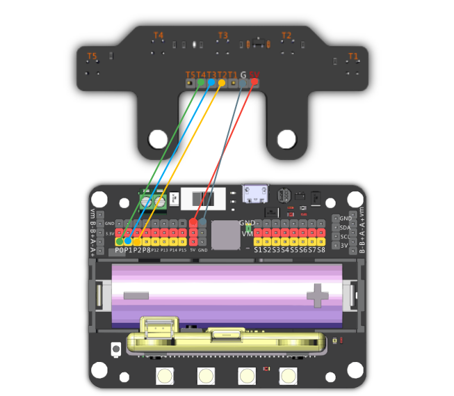
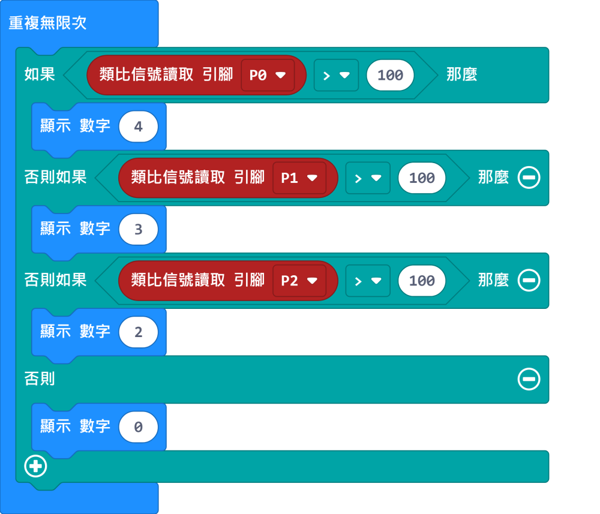
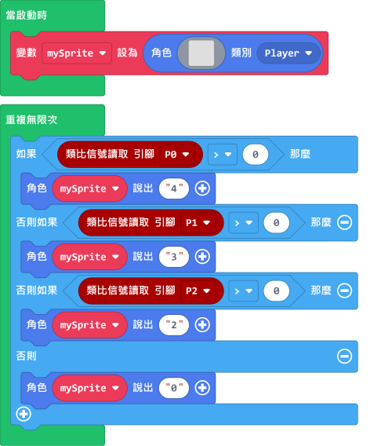
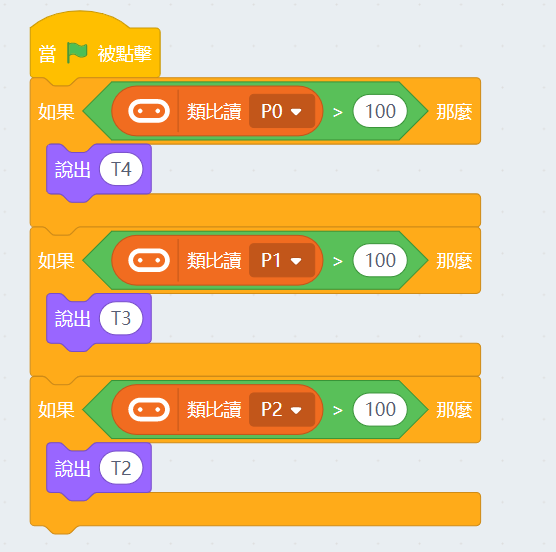

# 五路巡線模組

五路巡線模組

這是一隻巡線模組，它有五顆巡線感應器，它返回的數值是類比形式。

感應器收到的光度越少（遇上黑線），返回的數值就會越低。

## 產品參數

- 工作電壓：3V-5V
- 感應器間距：11mm
- 固定孔直徑：5mm
- 感應距離：1cm-5cm
- 接口：杜邦線

## 接線教學

五路巡線模組可以接3v或5v電源。

    由於這是類比模組，所以只能使用robotbit的PIN0-2。（使用PIN0的話需要拔除蜂鳴器跳線帽）

## MakeCode編程教學

### 此模組可供Microbit和Meowbit使用。

#### 巡線感應器編程

    巡線感應器返回的數值可能會因環境而改變，例如感應器高度、巡線膠紙的顏色和物料等。
    建議在使用前測試和調較一下觸發巡線的數值。

### Microbit:

[參考程式網址](https://makecode.microbit.org/_c7rXpLY791Cw)

### Meowbit:

[參考程式網址](https://makecode.com/_2pw59JbHhVfV)

## KittenBlock編程教學

### 加載Robotbit插件

#### 巡線感應器編程

    巡線感應器返回的數值可能會因環境而改變，例如感應器高度、巡線膠紙的顏色和物料等。
    建議在使用前測試和調較一下觸發巡線的數值。

